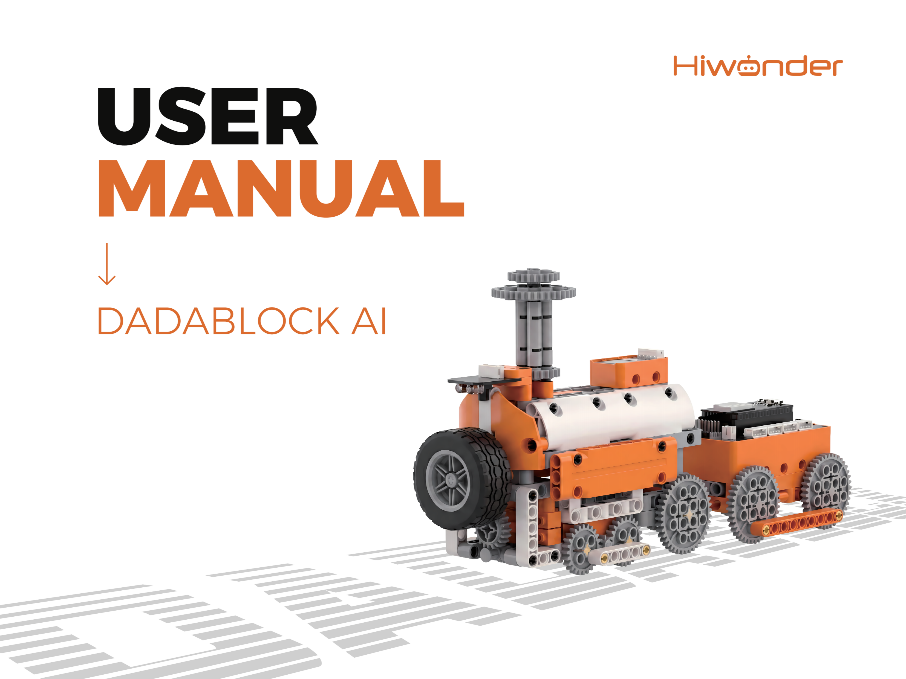

# 1. Kit Overview

## 1.1 Product Introduction

DaDaBlock是一款基于ESP32编程的百变积木套件。它搭配了ESP32主板、ESP32扩展、巡线传感器、270°积木舵机、360°积木电机等电子模块，具有300+结构件，可搭建多种创意场景。课程资料丰富，提供了36种创意造型，从造型的拼装到创意玩法的编程，寓教于乐。

## 1.2 Packing List

## 1.3 Disclaimer

- 本册所描述的产品（含硬件、软件等）均按照“**产品现状**”提供，在编写时已尽力保证其内容准确性，但并不确保手册内容完全没有错误或遗漏，资料会定期进行检查，欢迎广大用户提出改进意见。
- 产品内容随着产品版本升级，其相应的内容可能也会随之变化，请在订购时联系客服以获得产品最新信息。
- 另外，在幻尔科技未明确表示产品有该项用途时，对于产品使用在极端情况下导致一些失灵或者损毁而造成的损失概不负责。