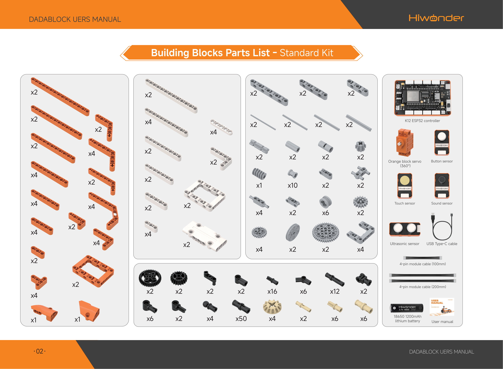
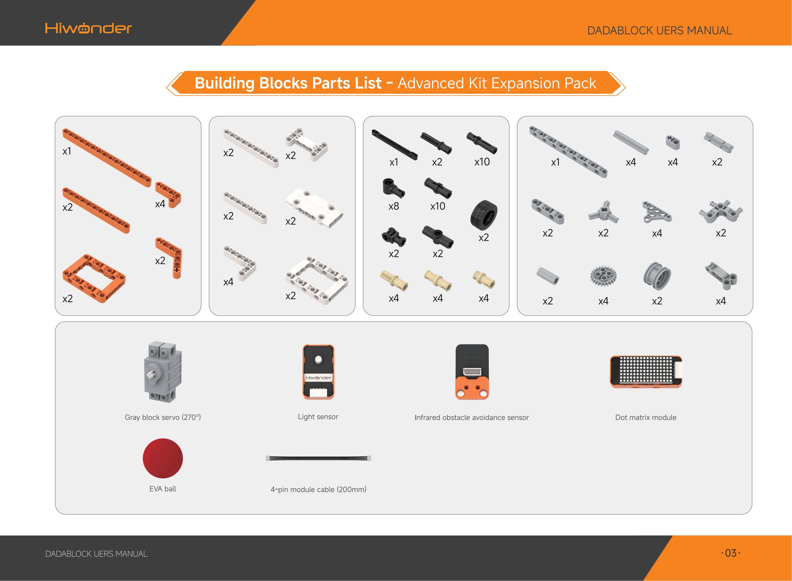
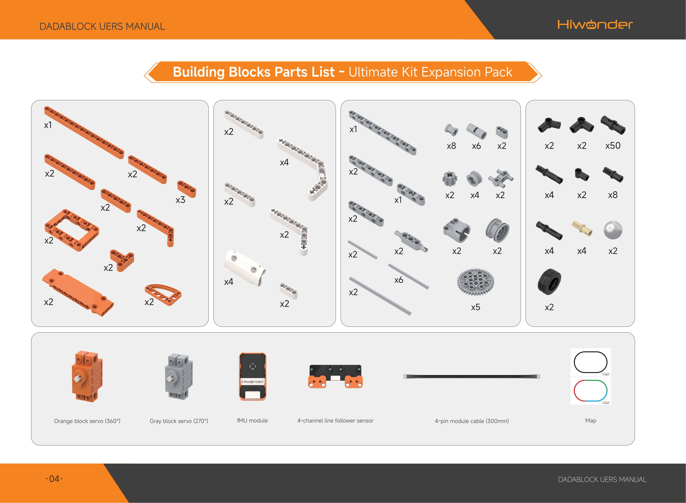

# 1. Kit Overview

## 1.1 Product Introduction

DaDablock is a versatile building block kit built around ESP32 programming. It includes the ESP32 controller, ESP32 expansion board, line follower sensor, 270° block servo, 360° block motor, and other electronic modules, along with more than 300 structural parts for building a wide range of creative models. The course materials are extensive and include 36 creative builds, covering everything from model assembly to programming for interactive play, combining hands-on making with educational exploration.

## 1.2 Packing List

## 1.3 Disclaimer

- The products described in this manual, including hardware and software, are provided on an "**as-is**" basis. Every effort has been made to ensure the accuracy of the content at the time of writing, but the manual may still contain errors or omissions. The material is reviewed regularly, and recommendations for improvement are welcome.
- Product content may change as product versions are updated. For the latest product information, contact customer service before placing an order.
- Unless Hiwonder explicitly states that the product is intended for a specific use, no liability is assumed for losses caused by malfunction or damage when the product is used under extreme conditions.

