# 2. Quick Start Guide

## 2.1 ESP32 Controller Overview

### 2.1.1 Introduction

这是一款以ESP32为核心，支持图形化编程和Python编程的智能主控器。它采用PC塑料外壳封装，板载PWM舵机接口、电机接口、可编程按钮、蜂鸣器等电子模块，并预留多个传感器接口，可拓展性强，统一4PN防反插接口，适配幻尔全系列传感器，使用方便安全。

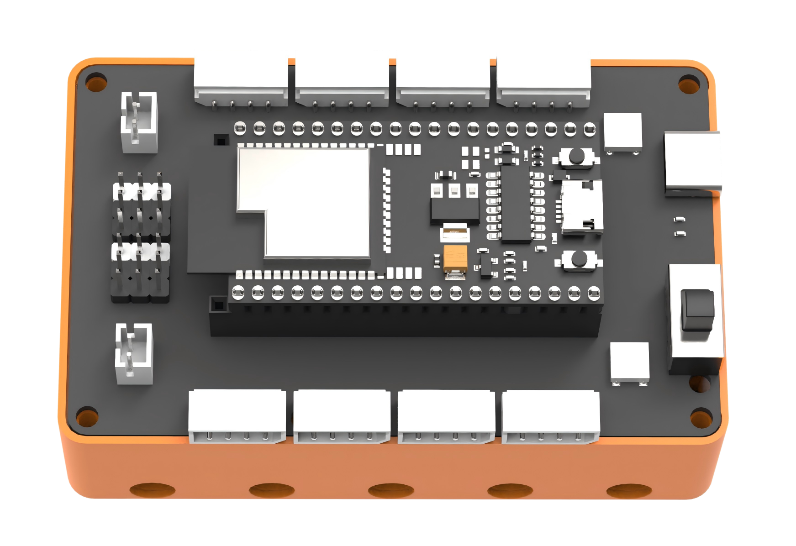

### 2.1.2 Specifications

<table style="text-align:center">
    <tr><th>产品名称</th><td>ESP32控制器</td></tr>
    <tr><th>产品尺寸</th><td>88.0mm*55.5mm*42.5mm</td></tr>
    <tr><th>充电电压</th><td>5V</td></tr>
    <tr><th>充电电流</th><td>1500mA</td></tr>
    <tr><th>充电时间</th><td>3.5h</td></tr>
    <tr><th>电池容量</th><td>1200mA 3.7V锂电池2节</td></tr>
    <tr><th>最大工作电压</th><td>4.2V</td></tr>
    <tr><th>额定工作电压</th><td>3.7V</td></tr>
</table>

### 2.1.3 Interface Overview

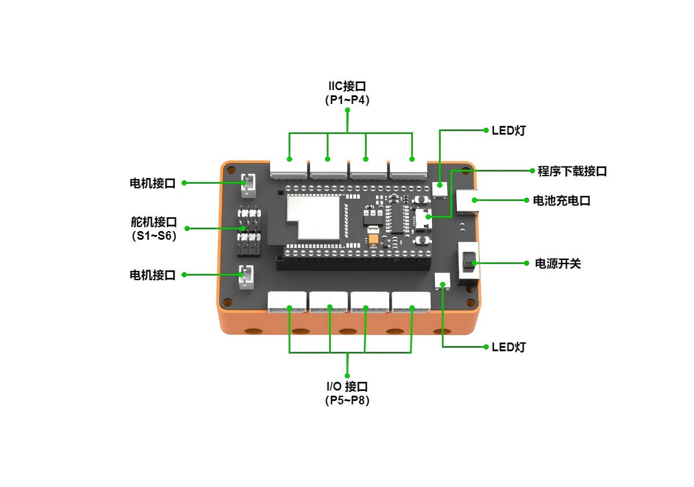

**注：S1~S4为积木电机、舵机通用接口；P1~P8为传感器接口。**

### 2.1.4 Battery Charging Notes

1. 确保主控器的开关拨到“**OFF**”档。将电池安装在主控器的的电池槽内。（注意：正负极不要接反）

   

2. 将 USB 数据线，一端接入到主控器的充电接口中，另一端接入充电器中。

   

3. 充电时主控器上的 LED 灯亮蓝灯，充满后 LED 灯熄灭，充电完成后需及时将电源线拔掉，避免过度充电。

   

## 2.2 WonderCode Programming Software

1. 打开 “WonderLab setup.exe” 软件；

   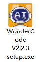

2. 选择语言，然后点击“确定”；

   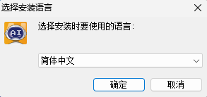

3. 选择安装位置，然后点击“下一步”；

   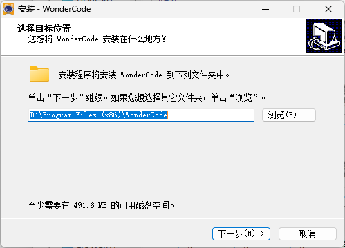

4. 点击“下一步”；

   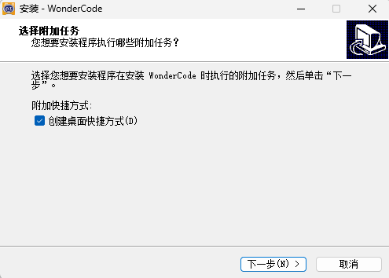

5. 点击“安装”；

   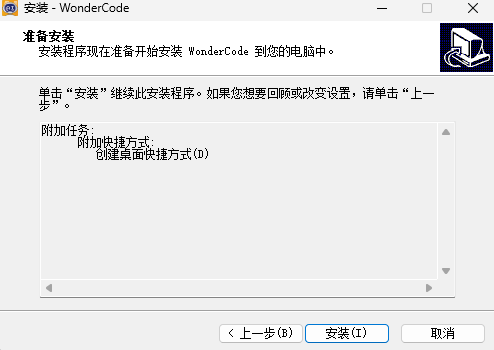

   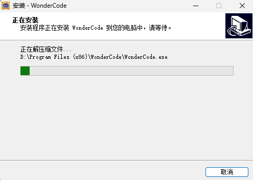

6. 安装成功后，点击“完成”。

   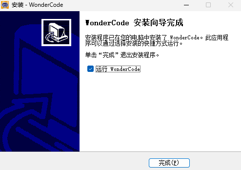

## 2.3 WonderCode Programming Software

### 2.3.1 Introduction

WonderCode是幻尔产品专用的Scratch编程软件工具。软件支持图形化指令块与Python代码的自动转换，可采用拖拽指令块的方式即可进行程序编写，非常适合新手进行编程学习。

### 2.3.2 Programming Interface Overview

下图为“WonderCode”软件的功能区域示意图：①菜单栏，②指令区，③脚本区，④代码展示与上传区。

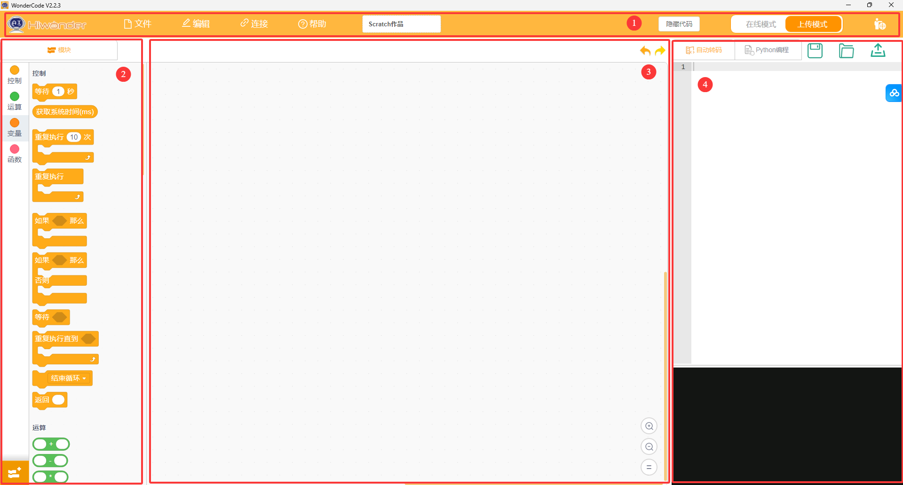

其对应功能如下表所示：

<table style="text-align:center">
    <tr><th>图标</th><th>功能</th></tr>
    <tr><td></td><td>可以新建、保存和打开程序文件</td></tr>
    <tr><td></td><td>用于在线模式，仅作了解，无需掌握</td></tr>
    <tr><td></td><td>决定是否连接设备与软件以及确定连接端口</td></tr>
    <tr><td></td><td>用于查找帮助资料、检查更新以及安装驱动</td></tr>
    <tr><td></td><td>显示程序文件名，当未开始编程或文件未保存时，则显示“scratch作品”</td></tr>
    <tr><td></td><td>界面切换按钮，可在“在线模式”和“上传模式”之间进行切换</td></tr>
    <tr><td></td><td>选择界面显示语言，可切换英语、简体中文以及繁体中文</td></tr>
    <tr><td></td><td>在编写程序时可对操作进行撤销或恢复</td></tr>
    <tr><td></td><td>编辑方式切换按钮，“自动转码”将指令块程序转化为Python形式，切换至“Python编程”可直接使用Python来编辑程序</td></tr>
    <tr><td></td><td>将程序以Python代码的形式保存</td></tr>
    <tr><td></td><td>打开已保存的Python文件</td></tr>
    <tr><td></td><td>进行设备交互，将程序下载到主控板</td></tr>
    <tr><td></td><td>用于添加设备的扩展包</td></tr>
    <tr><td></td><td>从上至下分别控制代码编辑界面的放大、缩小以及恢复默认大小</td></tr>
</table>

## 2.4 Programming Steps

1. **打开平台**：启动编程软件，新建项目；

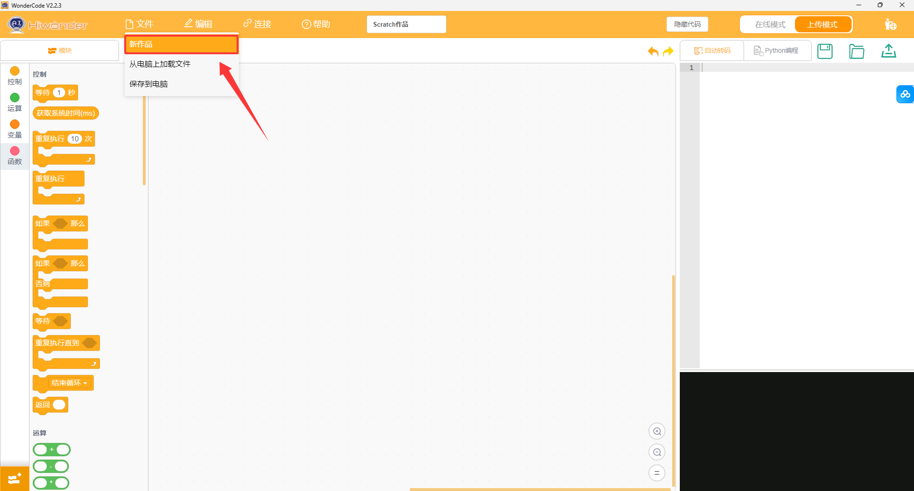

2. **添加扩展**：

- 在软件左下角打开 “**扩展**” ；

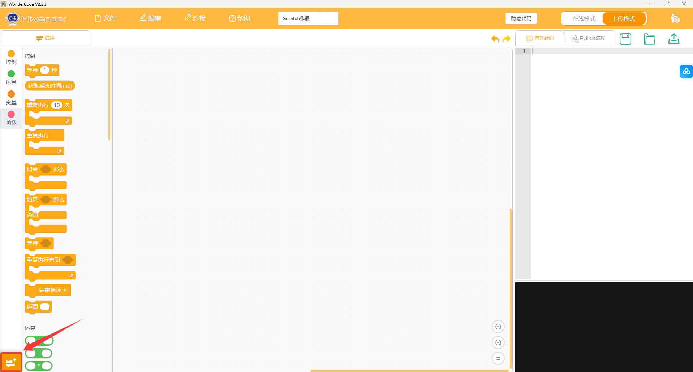

- 在 “**扩展**” 中选择”**主控器**“添加 “**K12 ESP32**” ；

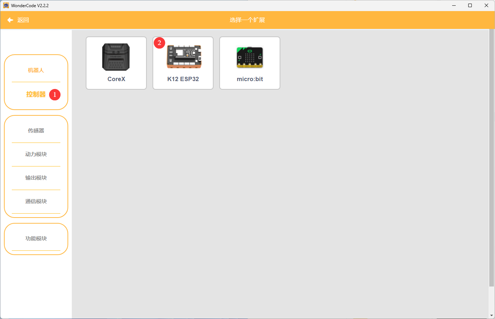

- 添加成功后，可在WonderCode界面看到已添加的扩展包；

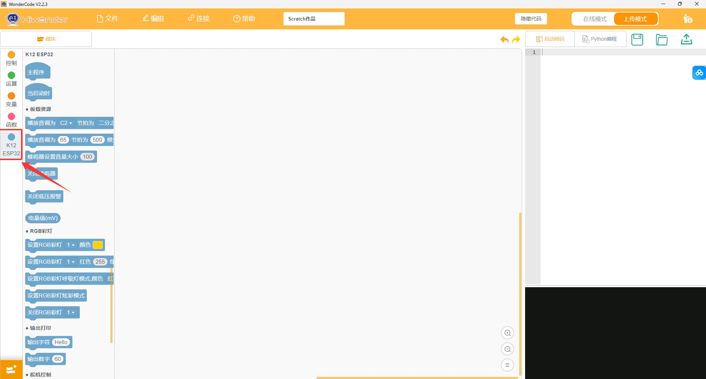

3. **编写程序**：在指令区将相应的积木块拖动到脚本区进行编程，编写成功后可以在代码展示与上传区看到积木块转换后的python语言程序。

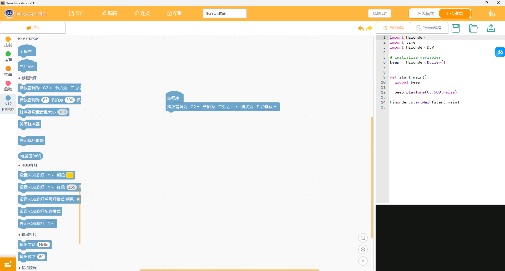

## 2.5 Program Download Steps

### 2.5.1 Connecting to a Computer

1. 先将主控板的开关拨到“**ON**”档，再将 USB 数据线接入到主控器的程序下载接口中；

   

2. 将数据线另一端插入电脑USB卡槽；

   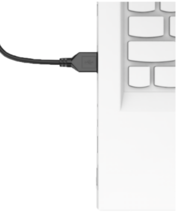

3. 点击“连接”按钮，并连接对应端口。

   

**注意：连接的端口号不唯一，本小节连接的端口号是“COM3”，但切勿连接“COM1”，它通常为系统通信的接口。如果显示多个COM口无法确定时，可右击电脑的“此电脑”，依次点击“属性->设备管理器”，查看主控器对应的端口号。（含CH340标识即为该端口）**

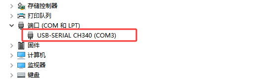

### 2.5.2 Downloading the Program

点击右上角的“”，即可将程序下载到主控器中。

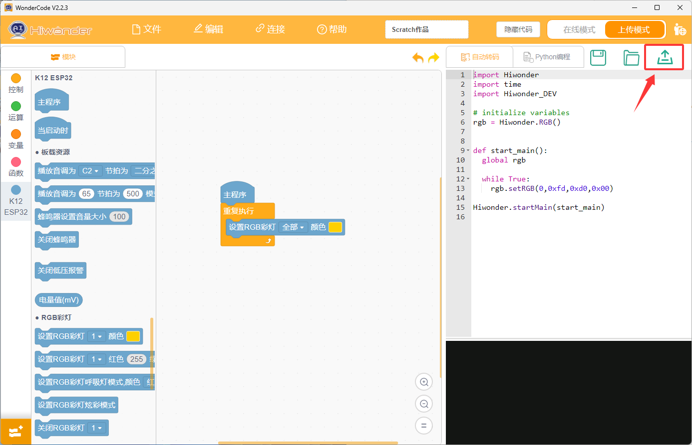

**注意：如果连接主控器后，电脑没有显示COM口，请检查USB线是否为数据线或者在电脑端接入其他USB数据接口。**