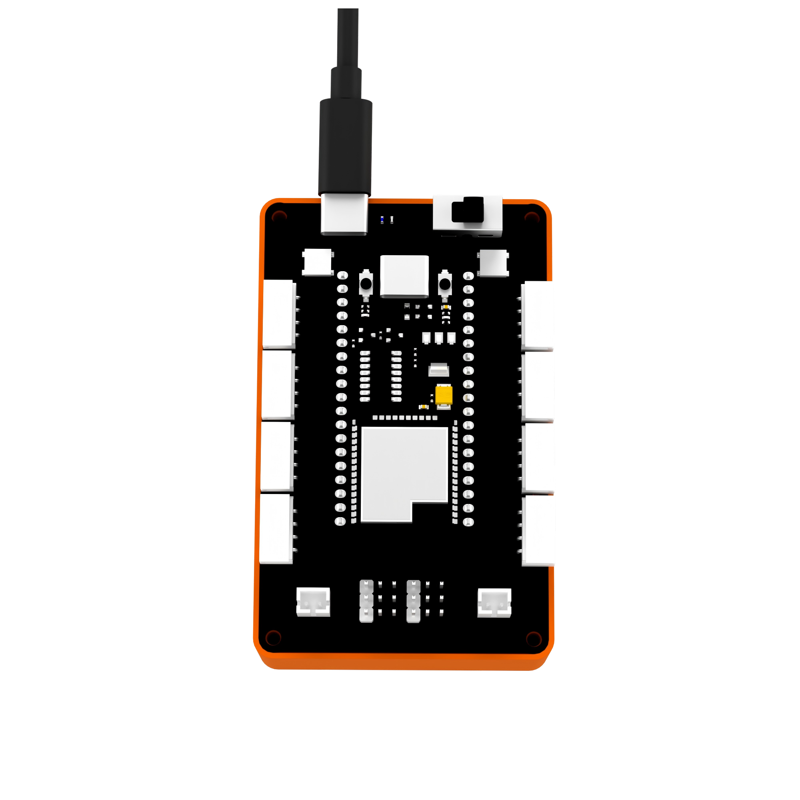
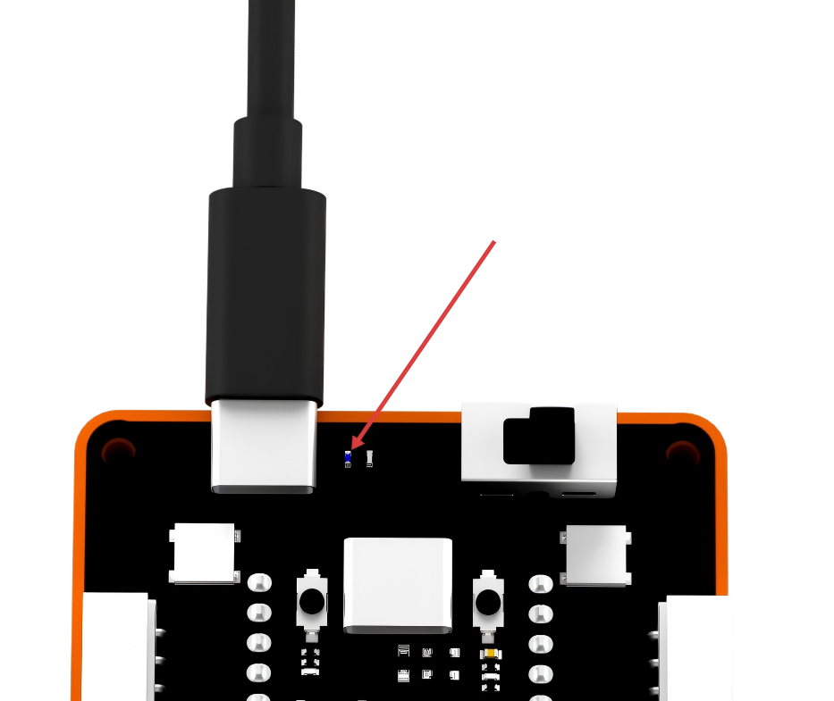

# 2. Quick Start Guide

## 2.1 ESP32 Controller Overview

### 2.1.1 Introduction

This is an intelligent controller built around ESP32 and supporting both block-based programming and Python programming. It uses a PC plastic housing and integrates onboard PWM servo ports, motor ports, programmable buttons, a buzzer, and other electronic modules. Multiple sensor ports are also provided for flexible expansion. All ports use a unified 4-pin anti-reverse connector design, making the controller compatible with the full Hiwonder sensor lineup while remaining convenient and safe to use.

### 2.1.2 Specifications

| Item | Specification |
| --- | --- |
| Product name | ESP32 controller |
| Dimensions | 88.0 x 55.5 x 42.5 mm |
| Charging voltage | 5 V |
| Charging current | 1500 mA |
| Charging time | 3.5 h |
| Battery capacity | Two 3.7 V, 1200 mAh lithium batteries |
| Maximum operating voltage | 4.2 V |
| Rated operating voltage | 3.7 V |

### 2.1.3 Interface Overview

> [!NOTE]
> **S1-S4 are shared ports for block motors and servos, while P1-P8 are sensor ports.**

### 2.1.4 Battery Charging Notes

1. Make sure the controller power switch is set to **OFF**. Install the battery in the battery compartment of the controller.

   > [!NOTE]
   > **Make sure the positive and negative terminals are not reversed.**

   

2. Connect a USB data cable to the charging port on the controller, and connect the other end to a charger.

   

3. While charging, the controller LED lights up blue. When charging is complete, the LED turns off. Disconnect the power cable promptly after charging to avoid overcharging.

   

## 2.2 WonderCode Installation

1. Open **[WonderCode setup.exe]()**.

   

2. Select the installation language, then click **OK**.

   

3. Select the installation location, then click **Next**.

   

4. Click **Next**.

   

5. Click **Install**.

   

   

6. After the installation is complete, click **Finish**.

   

## 2.3 WonderCode Overview

### 2.3.1 Introduction

WonderCode is a Scratch-based programming tool for Hiwonder products. It supports automatic conversion between graphical blocks and Python code. Programs can be created by dragging and dropping blocks, making the software especially suitable for beginners learning programming.

### 2.3.2 Programming Interface Overview

The diagram below shows the functional areas of the **WonderCode** software: ① Menu Bar, ② Command Area, ③ Script Area, and ④ Code Display and Upload Area.

The corresponding functions are listed in the table below:

| Icon | Function |
| --- | --- |
|  | Creates, saves, and opens program files. |
|  | This section is used for online mode. It is included for reference only and is not required at this stage. |
|  | Determines whether the device is connected to the software and selects the corresponding port. |
|  | Used to access help information, check for updates, and install drivers. |
|  | Displays the program file name. Before programming starts, or before a file is saved, the default name shown is **Scratch Project**. |
|  | Switches the interface between online mode and upload mode. |
|  | Selects the display language for the interface, including English, Simplified Chinese, and Traditional Chinese. |
|  | Undoes or redoes actions while programming. |
|  | Used to switch editing modes. **Auto Conversion** converts a block program into Python format, while **Python Programming** allows direct editing in Python. |
|  | Saves the current program as a Python file. |
|  | Opens a previously saved Python file. |
|  | Communicates with the device and downloads the program to the controller. |
|  | Adds extension packages for devices. |
|  | From top to bottom, these controls are used to zoom in, zoom out, and restore the default size of the code editing area. |

## 2.4 Programming Steps

1. **Open the software**: Start the programming software and create a new project.

2. **Add the extension**

- Open **Extensions** in the lower-left corner of the software.

- In **Extensions**, choose **Controllers** and add **K12 ESP32**.

- After the extension is added successfully, the added package appears in the WonderCode interface.

3. **Write the program**: Drag the required blocks from the command area into the script area to create the program. After the program is completed, the converted Python code appears in the code display and upload area.

## 2.5 Program Download Steps

### 2.5.1 Connecting to a Computer

1. Set the controller power switch to **ON**, then connect a USB data cable to the program download port on the controller.

   

2. Plug the other end of the cable into a USB port on the computer.

   

3. Click **Connect** and select the corresponding port.

   

   > [!NOTE]
   > **The port number is not fixed. The example in this section uses COM3, but COM1 should not be selected because it is usually reserved for system communication. If multiple COM ports are shown and the correct one is unclear, right-click This PC, select Properties > Device Manager, and check the port assigned to the controller. The correct port typically includes the CH340 identifier.**

### 2.5.2 Downloading the Program

Click the **Download** button in the upper-right corner to download the program to the controller.

> [!NOTE]
> **If no COM port appears after the controller is connected, check whether the USB cable is a data cable, or try another USB data port on the computer.**

