# 3. Sensors and Modules Introduction

## 3.1 360° Block Motor

### 3.1.1 Sensor Overview

这是一款可以兼容各种乐高积木组件的舵机。使用时，我们一般使用 PWM（脉冲宽度调制）来控制。它是连续旋转舵机，通过 PWM 信号可以控制旋转速度和方向，但无法控制具体转动的角度。

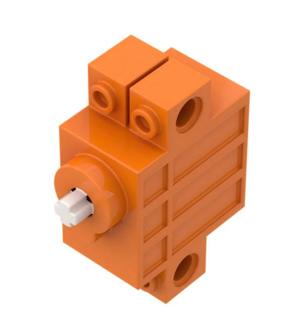

### 3.1.2 Specifications

<table style="text-align:center">
    <tr><th>工作电压</th><td>DC 4.8-6V</td></tr>
    <tr><th>额定扭矩</th><td>1N.m</td></tr>
    <tr><th>转动范围</th><td>0°~360°</td></tr>
    <tr><th>产品线长</th><td>25cm</td></tr>
    <tr><th>产品尺寸</th><td>40mm*16mm</td></tr>
</table>

### 3.1.3 Wiring Diagram

将电机接入主控器接口S1，注意黄色线接S，红色线接5V，棕色线接GND，如下图所示：

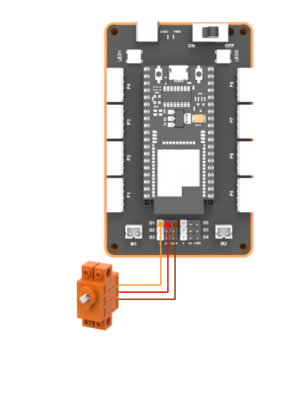

### 3.1.4 Test Demo

下载程序后，积木电机将按照50的速度，正转2秒，再反转2秒，最后停止。

### 3.1.5 Program Screenshot

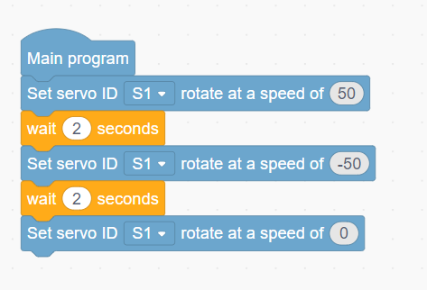

- 图中程序使用”**设置舵机S1以的50速度转动**“，是因为需要使用PWM信号控制积木电机转动，而主控器PWM信号输出接口为S1~S6，因此这里使用了S1接口来发出信号给积木电机。

## 3.2 270° Block Servo

### 3.2.1 Sensor Overview

这是一款可以兼容各种乐高积木组件的舵机。使用时，我们一般使用PWM（脉冲宽度调制）来控制。它是有限旋转舵机，也就是说舵机可以控制旋转角度，但有旋转角度限制，角度范围为0°到270°。

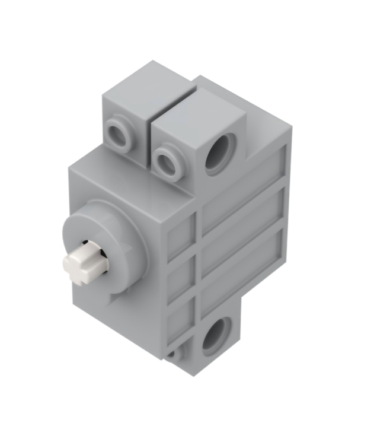

### 3.2.2 Specifications

<table style="text-align:center">
    <tr><th>工作电压</th><td>DC 4.8-6V</td></tr>
    <tr><th>额定扭矩</th><td>1N.m</td></tr>
    <tr><th>转动范围</th><td>0°~270°</td></tr>
    <tr><th>产品线长</th><td>25cm</td></tr>
    <tr><th>产品尺寸</th><td>40mm*16mm</td></tr>
</table>

### 3.2.3 Wiring Diagram

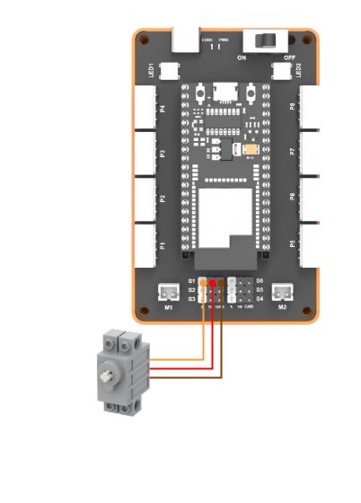

### 3.2.4 Test Demo

下载程序后，积木舵机先转到135°，2秒后，再转到0°，2秒后，再转到270°，2秒后停止。

### 3.2.5 Program Screenshot

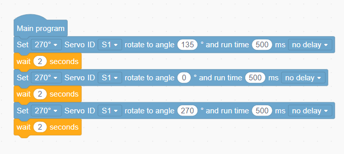

## 3.3 Button Sensor

### 3.3.1 Sensor Overview

这是一款常见的按键模块，该模块自带一个白色的按键帽，这个模块广泛用于各种DIY实验，如环境监控、电子秤制作、智能车、机器人等。

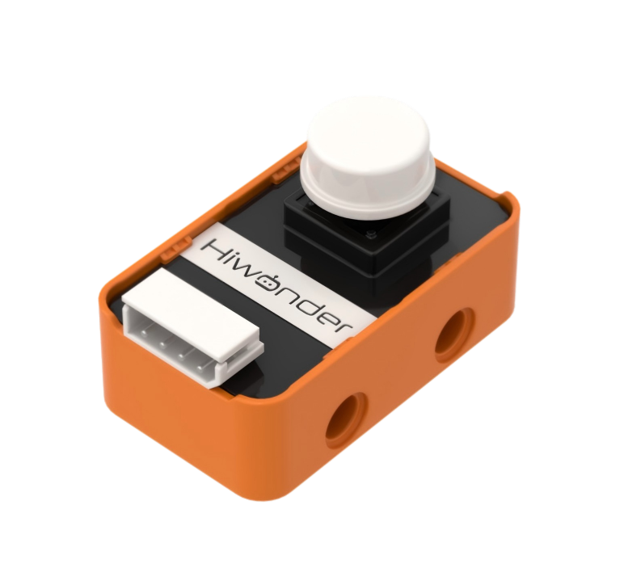

### 3.3.2 Specifications

<table style="text-align:center">
    <tr><th>工作电压</th><td>DC 5V</td></tr>
    <tr><th>工作电流</th><td>5mA</td></tr>
    <tr><th>接口型号</th><td>5264-4AW</td></tr>
    <tr><th>产品尺寸</th><td>39.5mm*23.5mm*24mm</td></tr>
</table>
### 3.3.3 Wiring Diagram

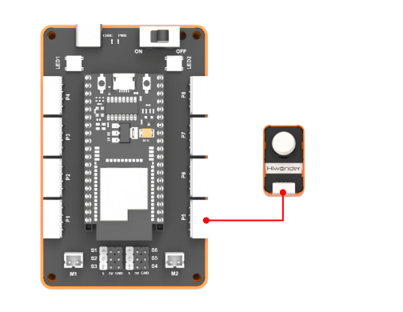

### 3.3.4 Test Demo

下载程序后，通过主控板载蜂鸣器测试按键传感器的按键状态，未按下按键时蜂鸣器不发声，按下按键时蜂鸣器发声。

### 3.3.5 Program Screenshot

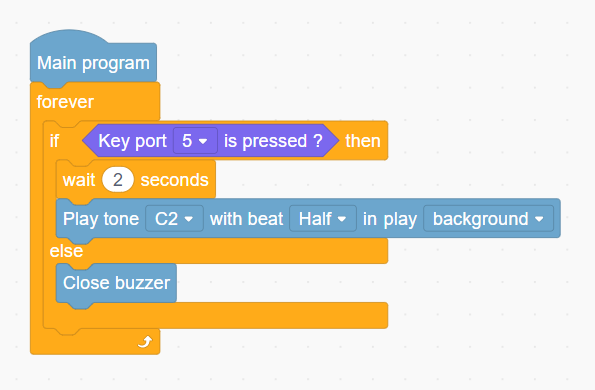

- 图中程序使用”**等待0.2秒**“，是因为物理按键在按下和松开的瞬间，金属触点会发生短暂的 “弹跳”，导致电平信号在短时间内反复跳变，程序会误以为是多次按下，等待0.2秒可以让按键的机械抖动稳定下来，确保程序检测到的是一次稳定的按键按下信号，避免误触发多次播放音调。

## 3.4 Touch Sensor

### 3.4.1 Sensor Overview

这是一款基于电容感应原理的触摸传感器，这个传感器可应用于设备的开关控制，比如控制开关灯、门铃触摸按键等。传感器兼容乐高孔位，可进行更多创意DIY设计。

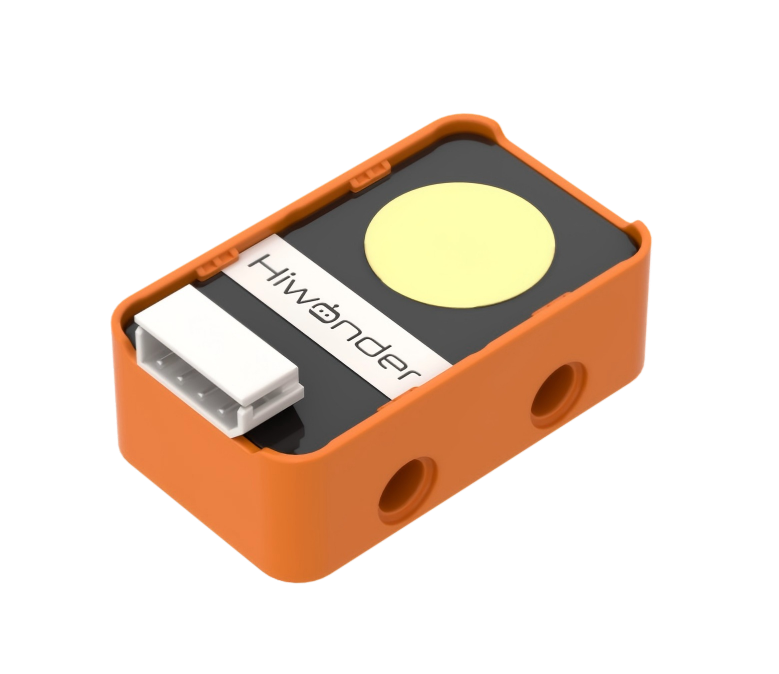

### 3.4.2 Specifications

<table style="text-align:center">
    <tr><th>工作电压</th><td>DC 5V</td></tr>
    <tr><th>工作电流</th><td>5mA</td></tr>
    <tr><th>接口型号</th><td>5264-4AW</td></tr>
    <tr><th>产品尺寸</th><td>39.5mm*23.5mm*24mm</td></tr>
</table>

### 3.4.3 Wiring Diagram

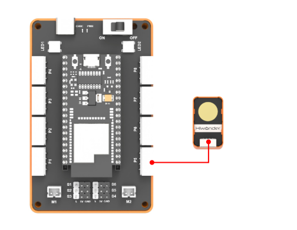

### 3.4.4 Test Demo

下载程序后，通过主控板载RGB彩灯测试触摸传感器的按键状态，未按下触摸时RGB不亮，按下触摸时RGB亮红灯。

### 3.4.5 Program Screenshot

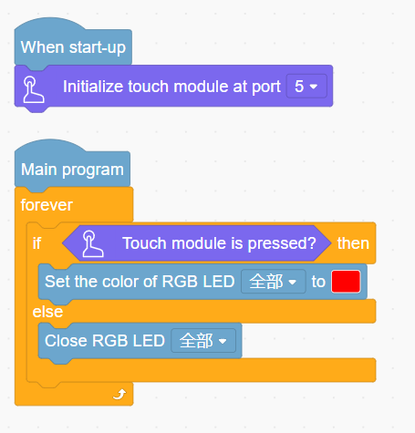

- 使用触摸传感器，需要在启动时初始化触摸传感器的接口，它可以接5/6/7/8任一接口。

## 3.5 Sound Sensor

### 3.5.1 Sensor Overview

这是一款检测外界声音大小的传感器。这个传感器用途广泛，主要应用于制作声控机器人、声控开关、声控报警等设备。传感器兼容乐高孔位，可进行更多创意DIY设计。

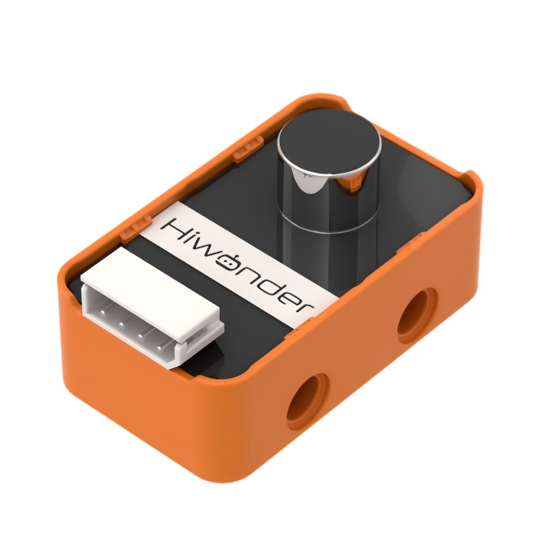

### 3.5.2 Specifications

<table style="text-align:center">
    <tr><th>工作电压</th><td>DC 5V</td></tr>
    <tr><th>工作电流</th><td>5mA</td></tr>
    <tr><th>麦克风类型</th><td>电容式驻极体</td></tr>
    <tr><th>接口型号</th><td>5264-4AW</td></tr>
    <tr><th>产品尺寸</th><td>39.5mm*23.5mm*24mm</td></tr>
</table>

### 3.5.3 Wiring Diagram

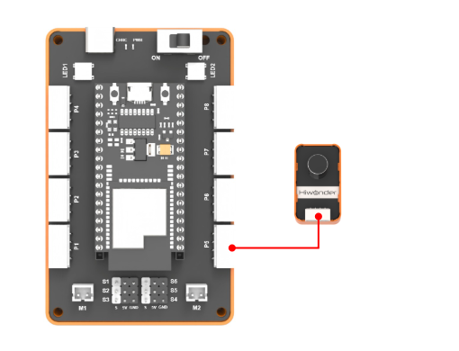

### 3.5.4 Test Demo

下载程序后，通过主控板载蜂鸣器测试声音传感器，当声音传感器检测到音量大于30时，蜂鸣器报警1秒后停止，每隔0.05秒刷新一次检测状态，保证响应及时。

### 3.5.5 Program Screenshot

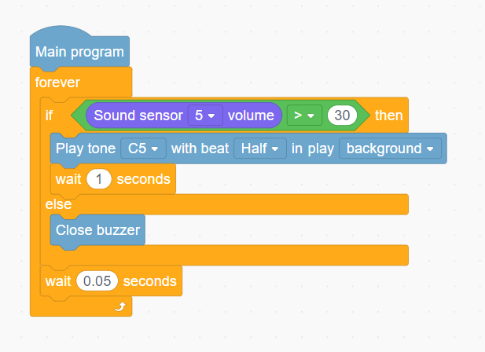

## 3.6 Ultrasonic Sensor

### 3.6.1 Sensor Overview

这是一款可发光的超声波测距模块，采用了一款工业级超声波测距芯片，芯片内部集成超声波发射电路、超声波接收电路、数字处理电路等。模块采用 IIC 通信接口，能通过 IIC通信进行读取超声波传感器测量的距离。传感器兼容乐高孔位，可进行更多创意DIY设计。

### 3.6.2 Specifications

<table style="text-align:center">
    <tr><th>工作电压</th><td>DC 5V</td></tr>
    <tr><th>工作电流</th><td>2mA</td></tr>
    <tr><th>工作频率</th><td>40Hz</td></tr>
    <tr><th>有效测距量程</th><td>2cm~400cm</td></tr>
    <tr><th>通信方式</th><td>IIC</td></tr>
    <tr><th>接口型号</th><td>5264-4AW</td></tr>
    <tr><th>产品尺寸</th><td>55.5mm*23.5mm*23.8mm</td></tr>
</table>

### 3.6.3 Wiring Diagram

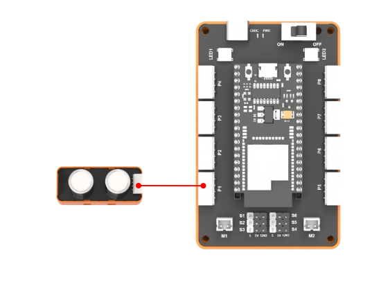

### 3.6.4 Test Demo

下载程序后，当超声波传感器检测到前方障碍物距离小于等于15cm时，超声波传感器的两个彩灯同时亮红灯，距离大于15cm时，超声波传感器的两个彩灯关闭，每隔0.1秒刷新一次检测状态，保证响应及时。

### 3.6.5 Program Screenshot

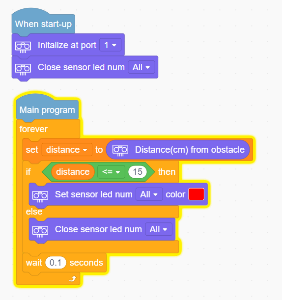

- 使用超声波传感器，需要在启动时初始化超声波传感器的接口，它可以接1/2/3/4任一接口，图中程序启动时使用”**关闭发光超声波彩灯（所有）**“，是因为超声波传感器上电会亮蓝灯。

## 3.7 IMU Module

### 3.7.1 Sensor Overview

这是一款常见的IMU加速度传感器，这款传感器用途广泛，主要应用于制作手持型游戏产品、3D 遥控器、可携式导航等设备。传感器兼容乐高孔位，可进行更多创意DIY设计。

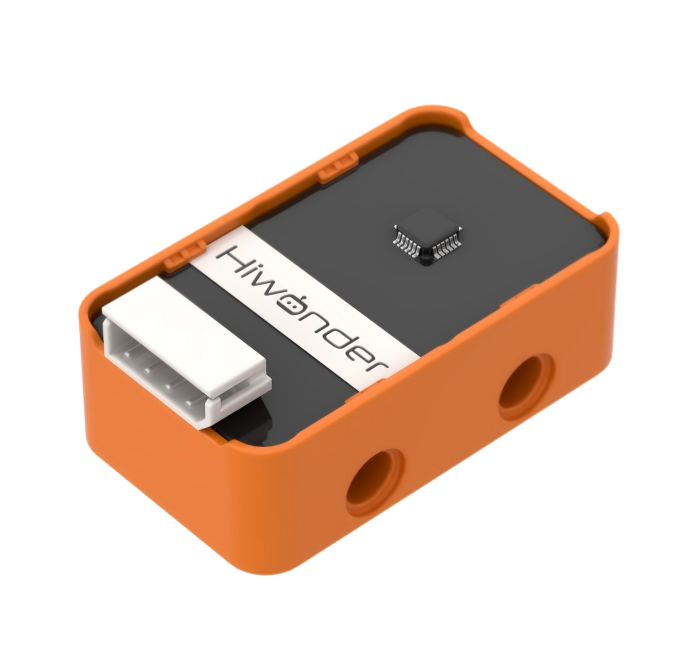

### 3.7.2 Specifications

<table style="text-align:center">
    <tr><th>工作电压</th><td>DC 5V</td></tr>
    <tr><th>数据接口</th><td>I2C总线，最快时钟频率可达400kHz</td></tr>
    <tr><th>接口型号</th><td>5264-4AW</td></tr>
    <tr><th>产品尺寸</th><td>39.5mm*23.5mm*24mm</td></tr>
</table>

### 3.7.3 Wiring Diagram

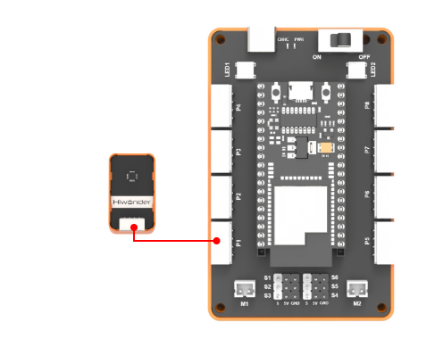

### 3.7.4 Test Demo

下载程序后，通过串口显示IMU传感器X、Y轴的数值。

### 3.7.5 Program Screenshot

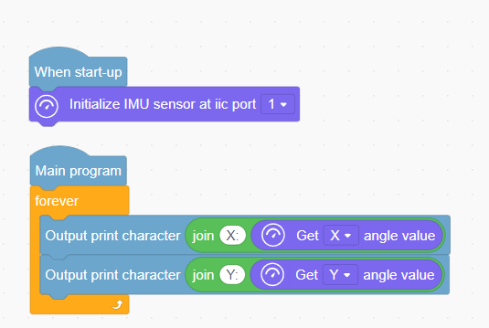

- 使用IMU传感器，需要在启动时初始化IMU传感器的接口，它可以接1/2/3/4任一接口，图中程序启动时使用”**等待2秒**“，是因为IMU传感器需要校准。

## 3.8 Infrared Obstacle Avoidance Sensor

### 3.8.1 Sensor Overview

这是一款用于检测前方是否存在障碍物的传感器。该传感器具有一个红外发射管和一个红外接收管，一旦传感器遇到障碍物，红外光就会反射回来被接收管接收。这个传感器用途广泛，传感器兼容乐高孔位，可进行更多创意DIY设计。

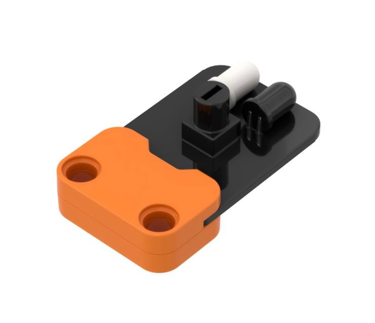

### 3.8.2 Specifications

<table style="text-align:center">
    <tr><th>工作电压</th><td>DC 5V</td></tr>
    <tr><th>工作电流</th><td>40mA</td></tr>
    <tr><th>有效探测范围</th><td>2~25cm</td></tr>
    <tr><th>探测范围调节方式</th><td>微型电位器调节</td></tr>
    <tr><th>接口型号</th><td>5264-4AW</td></tr>
    <tr><th>产品尺寸</th><td>39.5mm*23.5mm*10mm</td></tr>
</table>

### 3.8.3 Wiring Diagram

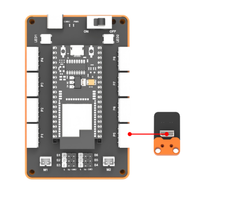

### 3.8.4 Test Demo

下载程序后，通过主控板载蜂鸣器测试避障传感器检测障碍物，未检测到障碍物时蜂鸣器不发声，检测到障碍物时蜂鸣器发声。

### 3.8.5 Program Screenshot

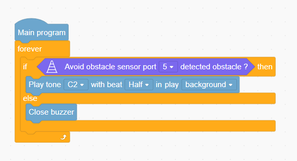

## 3.9 Light Sensor

### 3.9.1 Sensor Overview

这是一款检测外界光照强度的传感器，通常用来制作随光线强度变化产生特殊效果的互动作品，如路边照明灯自动控制系统、环境监控系统等。传感器兼容乐高孔位，可进行更多创意DIY设计。

### 3.9.2 Specifications

<table style="text-align:center">
    <tr><th>工作电压</th><td>DC 5V</td></tr>
    <tr><th>工作电流</th><td>5mA</td></tr>
    <tr><th>接口型号</th><td>5264-4AW</td></tr>
    <tr><th>产品尺寸</th><td>39.5mm*23.5mm*17.3mm</td></tr>
</table>

### 3.9.3 Wiring Diagram

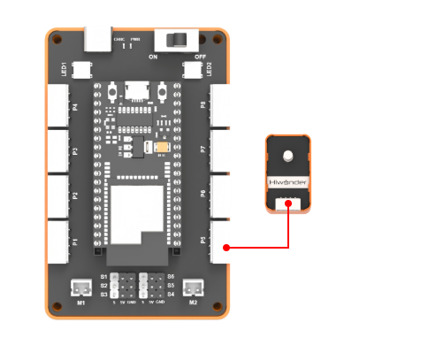

### 3.9.4 Test Demo

下载程序后，通过串口显示光线传感器检测光线强度的值。

### 3.9.5 Program Screenshot

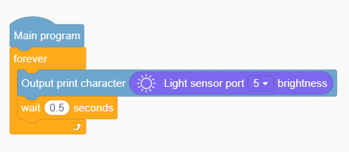

## 3.10 4-Channel Line Follower Sensor

### 3.10.1 Sensor Overview

四路巡线传感器可用于巡线识别。传感器兼容乐高孔位，可进行更多创意DIY设计。

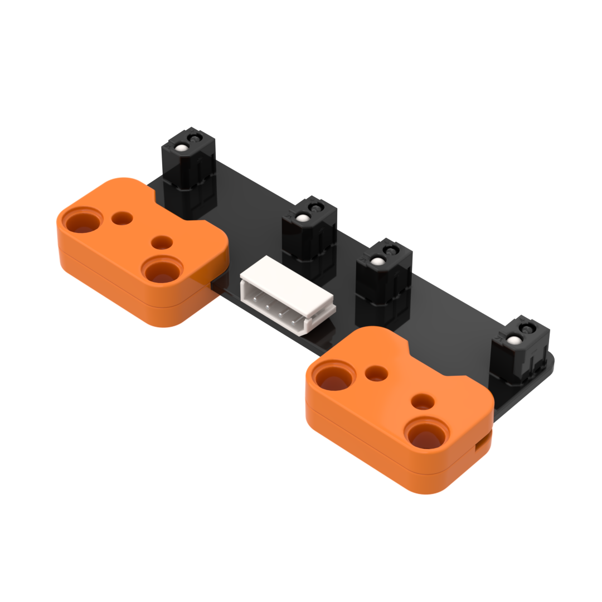

### 3.10.2 Specifications

<table style="text-align:center">
    <tr><th>工作电压</th><td>DC 5V</td></tr>
    <tr><th>有效区间</th><td>8~16mm</td></tr>
    <tr><th>接口类型</th><td>IIC</td></tr>
    <tr><th>接口型号</th><td>5264-4AW</td></tr>
    <tr><th>产品尺寸</th><td>71.7mm*31.2mm*9mm</td></tr>
</table>

### 3.10.3 Wiring Diagram

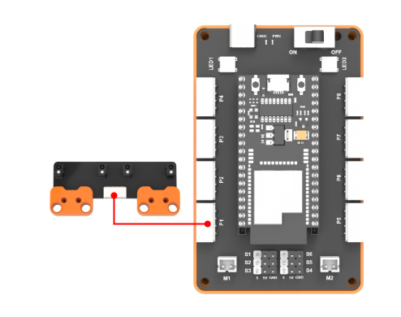

### 3.10.4 Learning Mode

四路巡线模块可通过按下传感器上的按键来学习地图背景和巡线轨迹（即黑色赛道）。按照以下步骤完成学习：

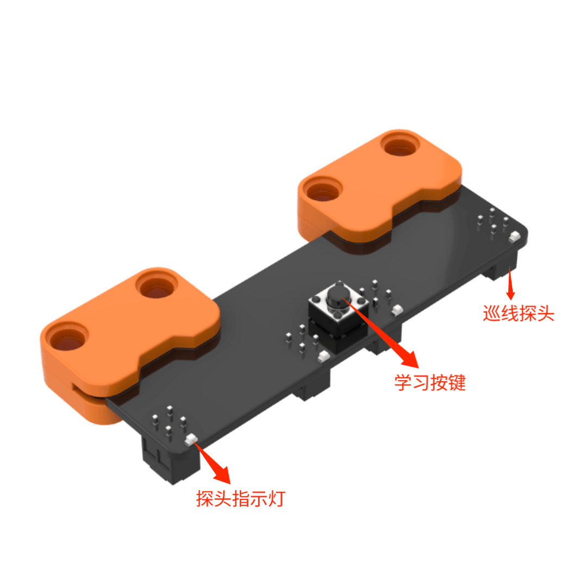

① 将四路巡线传感器探头正对地图背景区域并长按学习按键，此时1~4号探头指示灯同时闪烁，表示背景学习完成；

② 将四路巡线传感器探头正对将要巡线的线条并短按一次学习按键，此时1~4号探头指示灯同时闪烁，表示线条学习完成；

③ 当四路巡线传感器中间两个探头闪烁时，表示巡线传感器已学习完成。 

注意：使用时巡线探头的离地高度应在8mm~16mm之间。学习成功后，中间两个探头会闪烁，当巡线探头检测到巡线轨迹时，对应的探头指示灯灯会点亮。

### 3.10.5 Test Demo

下载程序后，使用四路巡线模块分别测试每个巡线探头，检测到黑线，输出对应探头数字。

### 3.10.6 Program Screenshot

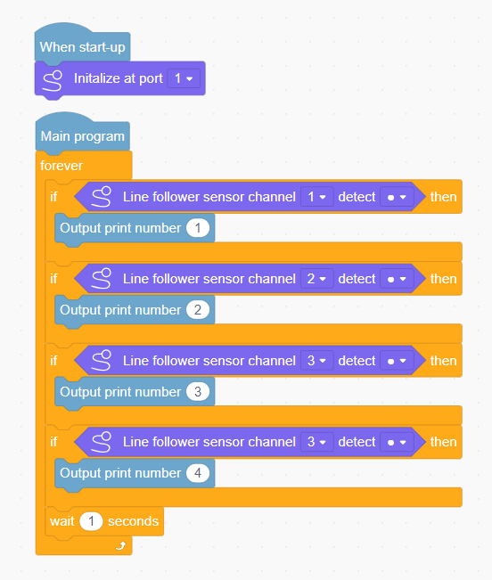

- 使用四路巡线传感器，需要在启动时初始化四路巡线传感器的接口，它可以接1/2/3/4任一接口。

## 3.11 Dot Matrix Module

### 3.11.1 Module Overview

这是一款 LED 点阵屏显示模块，具有显示亮度高，显示时无闪烁，接线方便等特点，可以显示数字、文本、图案等内容。同时模块板载了乐高兼容孔位，能进行更多创意 DIY 设计。

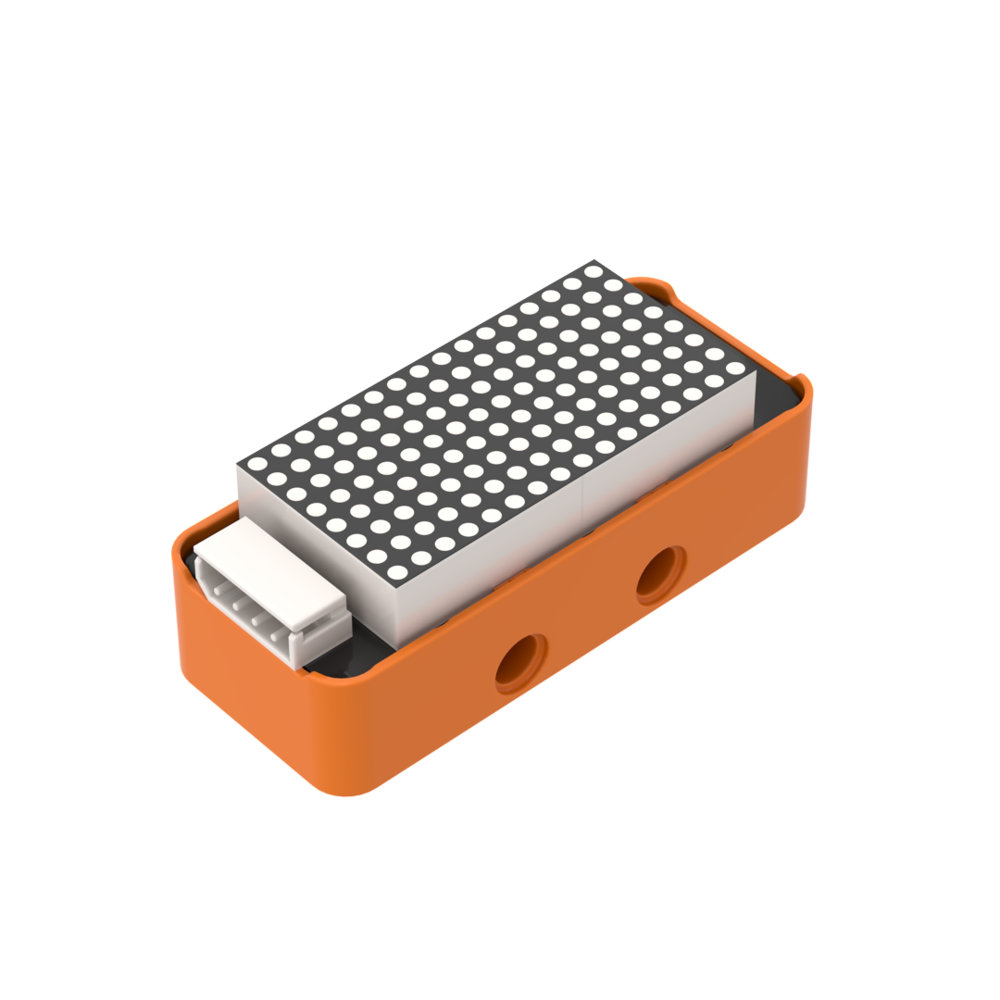

### 3.11.2 Specifications

<table style="text-align:center">
    <tr><th>工作电压</th><td>DC 5V</td></tr>
    <tr><th>工作电流</th><td>45mA</td></tr>
    <tr><th>点阵像素</th><td>8×16点阵</td></tr>
    <tr><th>点阵亮度</th><td>可调节8级亮度</td></tr>
    <tr><th>接口型号</th><td>5264-4AW</td></tr>
    <tr><th>产品尺寸</th><td>55.5mm*23.5mm*18.1mm</td></tr>
</table>

### 3.11.3 Wiring Diagram

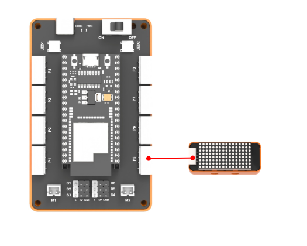

### 3.11.4 Test Demo

下载程序后，控制点阵屏切换显示“Hi”、“123”和“❤”。

### 3.11.5 Program Screenshot

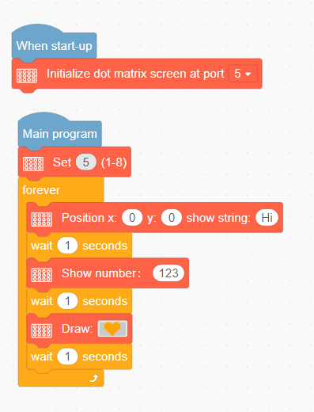

- 使用点阵屏模块，需要在启动时初始化点阵屏模块的接口，它可以接5/6/7/8任一接口。
