# 4. Standard Kit Creative Builds

## 4.1 Smart Gesture-Controlled Light

### 4.1.1 Project Overview

这是一盏会 “挥手变色” 的智能手控灯，超声波传感器每检测到一次挥手，灯的颜色就切换一次，共有红、绿、蓝和关灯四种状态，就像一位听话的灯光魔术师，用手势就能操控色彩变化。

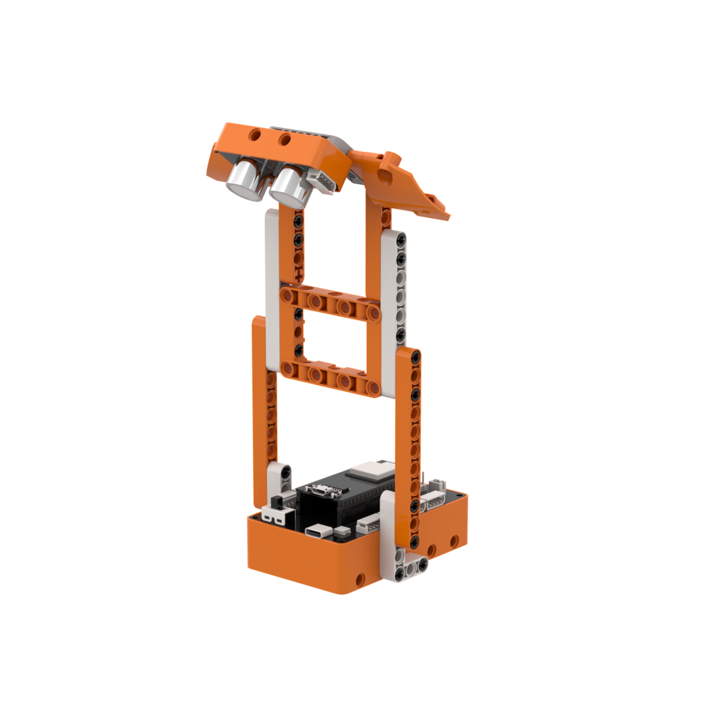

### 4.1.2 Learning Objectives

1. 在作品中实践超声波传感器的检测功能，理解手势触发与颜色切换的逻辑。
2. 掌握智能手控灯的机械搭建。
3. 学会编写 “超声波检测 + 颜色切换” 的程序，理解状态切换原理。
4. 提升动手实践与交互设计能力，感受手势控制的科技魅力。

### 4.1.3 Materials Needed

1. **材料准备**：主控器、超声波传感器、模块线、积木零件。

2. **模块介绍**：

<table style="text-align: center;vertical-align: middle;">
	<tr><td colspan="3">超声波传感器</td></tr>
	<tr><td>功能</td><td>检测挥手动作，触发彩灯颜色切换</td><td>输出红/绿/蓝三种颜色彩灯</td></tr>
    <tr><td>应用位置</td><td>安装在 “智能手控灯” 的灯架上</td><td>安装在 “智能手控灯” 的灯架上</td></tr>
    <tr><td>实现效果</td><td>每检测到一次挥手，向主控发送触发一次颜色切换的指令</td><td>接收到主控的指令后，循环切换红、绿、蓝和关灯四种状态</td></tr>
</table>

### 4.1.4 Assembly Guide{#build_manual_01}

### 4.1.5 Coding Steps

1. **打开平台**：启动编程软件，新建项目；

2. **添加扩展**：

- 在软件左下角打开 “**扩展**” ；

- 在 “**扩展**” 中选择”**主控器**“添加 “**K12 ESP32**” ；

- 在 “**扩展**” 中选择”**传感器**“添加 “**超声波传感器**” ；

3. **参考程序**：

- 启动时，初始化发光超声波的接口 1 ，关闭超声波所有彩灯，定义变量 “距离” 和 “灯光颜色” ，将两个变量初始化为 0 ；

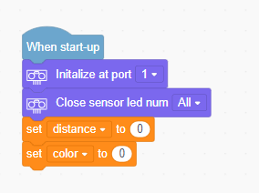

- 在主程序中进行距离检测：实时通过超声波传感器检测障碍物距离，将结果存入 “距离” 变量，当检测到的距离小于 15cm 时，将 “灯光颜色” 变量增加 1，实现颜色切换；

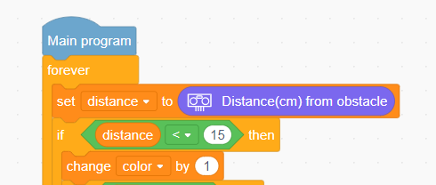

- 在主程序中进行灯光控制逻辑：当灯光颜色为 1 时，超声波彩灯显示红色，当灯光颜色为 2 时，超声波彩灯显示绿色，当灯光颜色为 3 时，超声波彩灯显示蓝色，当灯光颜色为 4 时，关闭彩灯，当灯光颜色为 5 时，将其重置为 0，完成颜色循环，每次颜色切换后等待 0.5 秒，主循环整体每 0.1 秒刷新一次。

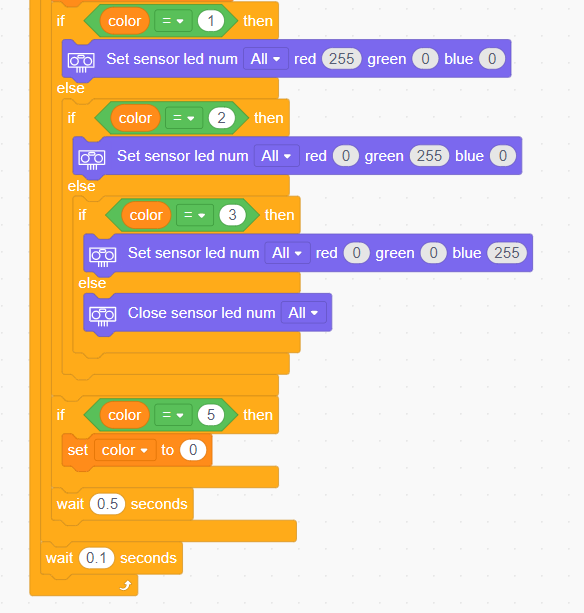

### 4.1.6 Program Download Steps

1. **连线**：用数据线将主控器与电脑 USB 端口连接；

2. **选端口**：在编程软件中选择主控器对应的 COM 端口（**COM口不唯一**）；

3. **下载**：点击 “**下载**” 按钮，将编写好的程序上传至主控器；

4. **开机**：给主控器接通电源，启动设备，测试功能。

### 4.1.7 Demo

## 4.2 Motorized Windmill

### 4.2.1 Project Overview

这是一台会 “自动转动” 的电动风车，上电后电机就带动风车叶片持续旋转，就像田野里的小风车，迎着风欢快转动，充满生机与活力。

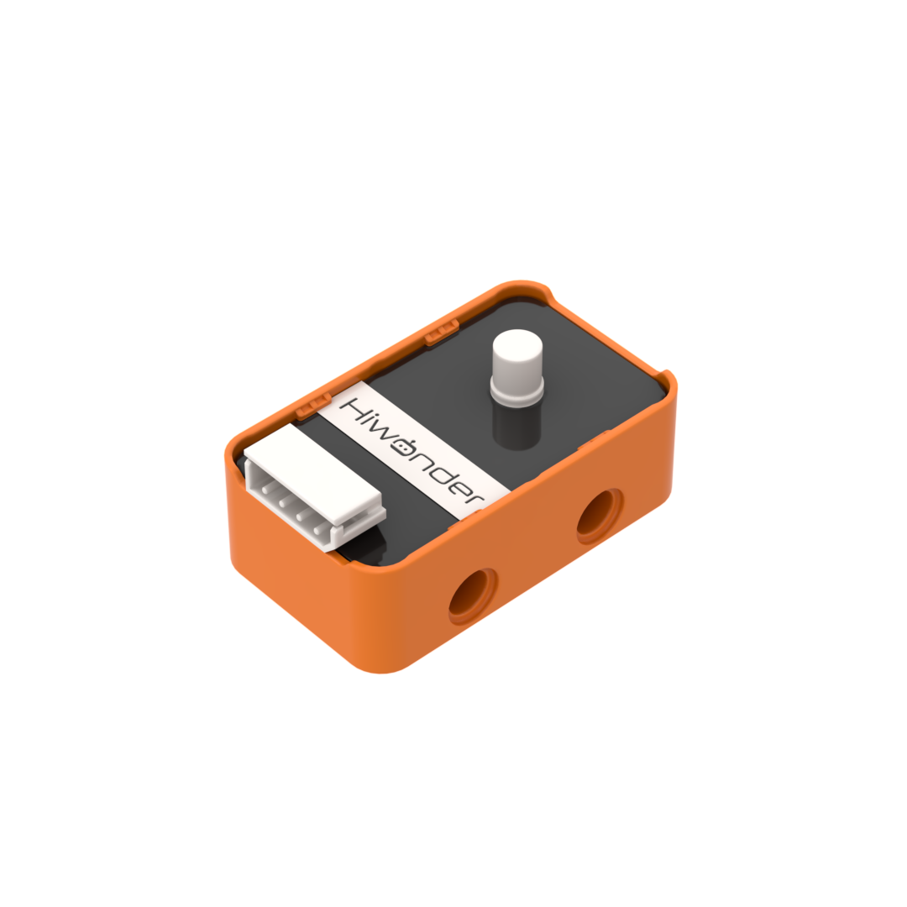

### 4.2.2 Learning Objectives

1. 在作品中实践电机的基础控制功能，理解上电启动与持续转动的逻辑。
2. 掌握电动风车的机械搭建。
3. 学会编写 “上电启动 + 持续转动” 的程序，理解电机基础控制原理。
4. 提升动手实践与机械结构理解能力，感受简单动力装置的乐趣。

### 4.2.3 Materials Needed

1. **材料准备**：主控器、电机、模块线、积木零件。

2. **模块介绍**：

<table style="text-align: center;vertical-align: middle;">
	<tr><td colspan="2">电机模块</td></tr>
	<tr><td>功能</td><td>提供风车转动动力</td></tr>
    <tr><td>应用位置</td><td>安装在 “电动风车” 的转轴处</td></tr>
    <tr><td>实现效果</td><td>接收主控信号后，控制风车叶片持续旋转</td></tr>
</table>

### 4.2.4 Assembly Guide{#build_manual_02}

### 4.2.5 Coding Steps

1. **打开平台**：启动编程软件，新建项目；

2. **添加扩展**：

- 在软件左下角打开 “**扩展**” ；

- 在 “**扩展**” 中选择”**主控器**“添加 “**K12 ESP32**” ；

3. **参考程序**：

- 在主程序中进行电机控制：电机 S1 以 60 的速度控制风车持续转动，每 0.1 秒刷新一次控制指令，保证电机保持稳定的转动状态。

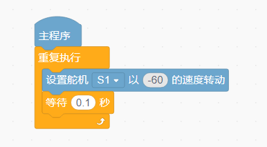

### 4.2.6 Program Download Steps

1. **连线**：用数据线将主控器与电脑 USB 端口连接；

2. **选端口**：在编程软件中选择主控器对应的 COM 端口（**COM口不唯一**）；

3. **下载**：点击 “**下载**” 按钮，将编写好的程序上传至主控器；

4. **开机**：给主控器接通电源，启动设备，测试功能。

### 4.2.7 Demo

## 4.3 Sound-Activated Ferris Wheel

### 4.3.1 Project Overview

这是一座会 “听声变速” 的声控摩天轮，根据声音传感器检测到的声音次数控制转动速度，转动时主控板 RGB 灯还会持续闪烁，就像游乐园里的欢乐摩天轮，声音越热闹，转得越快，灯光越炫。

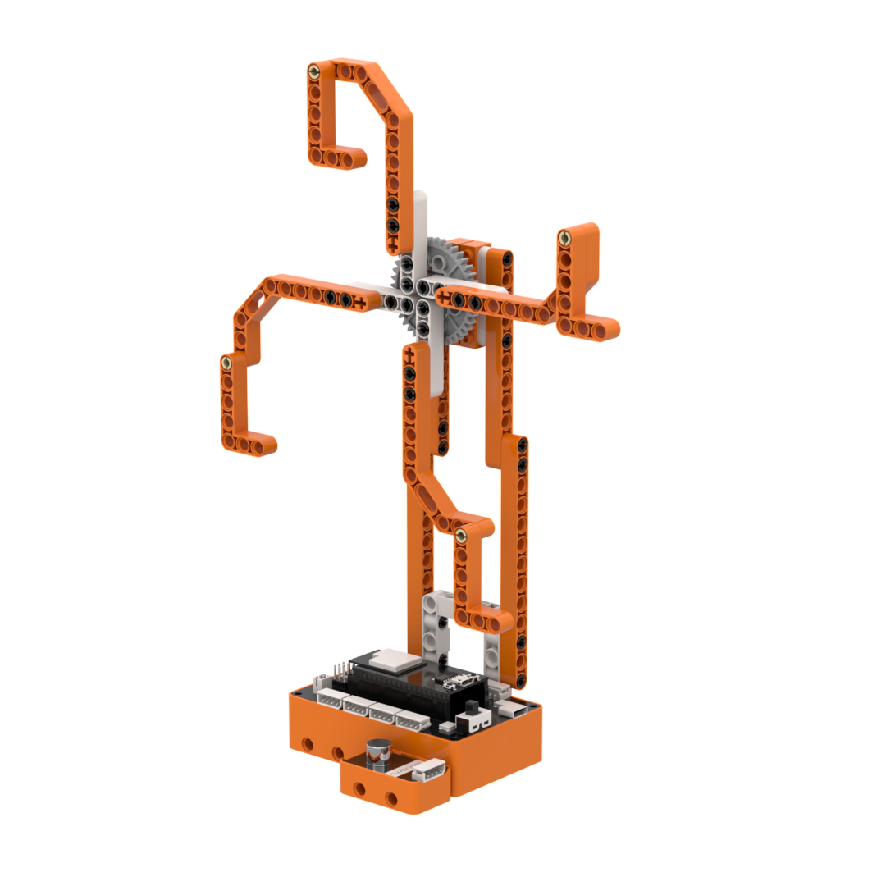

### 4.3.2 Learning Objectives

1. 在作品中实践电机、声音传感器与主控 RGB 灯的基础功能，理解声音检测、速度控制与灯光闪烁的联动逻辑。
2. 掌握声控摩天轮的机械搭建。
3. 学会编写 “声音计数 + 速度切换 + 灯光闪烁” 的程序，理解多设备协同工作原理。
4. 提升动手实践与交互设计能力，感受声控互动的编程乐趣。

### 4.3.3 Materials Needed

1. **材料准备**：主控器、电机、声音传感器、模块线、积木零件。

2. **模块介绍**：

<table style="text-align: center;vertical-align: middle;">
	<tr><td colspan="2">声音传感器</td></tr>
	<tr><td>功能</td><td>检测声音次数，触发摩天轮变速与停止</td></tr>
    <tr><td>应用位置</td><td>安装在 “声控摩天轮” 的底座侧面</td></tr>
    <tr><td>实现效果</td><td>每检测到一次声音，计数+1，向主控发送切换转动速度的指令</td></tr>
</table>

<table style="text-align: center;vertical-align: middle;">
	<tr><td colspan="2">电机模块</td></tr>
	<tr><td>功能</td><td>提供摩天轮转动动力	</td></tr>
    <tr><td>应用位置</td><td>安装在 “声控摩天轮” 的转轴处</td></tr>
    <tr><td>实现效果</td><td>接收到主控的指令后，根据声音次数切换不同转动速度</td></tr>
</table>

### 4.3.4 Assembly Guide{#build_manual_03}

### 4.3.5 Coding Steps

1. **打开平台**：启动编程软件，新建项目；

2. **添加扩展**：

- 在软件左下角打开 “**扩展**” ；

- 在 “**扩展**” 中选择”**主控器**“添加 “**K12 ESP32**” ；

- 在 “**扩展**” 中选择”**传感器**“添加 “**声音传感器**” ；

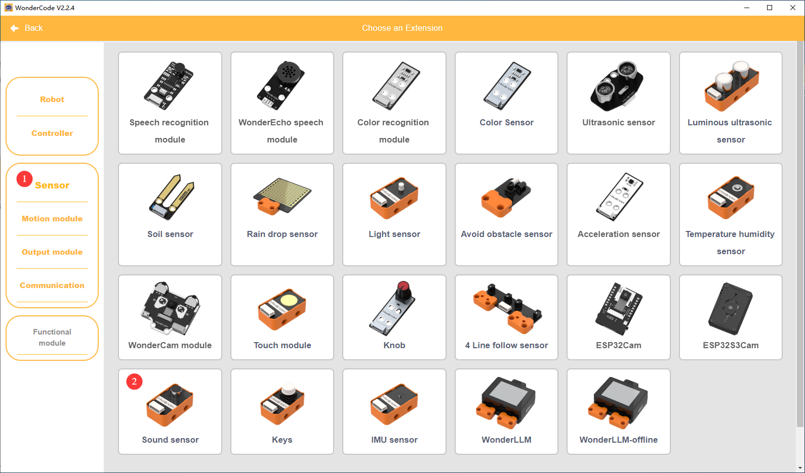

3. **参考程序**：

- 启动时，定义变量 “声音次数” 和 “状态” ，将两个变量初始化为 0 、1，进入声音检测等待状态；

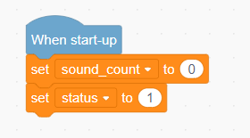

- 在主程序中进行声音检测和计时：当 “状态” 为 1 时，若声音传感器（接口 5 ）检测到音量值大于 35，将 “声音次数” 加 1，记录当前系统时间到变量 “时间“，防抖等待 0.1 秒，当前系统时间 - “时间“> 3000ms（3 秒），将 ”状态“ 设为 0，进入电机控制阶段，即摩天轮转动阶段；

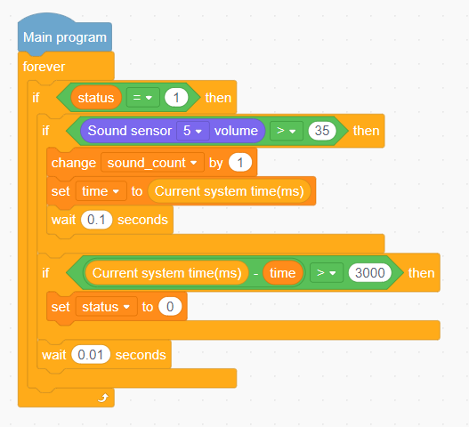

- 在主程序中根据 ”声音次数“ 进行电机控制：，当 “状态” 为 0 时，若声音次数为 1，电机 S1 以 20 速度控制摩天轮转动 5 秒后停止，如声音次数为 2，电机 S1 以 35 速度控制摩天轮转动 5 秒后停止，若声音次数大于等于 3 ，电机 S1 以 50 速度转动 5 秒后停止，每次转动主控 RGB 灯都进入闪烁各种颜色的呼吸灯，模拟游乐场的灯光，动作完成后，将 “状态” 设为 1，“声音次数” 设为 0，重新记录系统时间，等待下一次声音触发，控制频率为 0.01 秒，保证响应及时。

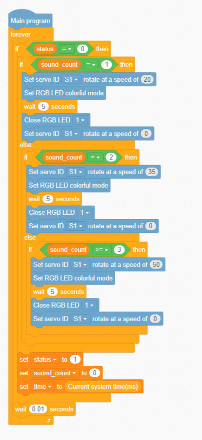

### 4.3.6 Program Download Steps

1. **连线**：用数据线将主控器与电脑 USB 端口连接；

2. **选端口**：在编程软件中选择主控器对应的 COM 端口（**COM口不唯一**）；

3. **下载**：点击 “**下载**” 按钮，将编写好的程序上传至主控器；

4. **开机**：给主控器接通电源，启动设备，测试功能。

### 4.3.7 Demo

## 4.4 Rotating Swing Ride

### 4.4.1 Project Overview

这是一台会 “按键启停” 的旋转飞椅，按下按键就启动旋转，再次按下就停止转动，就像游乐园里的刺激飞椅，简单操控就能体验旋转的快乐。

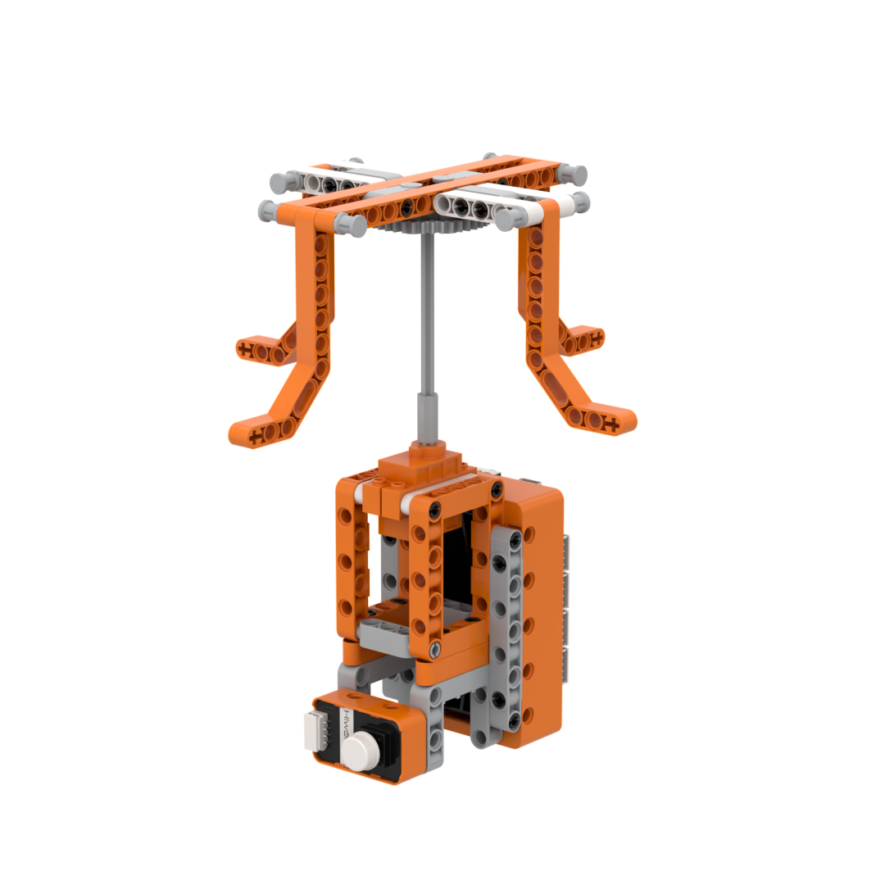

### 4.4.2 Learning Objectives

1. 在作品实践电机与按键的基础功能，理解按键触发与启停控制的逻辑。
2. 掌握旋转飞椅的机械搭建。
3. 学会编写 “按键触发 + 电机启停” 的程序，理解状态切换原理。
4. 提升动手实践与交互设计能力，感受按键控制的编程乐趣。

### 4.4.3 Materials Needed

1. **材料准备**：主控器、电机、按键传感器、模块线、积木零件。

2. **模块介绍**：

<table style="text-align: center;vertical-align: middle;">
	<tr><td colspan="2">按键传感器</td></tr>
	<tr><td>功能</td><td>检测按压动作，触发旋转飞椅的启停</td></tr>
    <tr><td>应用位置</td><td>安装在 “旋转飞椅” 的底座旁</td></tr>
    <tr><td>实现效果</td><td>每检测到一次按压信号，向主控发送状态切换的指令</td></tr>
</table>

<table style="text-align: center;vertical-align: middle;">
	<tr><td colspan="2">电机模块</td></tr>
	<tr><td>功能</td><td>提供飞椅旋转动力</td></tr>
    <tr><td>应用位置</td><td>安装在 “旋转飞椅” 的转轴处</td></tr>
    <tr><td>实现效果</td><td>接收到主控的指令后，控制飞椅启动与停止旋转</td></tr>
</table>

### 4.4.4 Assembly Guide{#build_manual_04}

### 4.4.5 Coding Steps

1. **打开平台**：启动编程软件，新建项目；

2. **添加扩展**：

- 在软件左下角打开 “**扩展**” ；

- 在 “**扩展**” 中选择”**主控器**“添加 “**K12 ESP32**” ；

- 在 “**扩展**” 中选择”**传感器**“添加 “**按键传感器**” ；

3. **参考程序**：

- 启动时，定义变量“运行状态”，并将变量初始化为 -1（-1是没有转动，1是在转动）；

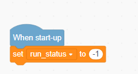

- 在主程序中进行按键检测和电机控制：当按键（接口5）被按下，将 “运行状态” 设置为“0-运行状态”（即取反），实现状态翻转，并等待 0.5 秒防抖；若 “运行状态” 为 1 ，电机 S1 以 50 的速度控制飞椅转动，否则停止转动。

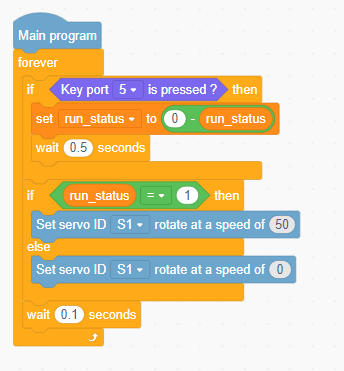

### 4.4.6 Program Download Steps

1. **连线**：用数据线将主控器与电脑 USB 端口连接；

2. **选端口**：在编程软件中选择主控器对应的 COM 端口（**COM口不唯一**）；

3. **下载**：点击 “**下载**” 按钮，将编写好的程序上传至主控器；

4. **开机**：给主控器接通电源，启动设备，测试功能。

### 4.4.7 Demo

## 4.5 Rotary Cutter

### 4.5.1 Project Overview

这是一台会 “触摸启停” 的飞转切割机，触摸传感器检测到触摸时，电机启动带动切割刀片转动；无触摸时，电机立即停止，就像安全的小工匠，只有在操作时才运转，保障使用安全。

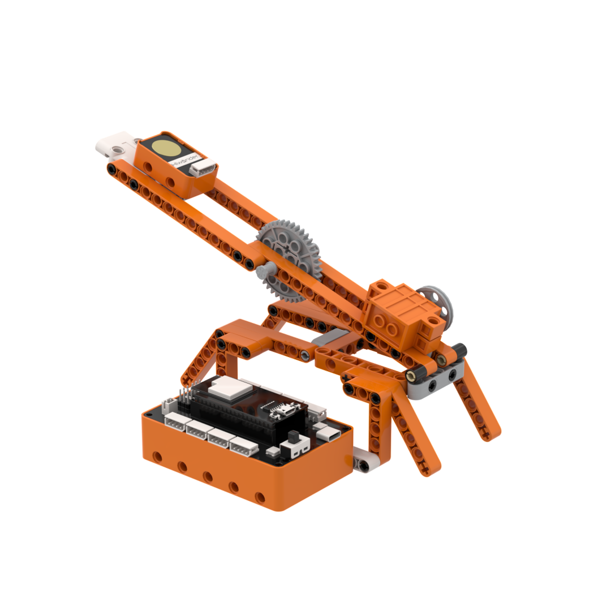

### 4.5.2 Learning Objectives

1. 在作品中实践电机与触摸传感器的基础功能，理解触摸检测与启停控制的逻辑。
2. 掌握飞转切割机的机械搭建。
3. 学会编写 “触摸触发 + 电机启停” 的程序，理解安全控制原理。
4. 提升动手实践与安全设计能力，感受工业工具的智能安全改造。

### 4.5.3 Materials Needed

1. **材料准备**：主控器、电机、触摸传感器、模块线、积木零件。

2. **模块介绍**：

<table style="text-align: center;vertical-align: middle;">
	<tr><td colspan="2">触摸传感器</td></tr>
	<tr><td>功能</td><td>检测触摸信号，触发切割机的启停</td></tr>
    <tr><td>应用位置</td><td>安装在 “飞转切割机” 的手柄旁</td></tr>
    <tr><td>实现效果</td><td>每检测到一次触摸信号，向主控发送状态切换的指令</td></tr>
</table>

<table style="text-align: center;vertical-align: middle;">
	<tr><td colspan="2">电机模块</td></tr>
	<tr><td>功能</td><td>提供切割刀片转动动力</td></tr>
    <tr><td>应用位置</td><td>安装在 “飞转切割机” 的刀片转轴处</td></tr>
    <tr><td>实现效果</td><td>接收到主控的指令后，控制切割机的启动与停止</td></tr>
</table>

### 4.5.4 Assembly Guide{#build_manual_05}

### 4.5.5 Coding Steps

1. **打开平台**：启动编程软件，新建项目；

2. **添加扩展**：

- 在软件左下角打开 “**扩展**” ；

- 在 “**扩展**” 中选择”**主控器**“添加 “**K12 ESP32**” ；

- 在 “**扩展**” 中选择”**传感器**“添加 “**触摸传感器**” ；

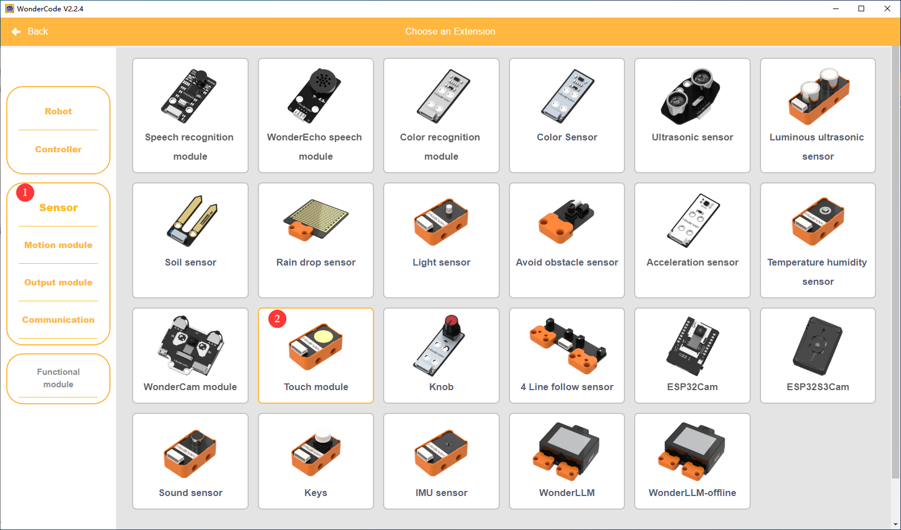

3. **参考程序**：

- 在启动时，先初始化触摸传感器的接口 5 ；

- 在主程序中进行触摸检测和电机控制：如果触摸传感器检测到触摸，电机开始以50的速度持续转动，模拟刀片切割动作，若停止触摸，电机则停止转动。

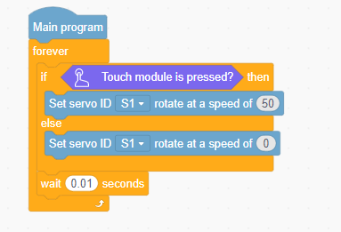

### 4.5.6 Program Download Steps

1. **连线**：用数据线将主控器与电脑 USB 端口连接；

2. **选端口**：在编程软件中选择主控器对应的 COM 端口（**COM口不唯一**）；

3. **下载**：点击 “**下载**” 按钮，将编写好的程序上传至主控器；

4. **开机**：给主控器接通电源，启动设备，测试功能。

### 4.5.7 Demo

## 4.6 Dual-Control Fishing Rod

### 4.6.1 Project Overview

这是一根会 “双控操作” 的双控钓鱼竿，按键控制放鱼饵，触摸控制收鱼饵，就像一位专业的钓鱼爱好者，用简单的操控就能体验放饵、收饵的乐趣。

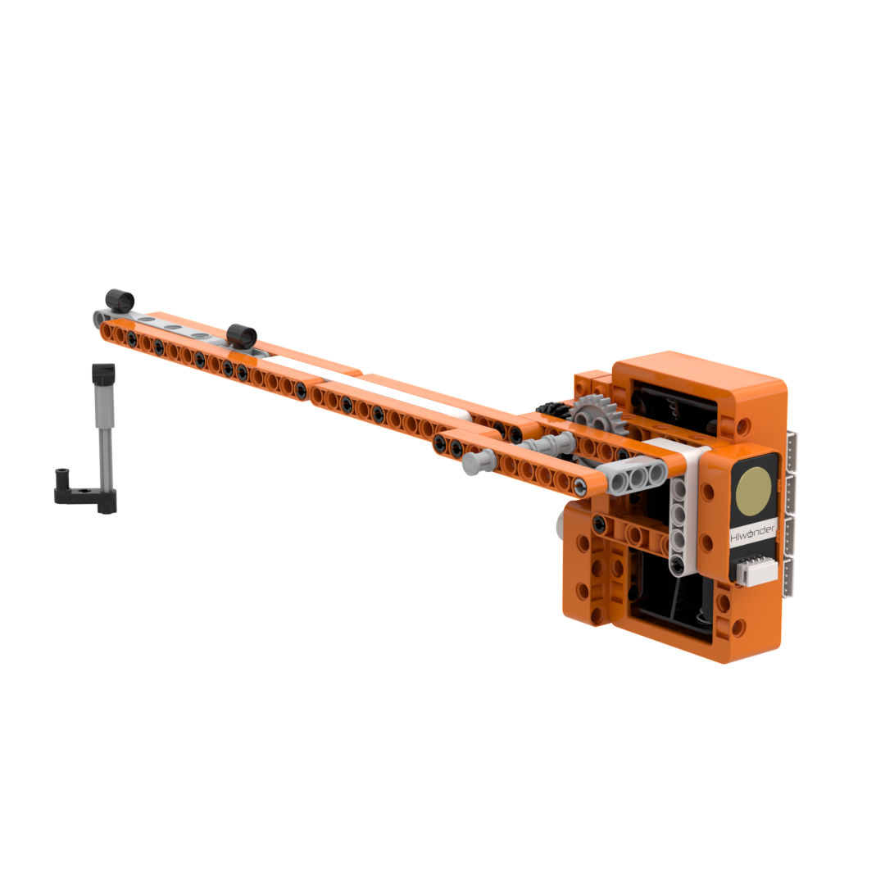

### 4.6.2 Learning Objectives

1. 在作品中实践电机、按键与触摸传感器的基础功能，理解双控操作与收放饵的逻辑。
2. 掌握双控钓鱼竿的机械搭建。
3. 学会编写 “按键放饵 + 触摸收饵” 的程序，理解多指令协同控制原理。
4. 提升动手实践与交互设计能力，感受双控操作的编程乐趣。

### 4.6.3 Materials Needed

1. **材料准备**：主控器、电机、按键传感器、触摸传感器、模块线、积木零件。

2. **模块介绍**：

<table style="text-align: center;vertical-align: middle;">
	<tr><td colspan="2">按键传感器</td></tr>
	<tr><td>功能</td><td>检测按压动作，触发放鱼饵动作</td></tr>
    <tr><td>应用位置</td><td>安装在 “双控钓鱼竿” 支架上</td></tr>
    <tr><td>实现效果</td><td>检测到按压信号，向主控发送放鱼饵的指令</td></tr>
</table>

<table style="text-align: center;vertical-align: middle;">
	<tr><td colspan="2">触摸传感器</td></tr>
	<tr><td>功能</td><td>检测触摸动作，触发收鱼饵动作</td></tr>
    <tr><td>应用位置</td><td>安装在 “双控钓鱼竿” 支架上</td></tr>
    <tr><td>实现效果</td><td>检测到触摸信号，向主控发送收鱼饵的指令</td></tr>
</table>

<table style="text-align: center;vertical-align: middle;">
	<tr><td colspan="2">电机模块</td></tr>
	<tr><td>功能</td><td>提供鱼线轮收放动力</td></tr>
    <tr><td>应用位置</td><td>安装在 “双控钓鱼竿” 钓鱼线转轴处</td></tr>
    <tr><td>实现效果</td><td>接收到主控的指令后，控制鱼线轮正转/反转，实现收饵/放饵动作</td></tr>
</table>

### 4.6.4 Assembly Guide{#build_manual_06}

### 4.6.5 Coding Steps

1. **打开平台**：启动编程软件，新建项目；

2. **添加扩展**：

- 在软件左下角打开 “**扩展**” ；

- 在 “**扩展**” 中选择”**主控器**“添加 “**K12 ESP32**” ；

- 在 “**扩展**” 中选择”**传感器**“添加 “**按键传感器**” 、“**触摸传感器**” ；

3. **参考程序**：

- 启动时，初始化触摸传感器的接口为 6；

- 在主程序中进行按键检测与电机控制：若按键（接口 5 ）被按下，电机 S1 以 80 的速度控制放出鱼饵，若触摸被按下，电机 S1 以 80 的速度控制收回鱼饵，若两者都未触发，电机 S1 停止转动，每 0.1 秒刷新一次检测与控制状态，保证响应及时。

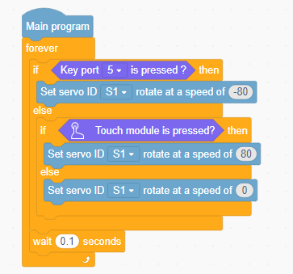

### 4.6.6 Program Download Steps

1. **连线**：用数据线将主控器与电脑 USB 端口连接；

2. **选端口**：在编程软件中选择主控器对应的 COM 端口（**COM口不唯一**）；

3. **下载**：点击 “**下载**” 按钮，将编写好的程序上传至主控器；

4. **开机**：给主控器接通电源，启动设备，测试功能。

### 4.6.7 Demo

## 4.7 Sentinel Radar

### 4.7.1 Project Overview

这是一台会 “自动警戒” 的警戒雷达，开机后雷达自动启动旋转，当超声波检测到物体时，立即停止转动，同时闪烁红灯并发出警报声，就像一位警惕的哨兵，时刻守护着区域安全。

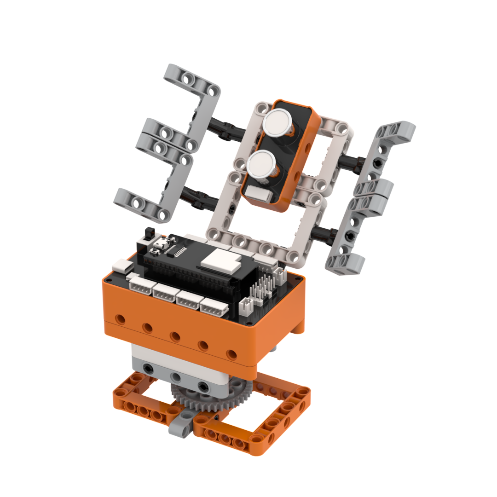

### 4.7.2 Learning Objectives

1. 在作品中实践电机与超声波传感器的基础功能，理解旋转、检测、报警的联动逻辑。
2. 掌握警戒雷达的机械搭建。
3. 学会编写 “旋转 + 检测 + 停止 + 报警” 的程序，理解多设备协同工作原理。
4. 提升动手实践与安全监控设计能力，感受智能警戒的科技魅力。

### 4.7.3 Materials Needed

1. **材料准备**：主控器、电机、超声波传感器、模块线、积木零件。

2. **模块介绍**：

<table style="text-align: center;vertical-align: middle;">
	<tr><td colspan="3">超声波传感器</td></tr>
	<tr><td>功能</td><td>检测前方物体的距离，触发报警信号</td><td>输出红色彩灯</td></tr>
    <tr><td>应用位置</td><td>安装在 “警戒雷达” 的正前方</td><td>安装在 “警戒雷达” 的正前方</td></tr>
    <tr><td>实现效果</td><td>每检测到一次物体距离小于15值时，向主控发送电机停止和报警指令</td><td>接收到主控的指令后，控制彩灯红光闪烁三次</td></tr>
</table>

<table style="text-align: center;vertical-align: middle;">
	<tr><td colspan="2">电机模块</td></tr>
	<tr><td>功能</td><td>提供雷达旋转的动力</td></tr>
    <tr><td>应用位置</td><td>安装在 “警戒雷达” 的转轮处</td></tr>
    <tr><td>实现效果</td><td>上电持续旋转，接收到主控的指令后，停止转动</td></tr>
</table>

### 4.7.4 Assembly Guide{#build_manual_07}

### 4.7.5 Coding Steps

1. **打开平台**：启动编程软件，新建项目；

2. **添加扩展**：

- 在软件左下角打开 “**扩展**” ；

- 在 “**扩展**” 中选择”**主控器**“添加 “**K12 ESP32**” ；

- 在 “**扩展**” 中选择”**传感器**“添加 “**超声波传感器**” ；

3. **参考程序**：

- 启动时，先初始化超声波传感器的接口1，关闭所有彩灯，定义变量“距离”，并初始化为 0；

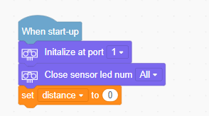

- 在主程序中进行距离检测、电机控制和声光警示：实时通过超声波传感器检测障碍物距离，将结果存入 “距离” 变量，如果距离小于 15cm时，电机 S1 停止转动，闪烁三次红色彩灯和警报音，等待 0.2 秒，电机 S1 以 15 的速度控制雷达继续转动，每 0.1 秒刷新一次检测与控制状态。

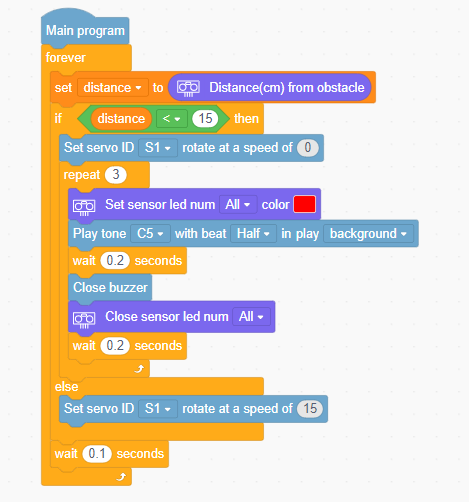

### 4.7.6 Program Download Steps

1. **连线**：用数据线将主控器与电脑 USB 端口连接；

2. **选端口**：在编程软件中选择主控器对应的 COM 端口（**COM口不唯一**）；

3. **下载**：点击 “**下载**” 按钮，将编写好的程序上传至主控器；

4. **开机**：给主控器接通电源，启动设备，测试功能。

### 4.7.7 Demo

## 4.8 Vintage Waterwheel

### 4.8.1 Project Overview

这是一台会 “三档变速” 的老式水车，按键切换三个档位的速度，第四次按下时停止转动，就像乡村里的老水车，一步步唤醒动力，充满复古韵味。

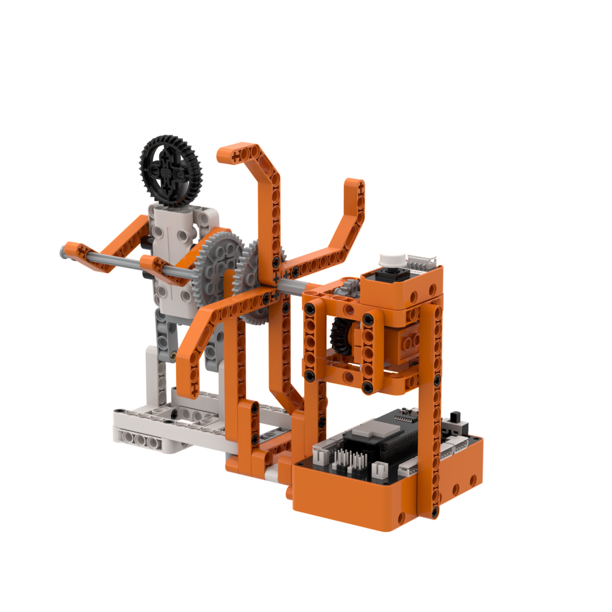

### 4.8.2 Learning Objectives

1. 在作品中实践电机、按键的基础功能，理解按键触发与多级转速控制的逻辑。
2. 掌握老式三档水车的机械搭建。
3. 学会编写 “按键触发 + 转速切换 + 停止” 的程序，理解状态切换与电机调速原理。
4. 提升动手实践与逻辑思维能力，感受传统农具的科技化改造乐趣。

### 4.8.3 Materials Needed

1. **材料准备**：主控器、电机、按键传感器、模块线、积木零件。

2. **模块介绍**：

<table style="text-align: center;vertical-align: middle;">
	<tr><td colspan="2">按键传感器</td></tr>
	<tr><td>功能</td><td>检测按压信号，触发水车变速和停止</td></tr>
    <tr><td>应用位置</td><td>安装在 “老式水车” 的支架上</td></tr>
    <tr><td>实现效果</td><td>每检测一次按压信号，计数+1，向主控发送切换转动速度的指令，直到第四次按下停止转动</td></tr>
</table>

<table style="text-align: center;vertical-align: middle;">
	<tr><td colspan="2">电机模块</td></tr>
	<tr><td>功能</td><td>提供水车叶片转动动力</td></tr>
    <tr><td>应用位置</td><td>安装在 “老式水车” 的转轴处</td></tr>
    <tr><td>实现效果</td><td>接收到主控的指令后，控制水车30/60/90切换速度及停止</td></tr>
</table>

### 4.8.4 Assembly Guide{#build_manual_08}

### 4.8.5 Coding Steps

1. **打开平台**：启动编程软件，新建项目；

2. **添加扩展**：

- 在软件左下角打开 “**扩展**” ；

- 在 “**扩展**” 中选择”**主控器**“添加 “**K12 ESP32**” ；

- 在 “**扩展**” 中选择”**传感器**“添加 “**按键传感器**” ；

3. **参考程序**：

- 启动时，定义变量 “按键次数” ，将变量初始化为 0 ；

- 在主程序中进行按键检测和电机控制：当按键（接口 8 ）被按下时，先等待 0.1 秒进行防抖，再次确认按键仍被按下后，将 “按键次数” 变量增加 1，并等待按键松开，当 “按键次数” 累计到 4 次时，自动重置为 0，最后根据 “按键次数” 的数值，电机 S1 以 30 倍按键次数（30/60/90）的速度控制水车转动，实现按键次数控制水车转速的功能。

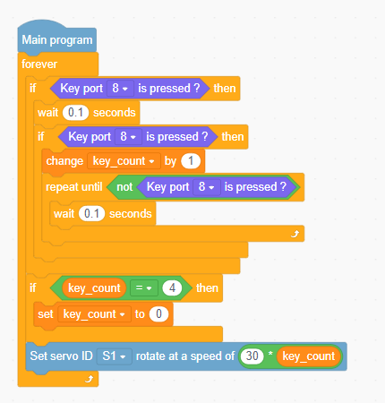

### 4.8.6 Program Download Steps

1. **连线**：用数据线将主控器与电脑 USB 端口连接；

2. **选端口**：在编程软件中选择主控器对应的 COM 端口（**COM口不唯一**）；

3. **下载**：点击 “**下载**” 按钮，将编写好的程序上传至主控器；

4. **开机**：给主控器接通电源，启动设备，测试功能。

### 4.8.7 Demo

## 4.9 Unicycle Rider

### 4.9.1 Project Overview

这是一位会 “按键骑行” 的骑行独轮侠，按键控制小人骑行与停止，就像一位勇敢的独轮车骑手，简单操控就能体验骑行的快乐。

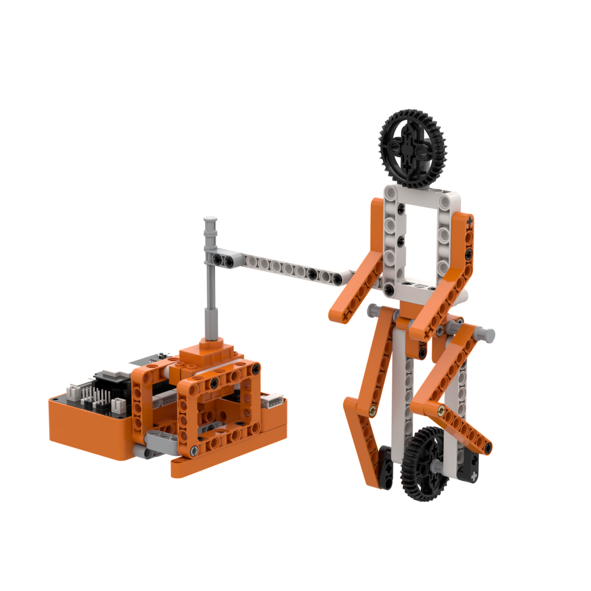

### 4.9.2 Learning Objectives

1. 在作品中实践电机与按键的基础功能，理解按键触发与骑行启停的逻辑。
2. 掌握骑行独轮侠的机械搭建。
3. 学会编写 “按键触发 + 电机启停” 的程序，理解状态切换原理。
4. 提升动手实践与交互设计能力，感受仿生骑行的编程乐趣。

### 4.9.3 Materials Needed

1. **材料准备**：主控器、电机、按键传感器、模块线、积木零件。

2. **模块介绍**：

<table style="text-align: center;vertical-align: middle;">
	<tr><td colspan="2">按键传感器</td></tr>
	<tr><td>功能</td><td>检测按压信号，触发骑行的启停</td></tr>
    <tr><td>应用位置</td><td>安装在 “独轮骑行侠” 的底座上</td></tr>
    <tr><td>实现效果</td><td>每检测到一次按压信号，向主控发送状态切换的指令</td></tr>
</table>

<table style="text-align: center;vertical-align: middle;">
	<tr><td colspan="2">电机模块</td></tr>
	<tr><td>功能</td><td>提供直升机螺旋桨转动的动力</td></tr>
    <tr><td>应用位置</td><td>安装在 “独轮骑行侠” 的转轴处</td></tr>
    <tr><td>实现效果</td><td>接收到主控的指令后，控制骑行的启动与停止</td></tr>
</table>

### 4.9.4 Assembly Guide{#build_manual_09}

### 4.9.5 Coding Steps

1. **打开平台**：启动编程软件，新建项目；

2. **添加扩展**：

- 在软件左下角打开 “**扩展**” ；

- 在 “**扩展**” 中选择”**主控器**“添加 “**K12 ESP32**” ；

- 在 “**扩展**” 中选择”**传感器**“添加 “**按键传感器**” ；

3. **参考程序**：

- 启动时，定义变量 “运行状态” ，并将变量初始化为 -1 （-1为没有骑行，1为在骑行）；

- 在主程序中进行按键检测和电机控制：当按键（接口5）被按下，将 “运行状态” 设置为“0-运行状态”（即取反），实现状态翻转，并等待 0.5 秒防抖；若 “运行状态” 为 1 ，电机 S1 以 50 的速度控制小人骑行，否则停止骑行。

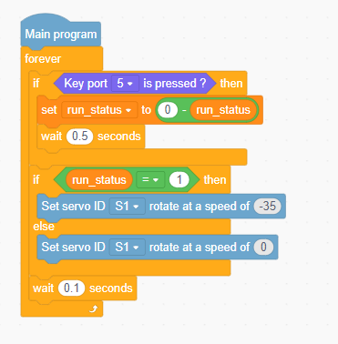

### 4.9.6 Program Download Steps

1. **连线**：用数据线将主控器与电脑 USB 端口连接；

2. **选端口**：在编程软件中选择主控器对应的 COM 端口（**COM口不唯一**）；

3. **下载**：点击 “**下载**” 按钮，将编写好的程序上传至主控器；

4. **开机**：给主控器接通电源，启动设备，测试功能。

### 4.9.7 Demo

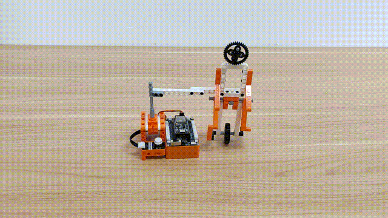

## 4.10 Twist Dancer

### 4.10.1 Project Overview

这是一位会 “声控扭腰” 的扭腰达人，声音传感器检测到声音后，小人就开始扭腰，就像派对上的舞蹈担当，跟着声音节奏扭动起来，充满活力。

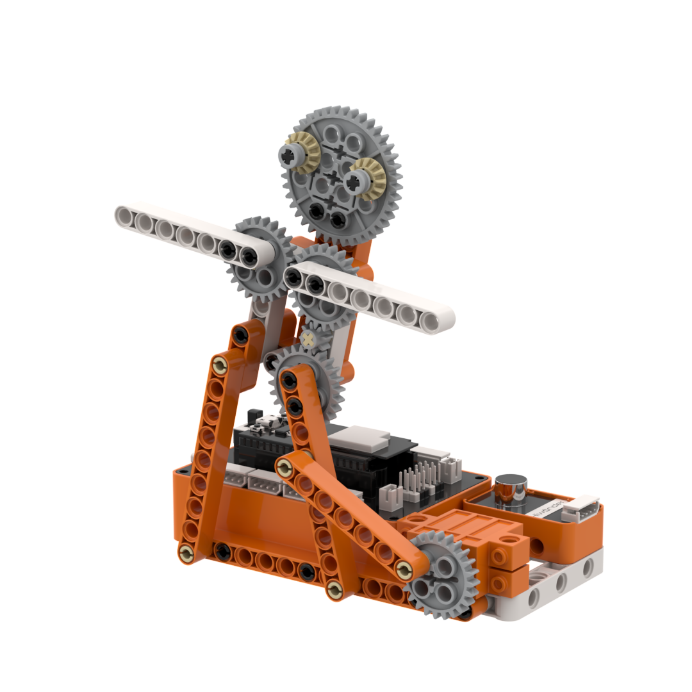

### 4.10.2 Learning Objectives

1. 在作品中实践电机、声音的基础功能，理解声音检测与多级扭腰控制的逻辑。
2. 掌握扭腰达人的机械搭建。
3. 学会编写 “声音触发 + 扭腰动作” 的程序，理解状态切换与电机调速原理。
4. 提升动手实践与创意表达能力，感受声控互动的编程乐趣。

### 4.10.3 Materials Needed

1. **材料准备**：主控器、电机、声音传感器、模块线、积木零件。

2. **模块介绍**：

<table style="text-align: center;vertical-align: middle;">
	<tr><td colspan="2">声音传感器</td></tr>
	<tr><td>功能</td><td>检测声音信号，触发扭腰动作</td></tr>
    <tr><td>应用位置</td><td>安装在 “扭腰达人” 的支架上</td></tr>
    <tr><td>实现效果</td><td>检测到一次声音信号大于40时，向主控发送扭腰的指令</td></tr>
</table>

<table style="text-align: center;vertical-align: middle;">
	<tr><td colspan="2">电机模块</td></tr>
	<tr><td>功能</td><td>提供扭腰动力</td></tr>
    <tr><td>应用位置</td><td>安装在 “扭腰达人” 转轮处</td></tr>
    <tr><td>实现效果</td><td>接收到主控指令后，控制扭腰达人扭腰</td></tr>
</table>

### 4.10.4 Assembly Guide{#build_manual_10}

### 4.10.5 Coding Steps

1. **打开平台**：启动编程软件，新建项目；

2. **添加扩展**：

- 在软件左下角打开 “**扩展**” ；

- 在 “**扩展**” 中选择”**主控器**“添加 “**K12 ESP32**” ；

- 在 “**扩展**” 中选择”**传感器**“添加 “**声音传感器**” ；

3. **参考程序**：

- 启动时，定义变量“运行状态”，并将变量初始化为0（0是没有扭腰，1是在扭腰）；

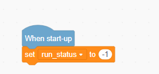

- 在主程序循环中进行声音检测和电机控制：当声音传感器（ 接口 5 ）检测到音量值 > 40 时，将 “运行状态” 设置为 “0-运行状态”（即取反），实现状态翻转，并等待 0.2 秒防抖避免重复触发；若 “运行状态” 为 1 ，电机 S1 以 50 的速度控制飞椅转动，否则停止转动。

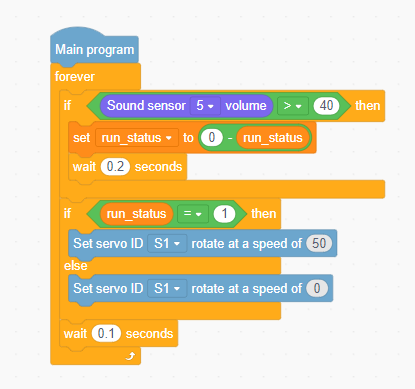

### 4.10.6 Program Download Steps

1. **连线**：用数据线将主控器与电脑 USB 端口连接；

2. **选端口**：在编程软件中选择主控器对应的 COM 端口（**COM口不唯一**）；

3. **下载**：点击 “**下载**” 按钮，将编写好的程序上传至主控器；

4. **开机**：给主控器接通电源，启动设备，测试功能。

### 4.10.7 Demo

## 4.11 Parkour Runner

### 4.11.1 Project Overview

这是一位会 “按键跑酷” 的跑酷达人，按键启动小人跑步与停止，就像一位勇敢的跑酷运动员，简单操控就能体验奔跑的快乐。

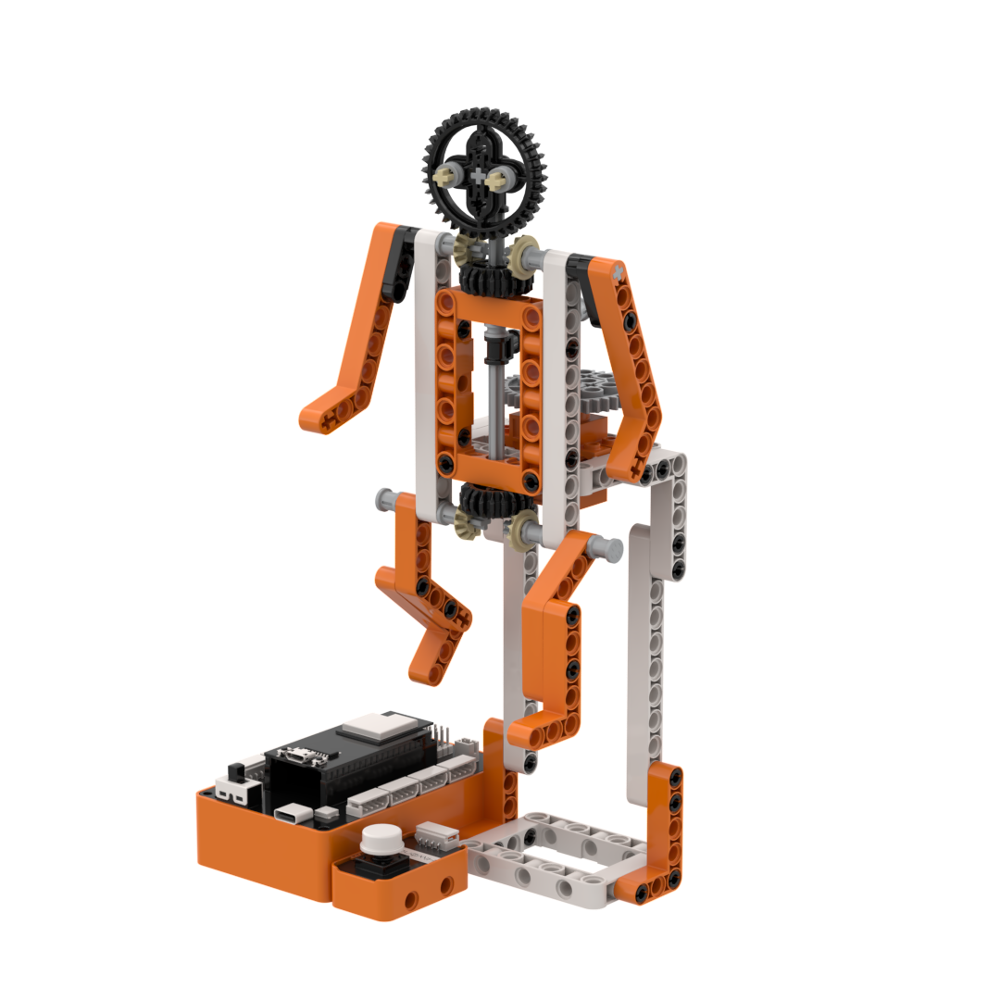

### 4.11.2 Learning Objectives

1. 在作品中实践电机与按键的基础功能，理解按键触发与跑步启停的逻辑。
2. 掌握跑酷勇士的机械搭建。
3. 学会编写 “按键触发 + 电机启停” 的程序，理解状态切换原理。
4. 提升动手实践与仿生结构理解能力，感受跑酷运动的编程乐趣。

### 4.11.3 Materials Needed

1. **材料准备**：主控器、电机、按键传感器、模块线、积木零件。

2. **模块介绍**：

<table style="text-align: center;vertical-align: middle;">
	<tr><td colspan="2">按键传感器</td></tr>
	<tr><td>功能</td><td>检测按压信号，触发跑步的启停</td></tr>
    <tr><td>应用位置</td><td>安装在 “跑酷达人” 的底座上</td></tr>
    <tr><td>实现效果</td><td>每检测到一次按压信号，向主控发送状态切换的指令</td></tr>
</table>

<table style="text-align: center;vertical-align: middle;">
	<tr><td colspan="2">电机模块</td></tr>
	<tr><td>功能</td><td>提供跑步动力</td></tr>
    <tr><td>应用位置</td><td>安装在 “跑酷达人” 的转轮处</td></tr>
    <tr><td>实现效果</td><td>接收到主控指令后，控制跑步的启动与停止</td></tr>
</table>

### 4.11.4 Assembly Guide{#build_manual_11}

### 4.11.5 Coding Steps

1. **打开平台**：启动编程软件，新建项目；

2. **添加扩展**：

- 在软件左下角打开 “**扩展**” ；

- 在 “**扩展**” 中选择”**主控器**“添加 “**K12 ESP32**” ；

- 在 “**扩展**” 中选择”**传感器**“添加 “**按键传感器**” ；

3. **参考程序**：

- 启动时，定义变量 “运行状态” ，并将变量初始化为 -1 （-1为没有跑步，1为在跑步）；

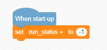

- 在主程序中进行按键检测和电机控制：当按键（接口5）被按下，将 “运行状态” 设置为“0-运行状态”（即取反），实现状态翻转，并等待 0.5 秒防抖；若 “运行状态” 为 1 ，电机 S1 以 30 的速度控制小人跑步，否则停止跑步。

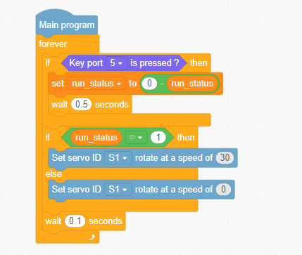

### 4.11.6 Program Download Steps

1. **连线**：用数据线将主控器与电脑 USB 端口连接；

2. **选端口**：在编程软件中选择主控器对应的 COM 端口（**COM口不唯一**）；

3. **下载**：点击 “**下载**” 按钮，将编写好的程序上传至主控器；

4. **开机**：给主控器接通电源，启动设备，测试功能。

### 4.11.7 Demo

## 4.12 Dual-Control Crossbow

### 4.12.1 Project Overview

这是一把会 “双控发射” 的弓弩，按键控制弓弩发射，触摸控制复位，就像一位精准的弓箭手，用简单的操控就能体验发射与复位的乐趣。

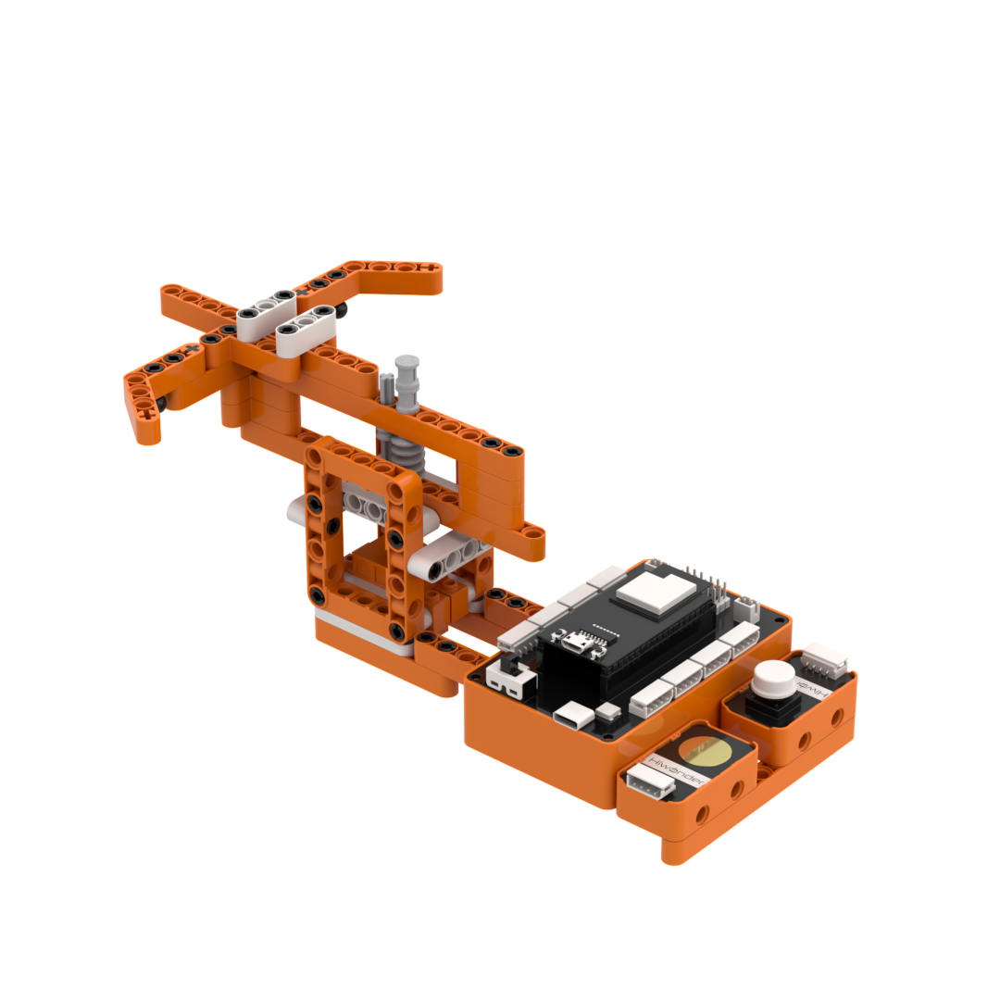

### 4.12.2 Learning Objectives

1. 在作品中实践电机、按键与触摸传感器的基础功能，理解双控操作与发射/复位的逻辑。
2. 掌握双控弓弩的机械搭建。
3. 学会编写 “按键发射 + 触摸复位” 的程序，理解多指令协同控制原理。
4. 提升动手实践与安全设计能力，感受机械发射的编程乐趣

### 4.12.3 Materials Needed

1. **材料准备**：主控器、电机、按键传感器、触摸传感器、模块线、积木零件。

2. **模块介绍**：

<table style="text-align: center;vertical-align: middle;">
	<tr><td colspan="2">按键传感器</td></tr>
	<tr><td>功能</td><td>检测按压动作，触发发射动作</td></tr>
    <tr><td>应用位置</td><td>安装在 “双控弓弩” 的底座上</td></tr>
    <tr><td>实现效果</td><td>每检测到一次按压信号，向主控发送发射的指令</td></tr>
</table>

<table style="text-align: center;vertical-align: middle;">
	<tr><td colspan="2">触摸传感器</td></tr>
	<tr><td>功能</td><td>检测触摸动作，触发弓弩复位动作</td></tr>
    <tr><td>应用位置</td><td>安装在 “双控弓弩” 的底座上</td></tr>
    <tr><td>实现效果</td><td>检测到触摸信号，向主控发送复位弓弩的指令</td></tr>
</table>

<table style="text-align: center;vertical-align: middle;">
	<tr><td colspan="2">电机模块</td></tr>
	<tr><td>功能</td><td>提供弓弩发射/复位动力</td></tr>
    <tr><td>应用位置</td><td>安装在 “双控弓弩” 的转轮处</td></tr>
    <tr><td>实现效果</td><td>接收到主控指令后，控制弓弩发射和复位</td></tr>
</table>

### 4.12.4 Assembly Guide{#build_manual_12}

### 4.12.5 Coding Steps

1. **打开平台**：启动编程软件，新建项目；

2. **添加扩展**：

- 在软件左下角打开 “**扩展**” ；

- 在 “**扩展**” 中选择”**主控器**“添加 “**K12 ESP32**” ；

- 在 “**扩展**” 中选择”**传感器**“添加 “**按键传感器**” 、“**按键传感器**” ；

3. **参考程序**：

- 启动时，初始化触摸传感器的接口为 6；

- 在主程序中进行按键检测与电机控制：若按键（接口 5 ）被按下，电机 S1 以50 的速度控制弓弩发射，若触摸被按下，电机 S1 以 50 的速度控制弓弩复位，若两者都未触发，电机 S1 停止转动，每 0.1 秒刷新一次检测与控制状态，保证响应及时。

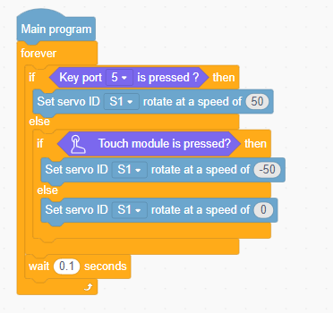

### 4.12.6 Program Download Steps

1. **连线**：用数据线将主控器与电脑 USB 端口连接；

2. **选端口**：在编程软件中选择主控器对应的 COM 端口（**COM口不唯一**）；

3. **下载**：点击 “**下载**” 按钮，将编写好的程序上传至主控器；

4. **开机**：给主控器接通电源，启动设备，测试功能。

### 4.12.7 Demo

