# 5. Advanced Kit Creative Builds

## 5.1 Smart Distance Meter

### 5.1.1 Project Overview

这是一把会 “实时测距” 的测距电子尺，将物体放在两个挡板之间时，点阵屏会实时显示超声波传感器测到的距离，就像一位精准的测量小助手，轻松完成长度检测任务。

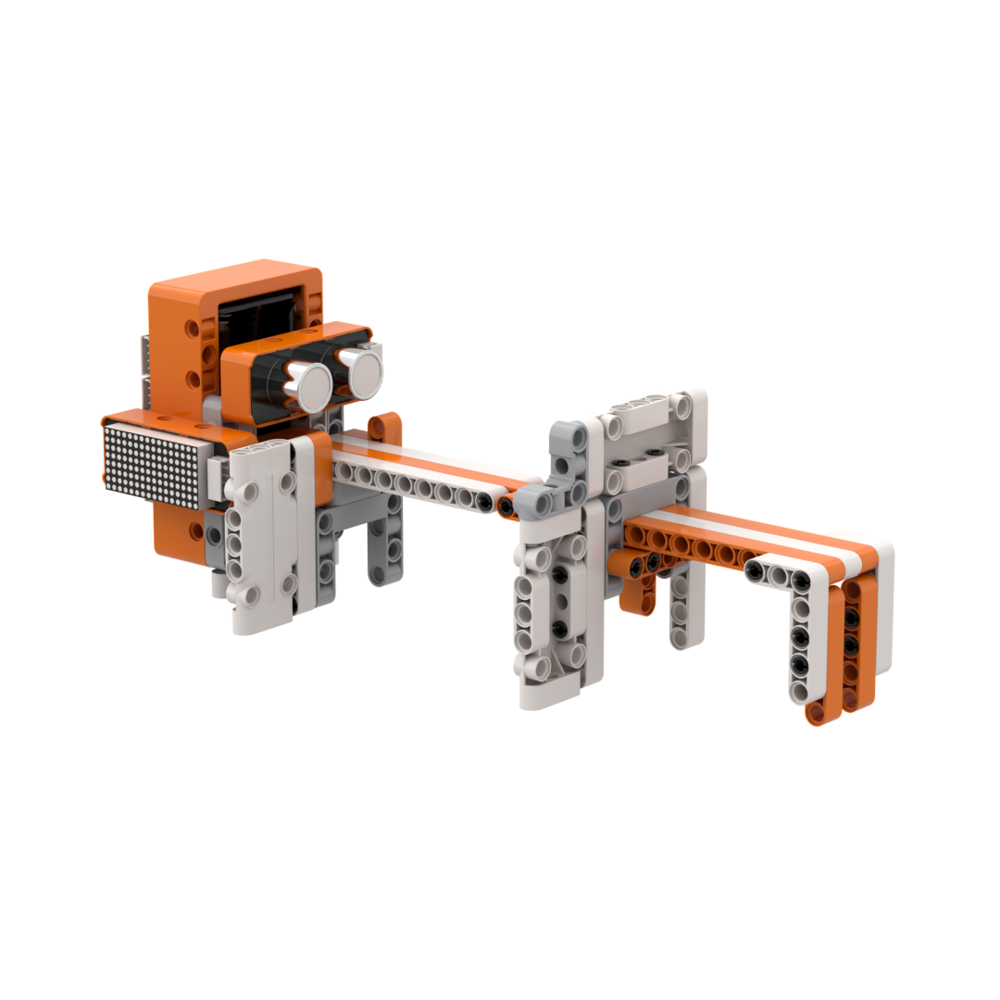

### 5.1.2 Learning Objectives

1. 在作品中实践超声波传感器与点阵屏的基础功能，理解距离检测与数据显示的联动逻辑。
2. 掌握测距电子尺的机械搭建。
3. 学会编写 “超声波测距 + 点阵显示” 的程序，理解传感器数据处理与可视化原理。
4. 提升动手实践与数据应用能力，感受智能测量的科技魅力。

### 5.1.3 Materials Needed

1. **材料准备**：主控器、超声波传感器、点阵屏模块、模块线、积木零件。

2. **模块介绍**：

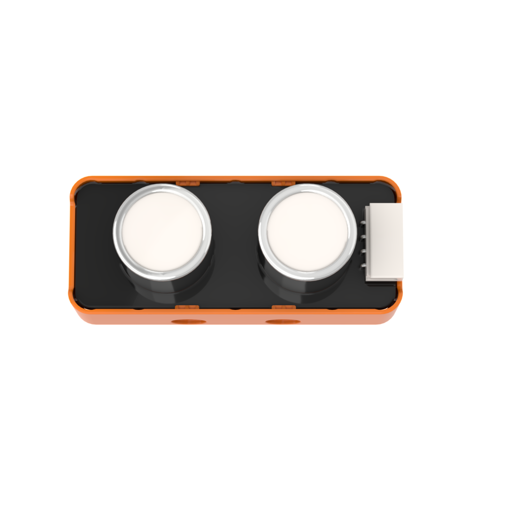

<table style="text-align: center;vertical-align: middle;">
	<tr><td colspan="2">超声波传感器</td></tr>
	<tr><td>功能</td><td>检测物体的长度</td></tr>
    <tr><td>应用位置</td><td>安装在 测距电子尺” 的固定挡板上</td></tr>
    <tr><td>实现效果</td><td>测量物体与挡板间的距离，将数据发送给主控</td></tr>
</table>

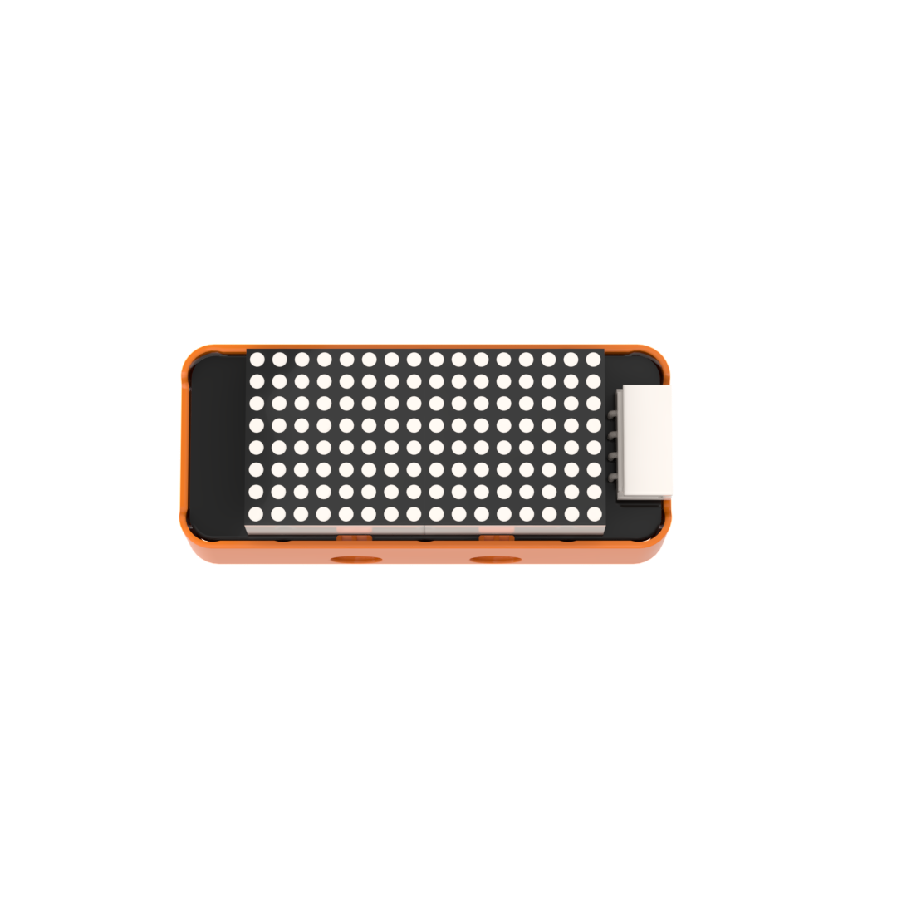

<table style="text-align: center;vertical-align: middle;">
	<tr><td colspan="2">点阵屏模块</td></tr>
	<tr><td>功能</td><td>显示物体的长度</td></tr>
    <tr><td>应用位置</td><td>安装在 “测距电子尺” 的固定挡板左侧</td></tr>
    <tr><td>实现效果</td><td>接收到主控的数据后，实时显示该数据</td></tr>
</table>

### 5.1.4 Assembly Guide{#build_manual_13}

### 5.1.5 Coding Steps

1. **打开平台**：启动编程软件，新建项目；

2. **添加扩展**：

- 在软件左下角打开 “**扩展**” ；

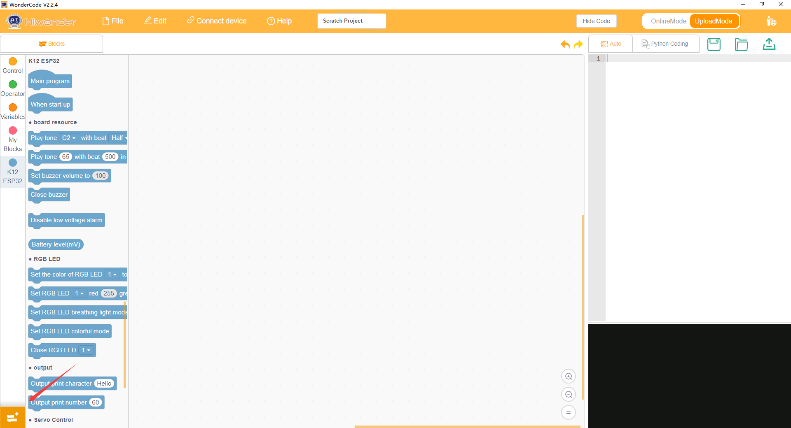

- 在 “**扩展**” 中选择”**主控器**“添加 “**K12 ESP32**” ；

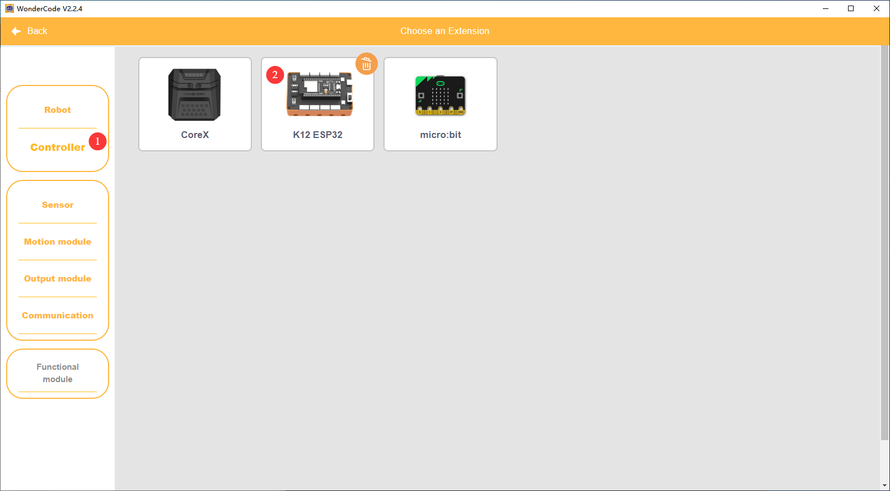

- 在 “**扩展**” 中选择”**传感器**“添加 “**超声波传感器**” ；

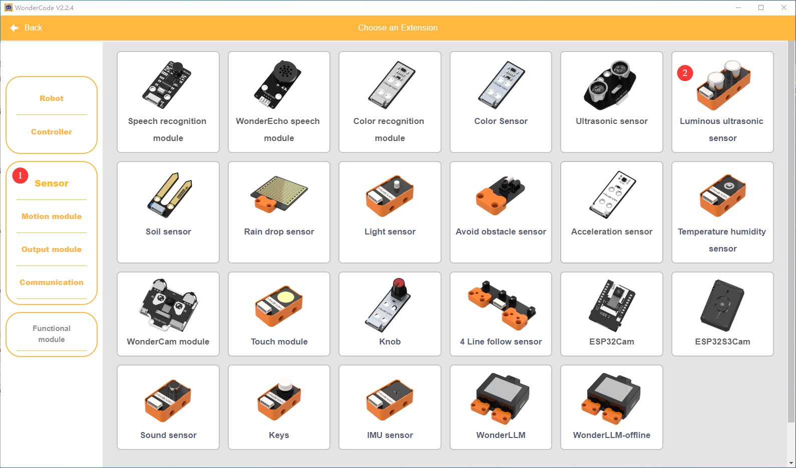

- 在 “**扩展**” 中选择”**输出模块**“添加 “**点阵屏**” ；

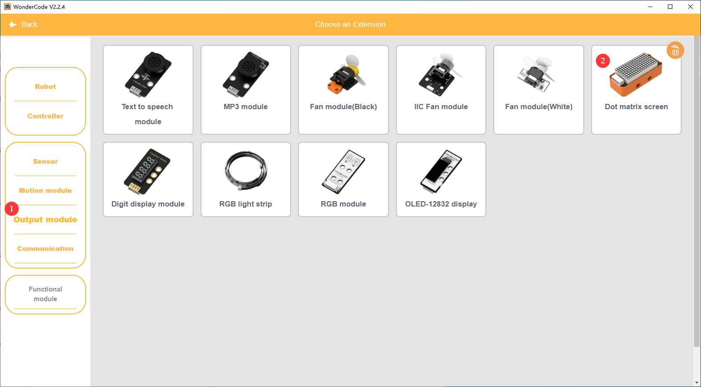

3. **参考程序**：

- 将物体放在固定挡板与移动挡板中间，启动时，先初始化超声波传感器的接口1、点阵屏模块的接口5，定义一个 “长度” 的变量，并初始化为 0 ；

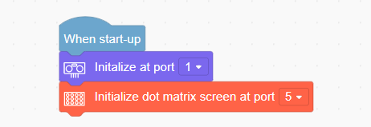

- 在主程序中进行距离检测与显示控制：实时通过超声波传感器检测障碍物距离，将结果减去4（超声波与移动挡板的最小距离）存入 “长度” 变量，当 “长度” 大于 0 时时，在点阵屏上显示当前的长度数值，每 0.2 秒刷新一次检测与显示状态，保证显示稳定。

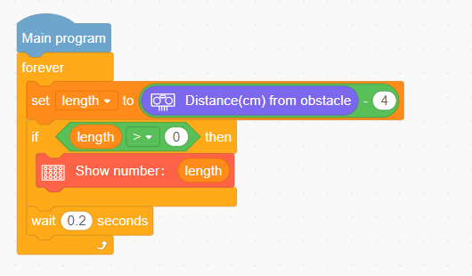

### 5.1.6 Program Download Steps

1. **连线**：用数据线将主控器与电脑 USB 端口连接；

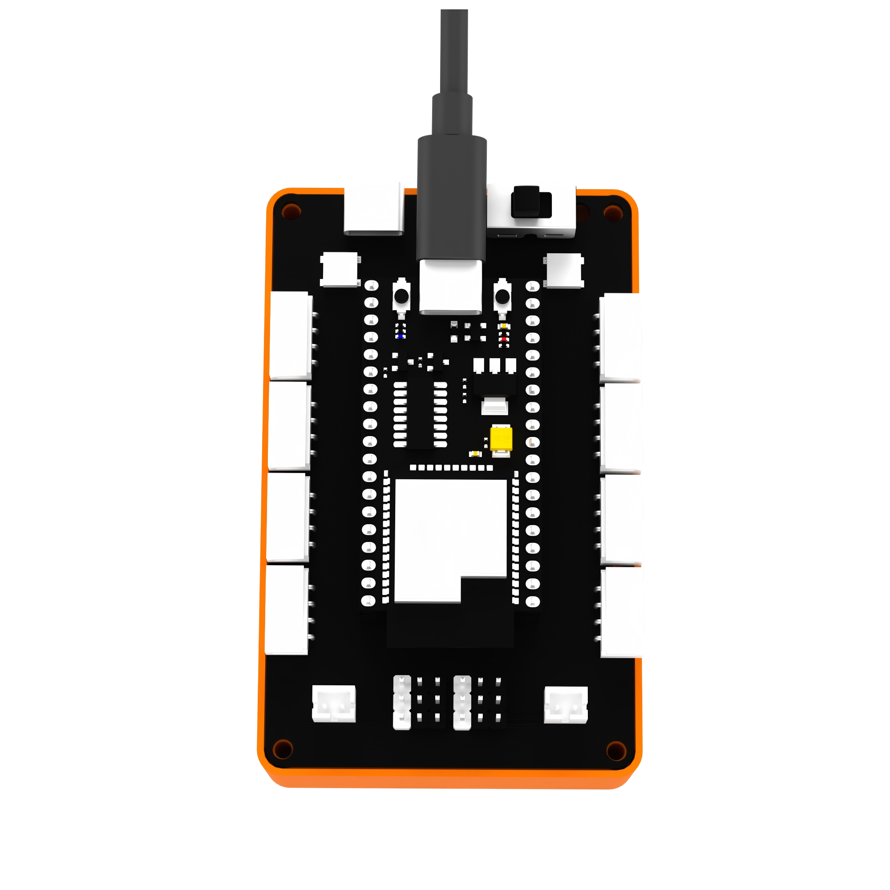

2. **选端口**：在编程软件中选择主控器对应的 COM 端口（**COM口不唯一**）；

3. **下载**：点击 “**下载**” 按钮，将编写好的程序上传至主控器；

4. **开机**：给主控器接通电源，启动设备，测试功能。

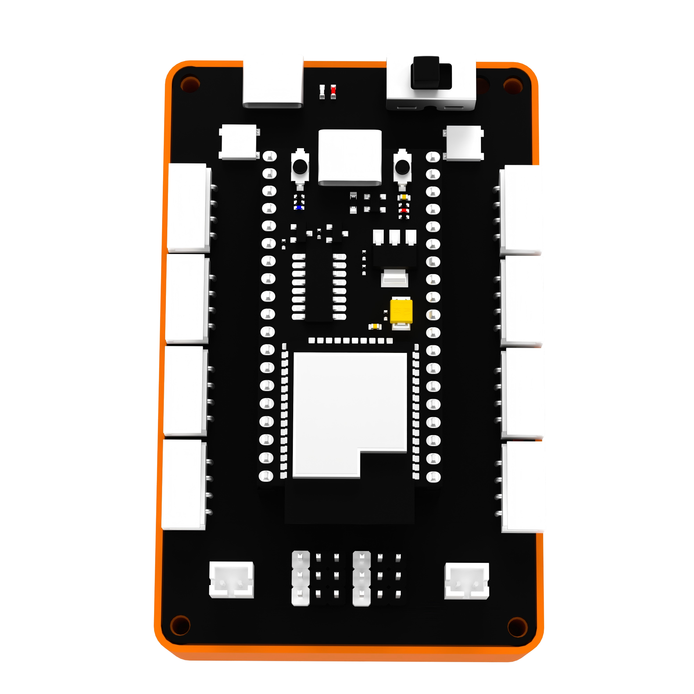

### 5.1.7 Demo

## 5.2 Golf Robot

### 5.2.1 Project Overview

这是一位精准的高尔夫机器人，当红外传感器检测到有小球时，舵机就驱动球杆挥动，将小球击打出去，就像一位专业的高尔夫球手，总能稳稳命中目标。

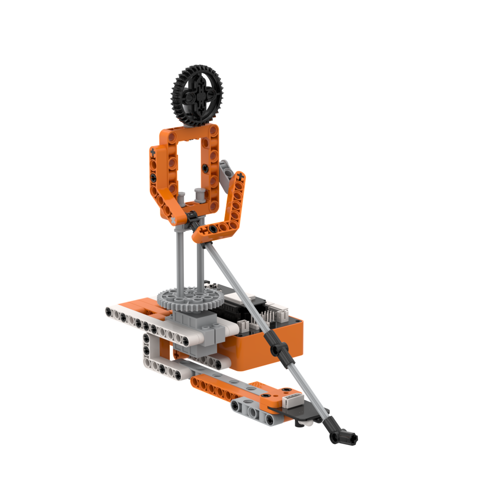

### 5.2.2 Learning Objectives

1. 在作品中实践舵机与红外传感器的基础功能，理解红外检测与挥杆击球的联动逻辑。
2. 掌握高尔夫机器人的机械搭建。
3. 学会编写 “红外检测 + 舵机挥杆” 的程序，理解触发式动作控制原理。
4. 提升动手实践与精准控制能力，感受体育竞技的科技魅力。

### 5.2.3 Materials Needed

1. **材料准备**：主控器、舵机、红外传感器、模块线、积木零件。

2. **模块介绍**：

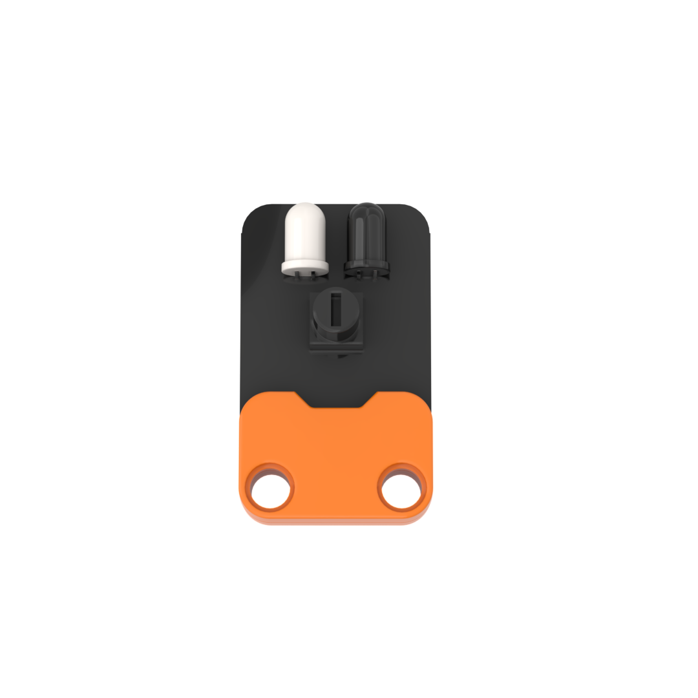

<table style="text-align: center;vertical-align: middle;">
	<tr><td colspan="2">红外传感器</td></tr>
	<tr><td>功能</td><td>检测前方障碍物距离</td></tr>
    <tr><td>应用位置</td><td>安装在 “高尔夫机器人” 球杆的前方</td></tr>
    <tr><td>实现效果</td><td>检测到小球时，向主控发送挥杆击球的指令</td></tr>
</table>

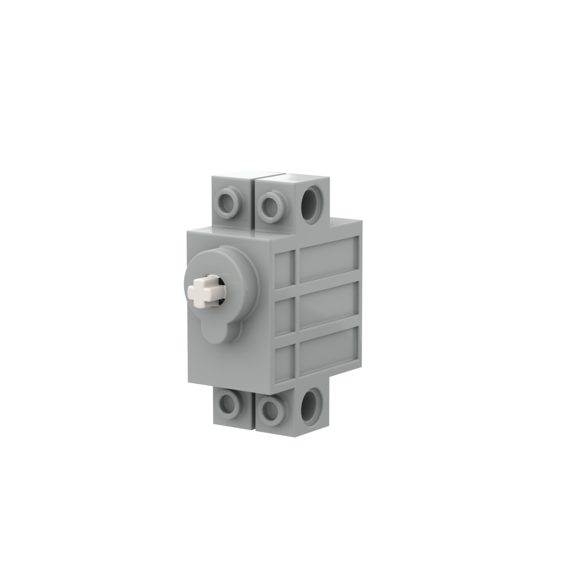

<table style="text-align: center;vertical-align: middle;">
	<tr><td colspan="2">舵机模块</td></tr>
	<tr><td>功能</td><td>提供球杆挥杆动力</td></tr>
    <tr><td>应用位置</td><td>安装在 “高尔夫机器人” 的腰部</td></tr>
    <tr><td>实现效果</td><td>接收到主控的指令后，控制机器人挥动球杆击打小球</td></tr>
</table>

### 5.2.4 Assembly Guide{#build_manual_14}

### 5.2.5 Coding Steps

1. **打开平台**：启动编程软件，新建项目；

2. **添加扩展**：

- 在软件左下角打开 “**扩展**” ；

- 在 “**扩展**” 中选择”**主控器**“添加 “**K12 ESP32**” ；

- 在 “**扩展**” 中选择”**传感器**“添加 “**红外传感器**” ；

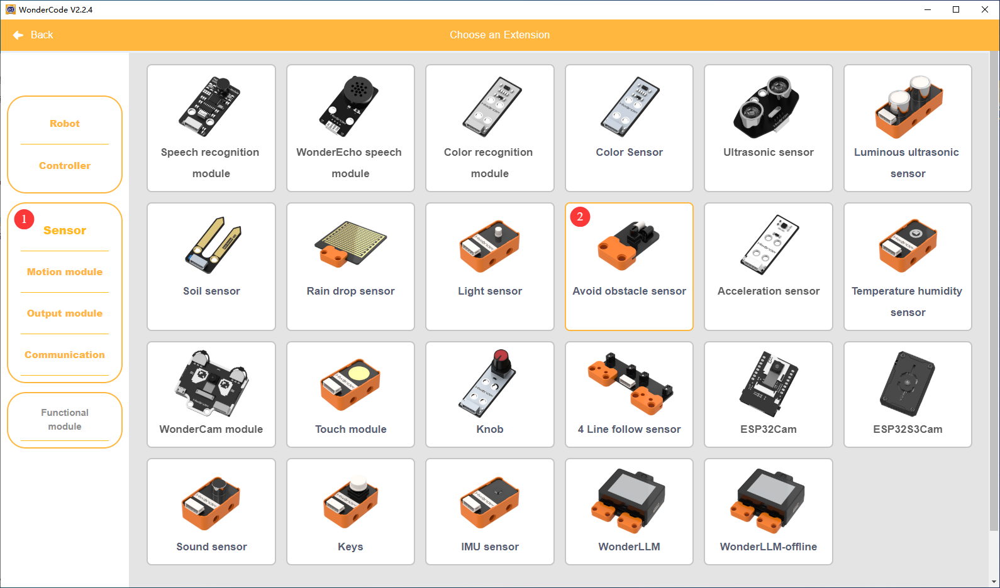

3. **参考程序**：

- 启动时，先初始化舵机的起始位置在140度，此时球杆处于小球检测区旁，随时准备挥杆击球；

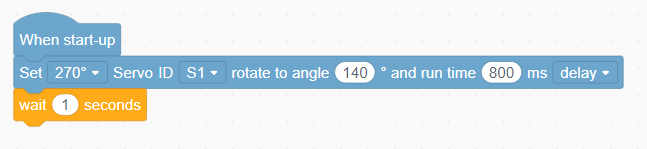

- 在主程序中进行小球检测与舵机控制：当红外传感器检测到有小球，舵机S1先慢速转到170度挥动球杆，再快速转到105度将小球击打出去，最后球杆回到起始位置，完成一次高尔夫机器人打球动作。

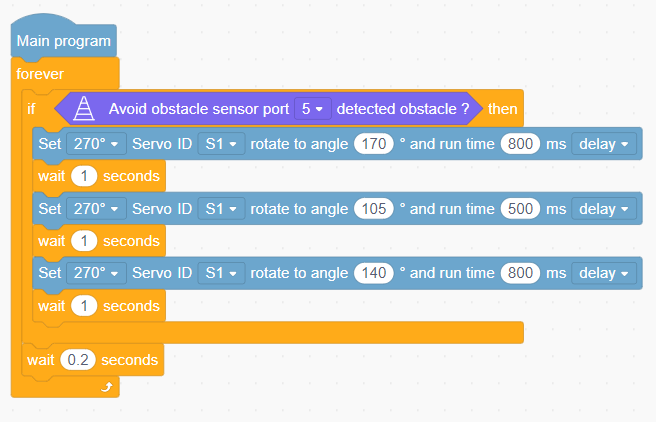

### 5.2.6 Program Download Steps

1. **连线**：用数据线将主控器与电脑 USB 端口连接；

2. **选端口**：在编程软件中选择主控器对应的 COM 端口（**COM口不唯一**）；

3. **下载**：点击 “**下载**” 按钮，将编写好的程序上传至主控器；

4. **开机**：给主控器接通电源，启动设备，测试功能。

### 5.2.7 Demo

## 5.3 Reaction Speed Challenge

### 5.3.1 Project Overview

这是一台会 “考验手速” 的手速挑战机，点阵上电显示 “prep”，按键按下后点阵显示 10 秒倒计时，蜂鸣器发出提示音；倒计时期间，触摸传感器触发速度越快，手才不会被打到，一旦被打到或 10 秒结束，挑战失败并发出警示音，就像一场紧张的反应力游戏。

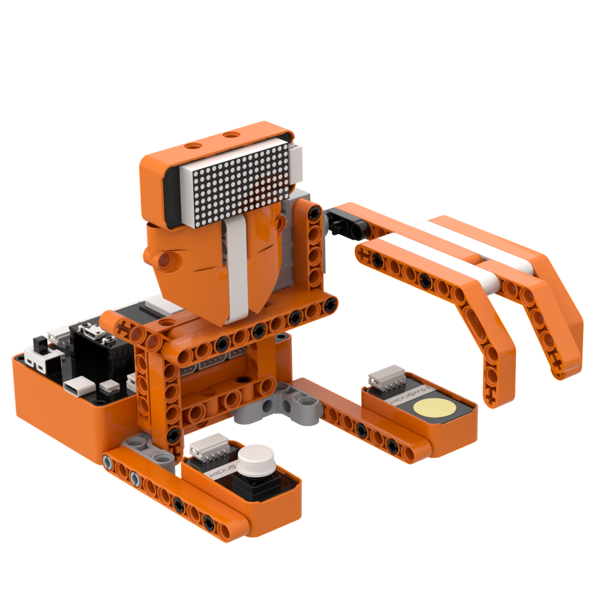

### 5.3.2 Learning Objectives

1. 在作品中实践舵机、触摸、按键、点阵与主控蜂鸣器的基础功能，理解倒计时、手速检测与失败判定的联动逻辑。
2. 掌握手速挑战机的机械搭建。
3. 学会编写 “按键启动 + 触摸手速检测 + 成败判定” 的完整程序，理解多设备协同工作原理。
4. 提升动手实践与互动游戏设计能力，感受反应力挑战的编程乐趣。

### 5.3.3 Materials Needed

1. **材料准备**：主控器、舵机、按键传感器、触摸传感器、点阵屏模块、模块线、积木零件。

2. **模块介绍**：

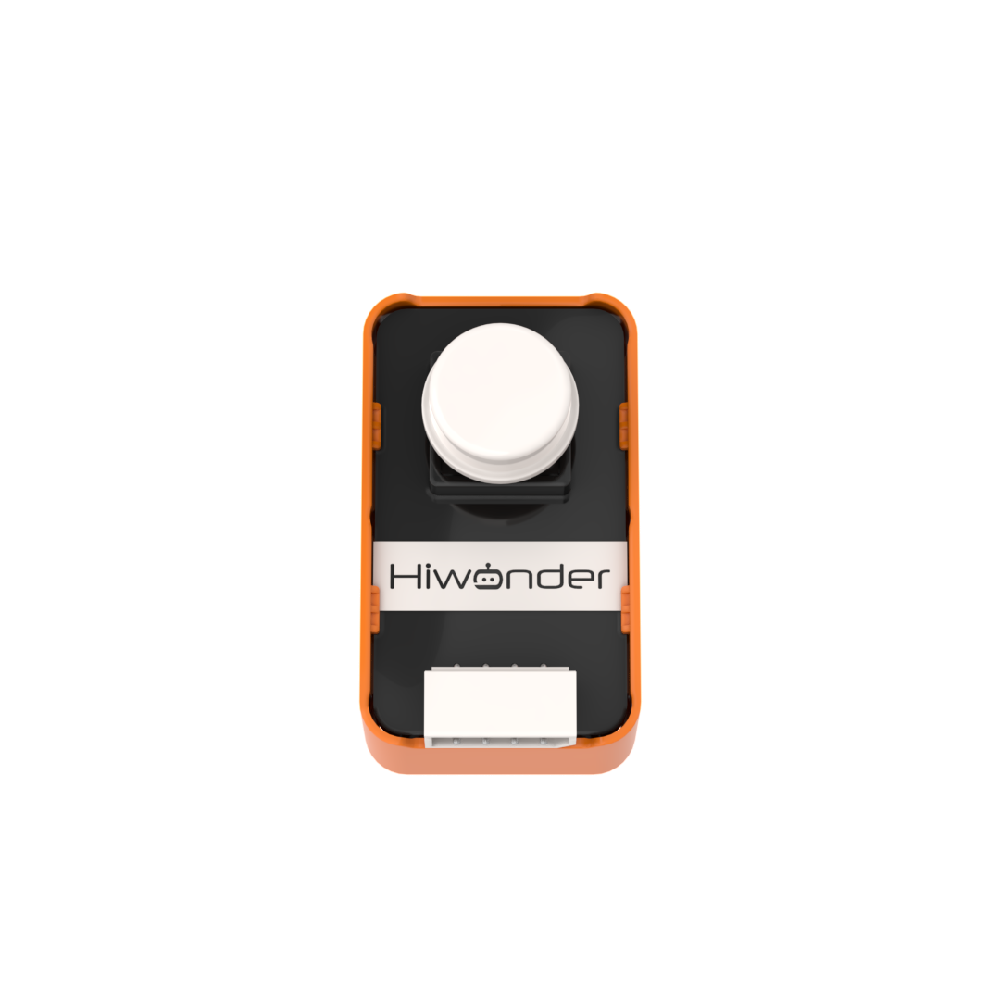

<table style="text-align: center;vertical-align: middle;">
	<tr><td colspan="2">按键传感器</td></tr>
	<tr><td>功能</td><td>检测按压信号，触发挑战开始</td></tr>
    <tr><td>应用位置</td><td>安装在 “手速挑战机” 的底座上</td></tr>
    <tr><td>实现效果</td><td>每检测到一次按压信号，向主控发送开始挑战的指令</td></tr>
</table>
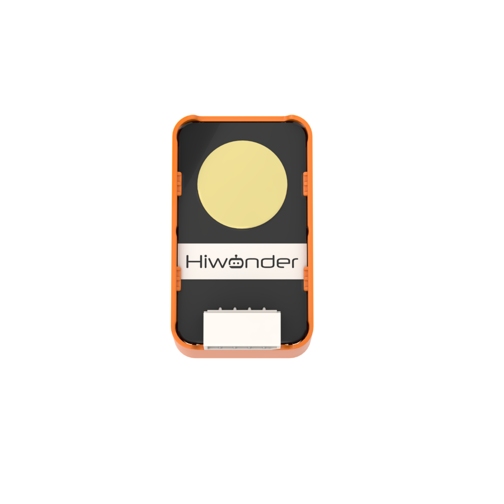

<table style="text-align: center;vertical-align: middle;">
	<tr><td colspan="2">触摸传感器</td></tr>
	<tr><td>功能</td><td>检测触摸信号，触发手速检测</td></tr>
    <tr><td>应用位置</td><td>安装在 “手速挑战机” 的底座上</td></tr>
    <tr><td>实现效果</td><td>每检测到一次触摸信号，向主控发送手速检测的指令，触摸越快越安全</td></tr>
</table>

<table style="text-align: center;vertical-align: middle;">
	<tr><td colspan="2">点阵屏模块</td></tr>
	<tr><td>功能</td><td>显示倒计时与状态	</td></tr>
    <tr><td>应用位置</td><td>安装在 “手速挑战机” 的头部</td></tr>
    <tr><td>实现效果</td><td>初始显示 “prep”，接受到主控开始挑战指令后，开始显示10秒倒计时</td></tr>
</table>

<table style="text-align: center;vertical-align: middle;">
	<tr><td colspan="2">舵机模块</td></tr>
	<tr><td>功能</td><td>提供爪子击打的动力</td></tr>
    <tr><td>应用位置</td><td>安装在 “手速挑战机” 的转轴处</td></tr>
    <tr><td>实现效果</td><td>接收到主控的指令后，控制爪子开始向下击打挑战者，如果触摸越快，向下击打的速度越慢</td></tr>
</table>

### 5.3.4 Assembly Guide{#build_manual_15}

### 5.3.5 Coding Steps

1. **打开平台**：启动编程软件，新建项目；

2. **添加扩展**：

- 在软件左下角打开 “**扩展**” ；

- 在 “**扩展**” 中选择”**主控器**“添加 “**K12 ESP32**” ；

- 在 “**扩展**” 中选择”**传感器**“添加 “**按键传感器**” 、“**按键传感器**” ；

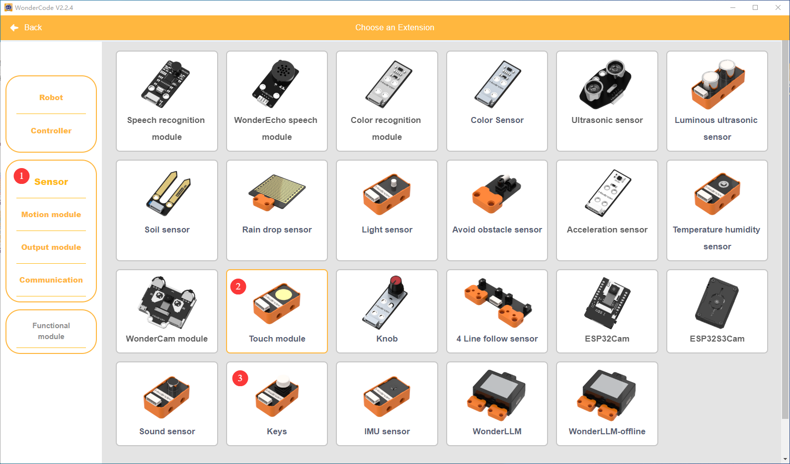

- 在 “**扩展**” 中选择”**输出模块**“添加 “**点阵屏**” ；

3. **参考程序**：

- 启动时，初始化触摸传感器的接口 5 和点阵屏模块的接口 6 ，定义变量 “次数” 、 “计时状态” 、“挑战” 、“时间” ，将变量初始化为 0 、0、0、1，0同时将 270° 舵机 S1 复位到 135°，此时爪子并未打下，点阵屏显示 “Prep”，为开始游戏做好准备；

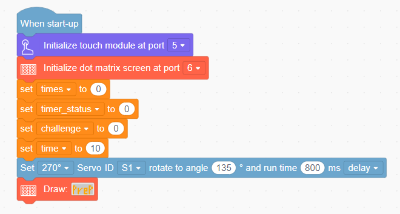

- 在主程序中进行触摸检测：当触摸被按下并松开后， “次数” 变量自动 + 1，实现快速点击计数；

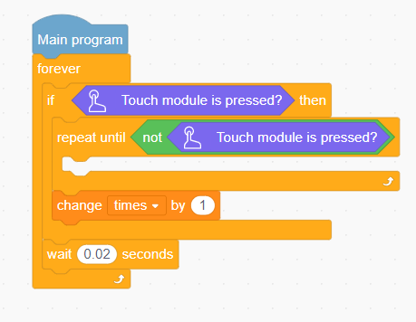

- 在主程序中进行倒计时及显示：在计时状态下， “时间” 每 0.1 秒减 0.1，点阵屏实时显示剩余时间，当 “时间” 小于等于 0 时，停止计时，播放 C8 音调提示时间结束，挑战成功；

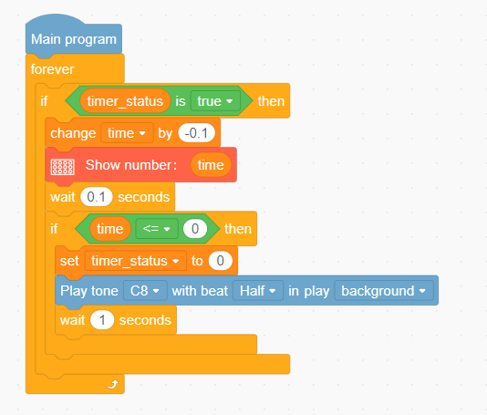

- 在主程序中进行按键启动/重置游戏：当按键（接口 7）被按下时，若当前为计时状态（计时状态为1），停止计时，重置变量，点阵屏回到 “Prep”，若当前未计时（计时状态为0），重置变量，舵机复位到 135°，点阵屏显示 10，播放 C5 音调，2 秒后进入计时状态；

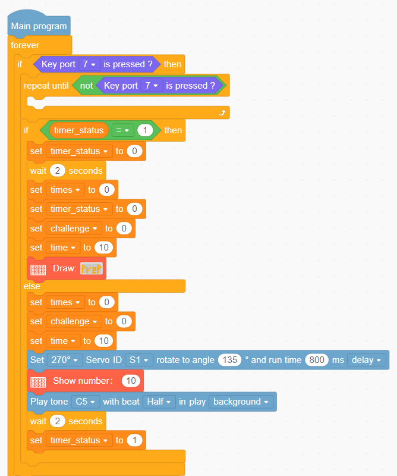

- 在主程序中进行舵机控制：在计时状态下，“挑战” 变量 + 1，计算 “挑战-次数” 的差值，若差值≤20，将差值从[-20,20]映射到[45,255]，控制舵机 S1 角度，实现 “点击越快，舵机角度越接近中间 135°” 的反馈，若差值 > 20，停止计时，播放 C7 音调两次，提示挑战失败。

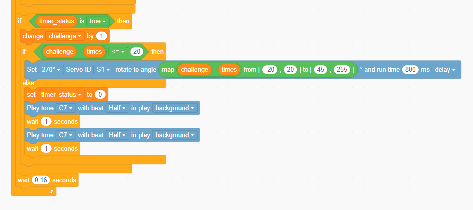

### 5.3.6 Program Download Steps

1. **连线**：用数据线将主控器与电脑 USB 端口连接；

2. **选端口**：在编程软件中选择主控器对应的 COM 端口（**COM口不唯一**）；

3. **下载**：点击 “**下载**” 按钮，将编写好的程序上传至主控器；

4. **开机**：给主控器接通电源，启动设备，测试功能。

### 5.3.7 Demo

## 5.4 Automatic Barrier Bot

### 5.4.1 Project Overview

这是一位会 “自动巡逻” 的路障小卫士，上电后以 50 的速度前进，每隔 1 秒放置一个路障，共放置 3 个，放完停止前进；前进时点阵显示 “go”，放置路障时点阵显示 “stop”，就像一位敬业的巡逻员，有序完成路障布置任务。

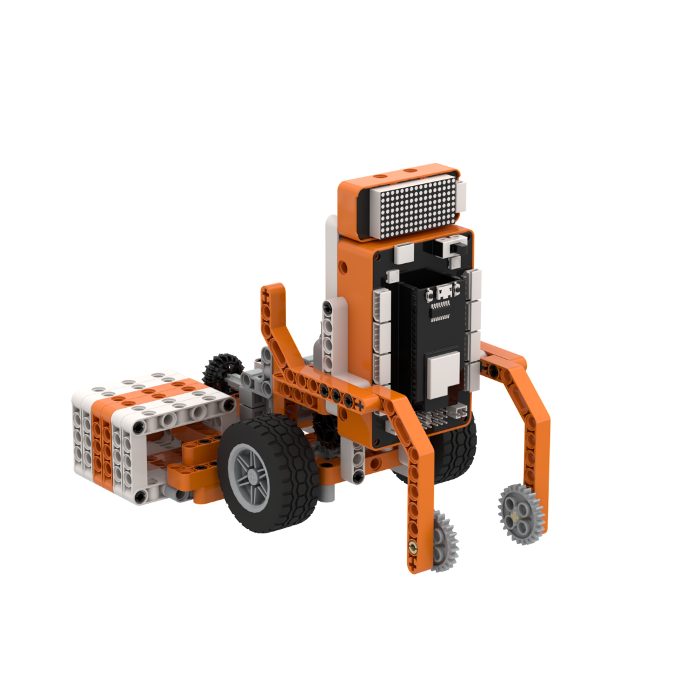

### 5.4.2 Learning Objectives

1. 在作品中实践电机、舵机与点阵屏的基础功能，理解前进、路障放置与状态显示的联动逻辑。
2. 掌握路障小卫士的机械搭建。
3. 学会编写 “电机前进 + 舵机放置 + 点阵显示” 的程序，理解多设备协同工作原理。
4. 提升动手实践与任务规划能力，感受智能巡逻的编程乐趣。

### 5.4.3 Materials Needed

1. **材料准备**：主控器、电机、舵机、点阵屏模块、模块线、积木零件。

2. **模块介绍**：

<table style="text-align: center;vertical-align: middle;">
	<tr><td colspan="2">点阵屏模块</td></tr>
	<tr><td>功能</td><td>显示状态信息</td></tr>
    <tr><td>应用位置</td><td>安装在 “路障小卫士” 的头部</td></tr>
    <tr><td>实现效果</td><td>前进时显示 “go”，放置路障时显示 “stop”</td></tr>
</table>

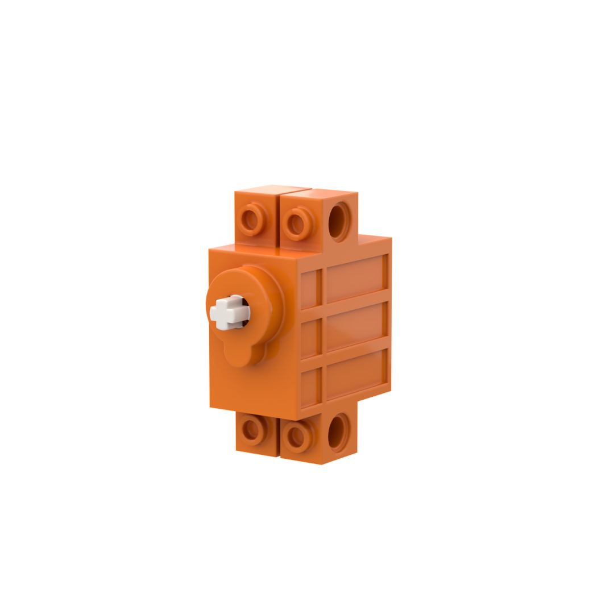

<table style="text-align: center;vertical-align: middle;">
	<tr><td colspan="2">电机模块</td></tr>
	<tr><td>功能</td><td>提供机器人前进的动力</td></tr>
    <tr><td>应用位置</td><td>安装在 “路障小卫士” 的后轮处</td></tr>
    <tr><td>实现效果</td><td>控制机器人以50的速度前进</td></tr>
</table>

<table style="text-align: center;vertical-align: middle;">
	<tr><td colspan="2">舵机模块</td></tr>
	<tr><td>功能</td><td>提供放置路障的动力</td></tr>
    <tr><td>应用位置</td><td>安装在 “路障小卫士” 的转轴处</td></tr>
    <tr><td>实现效果</td><td>控制路障小卫士放置路障</td></tr>
</table>

### 5.4.4 Assembly Guide{#build_manual_16}

### 5.4.5 Coding Steps

1. **打开平台**：启动编程软件，新建项目；

2. **添加扩展**：

- 在软件左下角打开 “**扩展**” ；

- 在 “**扩展**” 中选择”**主控器**“添加 “**K12 ESP32**” ；

- 在 “**扩展**” 中选择”**输出模块**“添加 “**点阵屏**” ；

3. **参考程序**：

- 启动时，初始化点阵屏的接口 7，初始化 270° 舵机 S1 为 0° ，此时处于没有放置路障的状态；

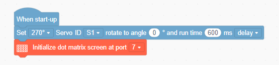

- 在主程序中执行 3 次完整放置路障的动作流程：电机 S2 以 50 的速度控制路障小卫士前进 1 秒后停下，舵机 S1 转到 270° 控制机器人放置路障后复位，同时前进时点阵屏显示 “go” 图案，放置路障时切换为 “stop” 图案。

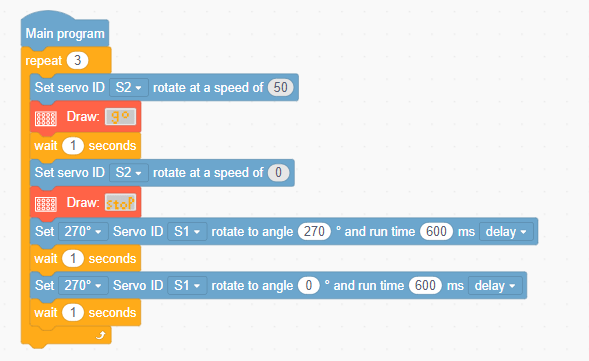

### 5.4.6 Program Download Steps

1. **连线**：用数据线将主控器与电脑 USB 端口连接；

2. **选端口**：在编程软件中选择主控器对应的 COM 端口（**COM口不唯一**）；

3. **下载**：点击 “**下载**” 按钮，将编写好的程序上传至主控器；

4. **开机**：给主控器接通电源，启动设备，测试功能。

### 5.4.7 Demo

## 5.5 Smart Catapult

### 5.5.1 Project Overview

这是一台会 “按键投石” 的智能投石机，按下按键就将小球抛出，就像一位古代的投石战士，简单操控就能体验精准抛射的乐趣。

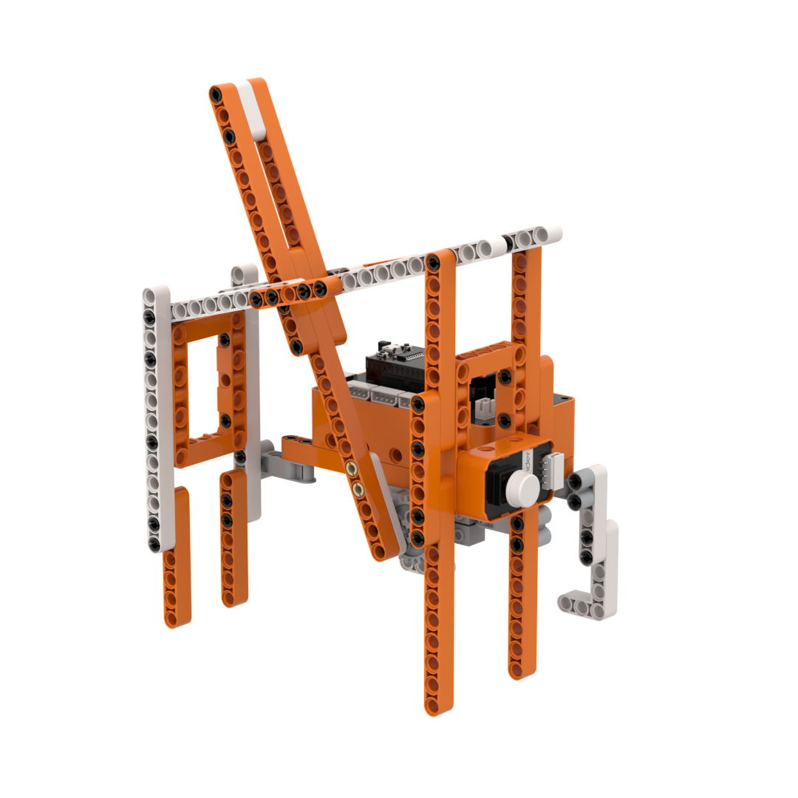

### 5.5.2 Learning Objectives

1. 在作品中实践舵机与按键的基础功能，理解按键触发与抛射动作的逻辑。
2. 掌握智能投石机的机械搭建。
3. 学会编写 “按键触发 + 舵机抛射” 的程序，理解触发式动作控制原理。
4. 提升动手实践与机械结构理解能力，感受抛射装置的编程乐趣。

### 5.5.3 Materials Needed

1. **材料准备**：主控器、舵机、按键传感器、模块线、积木零件。

2. **模块介绍**：

<table style="text-align: center;vertical-align: middle;">
	<tr><td colspan="2">按键传感器</td></tr>
	<tr><td>功能</td><td>检测按压信号，触发抛投动作</td></tr>
    <tr><td>应用位置</td><td>安装在 “智能投石机” 的底座旁</td></tr>
    <tr><td>实现效果</td><td>每检测到一次按压信号，向主控发送启动抛投动作的指令</td></tr>
</table>

<table style="text-align: center;vertical-align: middle;">
	<tr><td colspan="2">舵机模块</td></tr>
	<tr><td>功能</td><td>提供抛射动力</td></tr>
    <tr><td>应用位置</td><td>安装在 “智能投石机” 的转轴处</td></tr>
    <tr><td>实现效果</td><td>接收到主控的指令后，控制投石臂快速转动，抛出小球</td></tr>
</table>

### 5.5.4 Assembly Guide{#build_manual_17}

### 5.5.5 Coding Steps

1. **打开平台**：启动编程软件，新建项目；

2. **添加扩展**：

- 在软件左下角打开 “**扩展**” ；

- 在 “**扩展**” 中选择”**主控器**“添加 “**K12 ESP32**” ；

- 在 “**扩展**” 中选择”**传感器**“添加 “**按键传感器**” ；

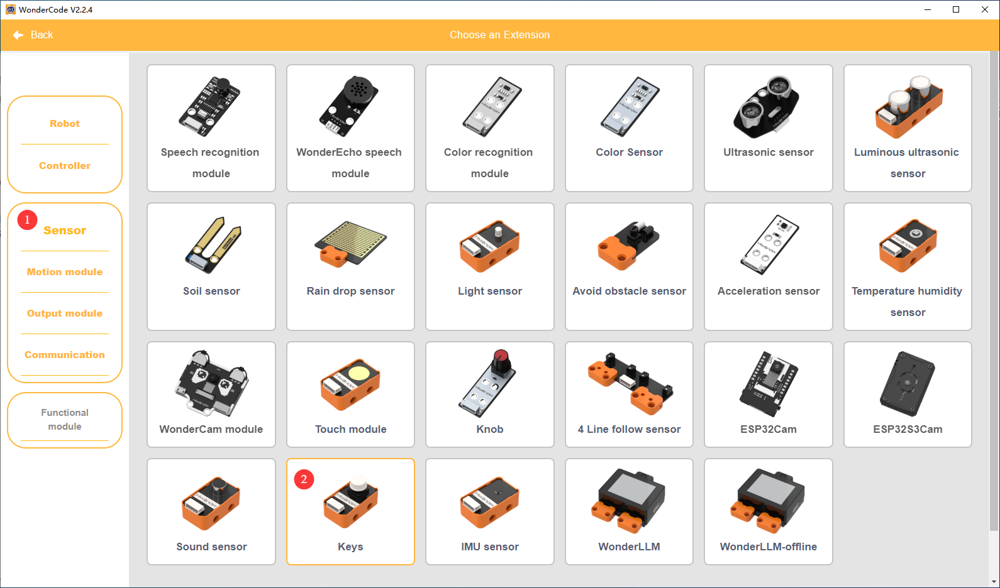

3. **参考程序**：

- 启动时，初始化 270° 舵机 S1 为 180° ，此时处于为抛投的状态；

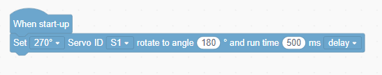

- 在主程序中进行按键检测和舵机控制：当按键（接口 5 ）被按下时，舵机 S1 快速转到 100°控制投石机做出抛投动作，1秒后舵机 S1 缓慢转到 180° 回到初始位置，每 0.1 秒刷新一次检测状态。

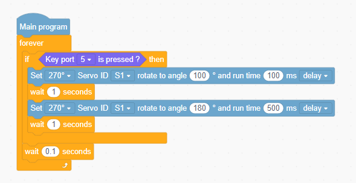

### 5.5.6 Program Download Steps

1. **连线**：用数据线将主控器与电脑 USB 端口连接；

2. **选端口**：在编程软件中选择主控器对应的 COM 端口（**COM口不唯一**）；

3. **下载**：点击 “**下载**” 按钮，将编写好的程序上传至主控器；

4. **开机**：给主控器接通电源，启动设备，测试功能。

### 5.5.7 Demo

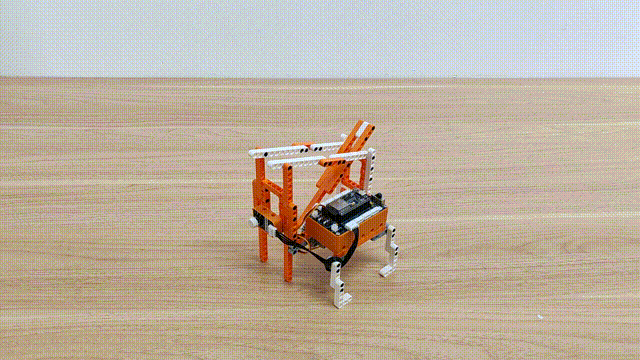

## 5.6 Motion-Activated Storage Box

### 5.6.1 Project Overview

这是一个会 “自动开盖” 的感应收纳盒，超声波检测到物体靠近时，舵机就打开收纳盒的盖子，就像一位贴心的小管家，自动为你打开收纳空间。

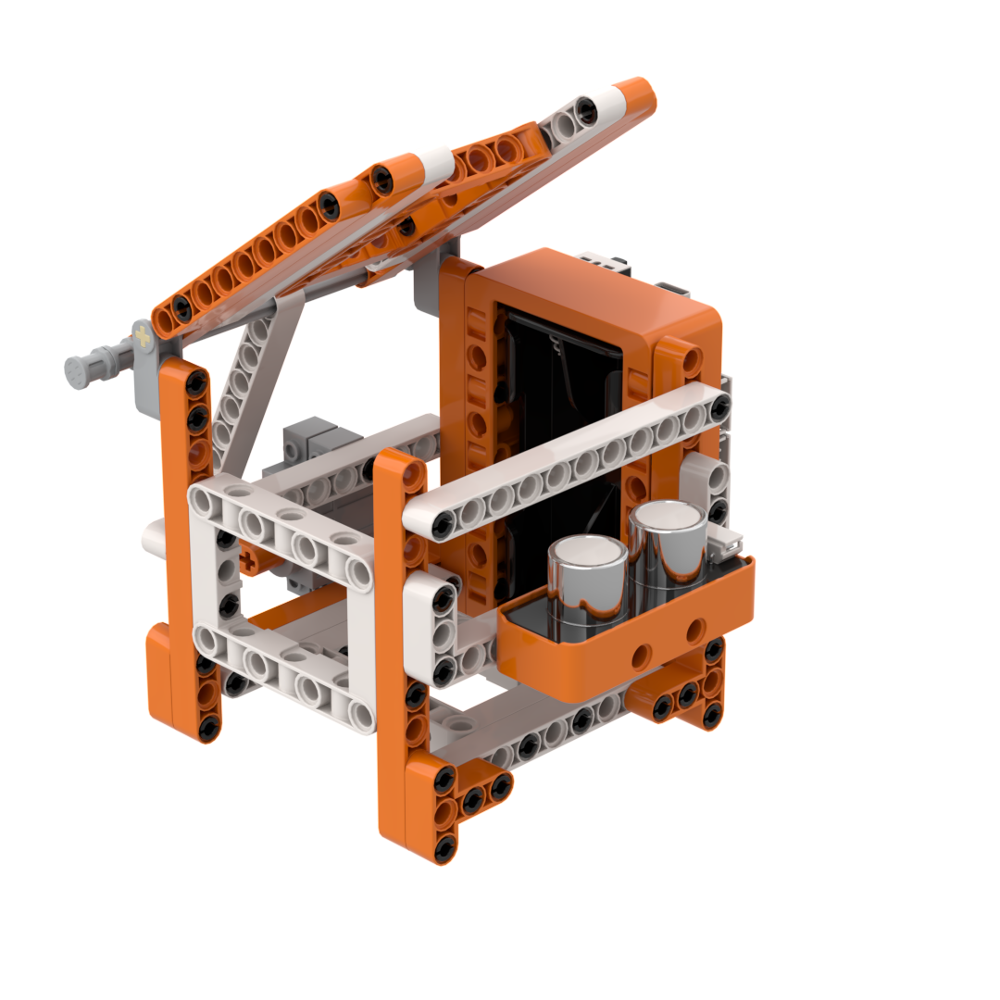

### 5.6.2 Learning Objectives

1. 在作品中实践舵机与超声波传感器的基础功能，理解物体检测与开盖的联动逻辑。
2. 掌握感应收纳盒的机械搭建。
3. 学会编写 “超声波检测 + 舵机开盖” 的程序，理解触发式动作控制原理。
4. 提升动手实践与智能收纳设计能力，感受感应交互的科技魅力。

### 5.6.3 Materials Needed

1. **材料准备**：主控器、舵机、超声波传感器、模块线、积木零件。

2. **模块介绍**：

<table style="text-align: center;vertical-align: middle;">
	<tr><td colspan="2">超声波传感器</td></tr>
	<tr><td>功能</td><td>检测物体距离，触发收纳盒打开</td></tr>
    <tr><td>应用位置</td><td>安装在 “感应收纳盒” 的正面</td></tr>
    <tr><td>实现效果</td><td>检测到物体距离小于10时，向主控发送打开收纳盒的指令</td></tr>
</table>

<table style="text-align: center;vertical-align: middle;">
	<tr><td colspan="2">舵机模块</td></tr>
	<tr><td>功能</td><td>提供收纳盒盒盖开合的动力</td></tr>
    <tr><td>应用位置</td><td>安装在 “感应收纳盒” 的转轴处</td></tr>
    <tr><td>实现效果</td><td>接收到主控的指令后，控制收纳盒打开盒盖5秒后自动关闭</td></tr>
</table>

### 5.6.4 Assembly Guide{#build_manual_18}

### 5.6.5 Coding Steps

1. **打开平台**：启动编程软件，新建项目；

2. **添加扩展**：

- 在软件左下角打开 “**扩展**” ；

- 在 “**扩展**” 中选择”**主控器**“添加 “**K12 ESP32**” ；

- 在 “**扩展**” 中选择”**传感器**“添加 “**超声波传感器**” ；

3. **参考程序**：

- 启动时，初始化发光超声波的接口 1 ，初始化 270° 舵机 S1 为 30° ，此时处于收纳盒关闭盒盖的状态，定义变量 “距离” ，将变量初始化为 0 ；

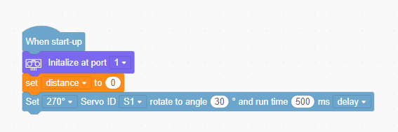

- 在主程序中进行距离检测和舵机控制：实时通过超声波传感器检测障碍物距离，将结果存入 “距离” 变量，当检测到的距离小于 10cm 时，舵机 S1 快速转到 60° 打开盒盖，5 秒后舵机 S1 缓慢复位到 30° 关闭盒盖，每 0.1 秒刷新一次检测状态。

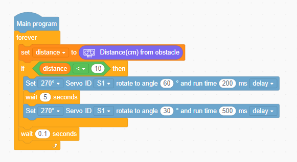

### 5.6.6 Program Download Steps

1. **连线**：用数据线将主控器与电脑 USB 端口连接；

2. **选端口**：在编程软件中选择主控器对应的 COM 端口（**COM口不唯一**）；

3. **下载**：点击 “**下载**” 按钮，将编写好的程序上传至主控器；

4. **开机**：给主控器接通电源，启动设备，测试功能。

### 5.6.7 Demo

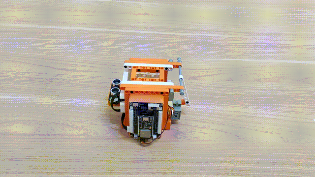

## 5.7 Light-Responsive Sunshade

### 5.7.1 Project Overview

这是一把会 “自动开合” 的光控遮阳伞，上电后遮阳伞收伞，直到光敏传感器检测到光线大于 70 时，遮阳伞自动开伞，就像一位贴心的遮阳助手，根据光线强弱自动调节开合状态。

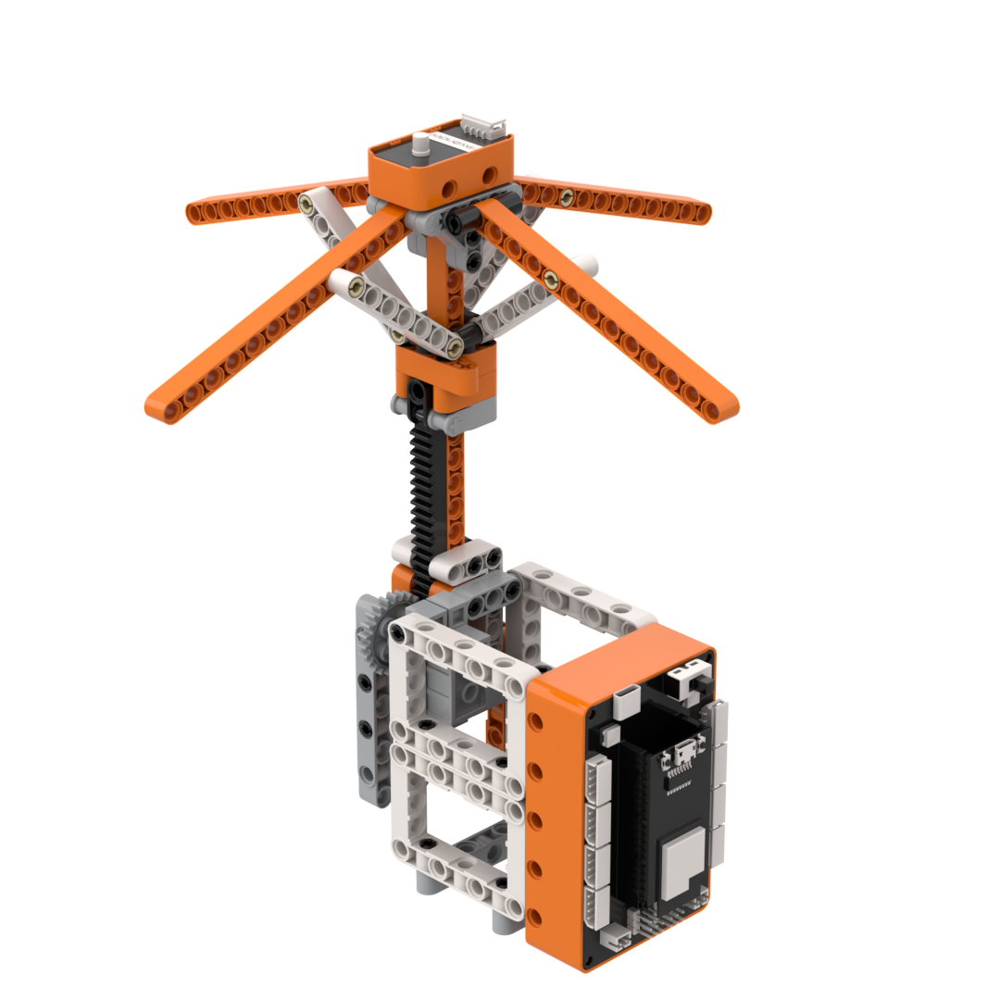

### 5.7.2 Learning Objectives

1. 在作品中实践舵机与光敏传感器的基础功能，理解光线检测与伞体开合的联动逻辑。
2. 掌握光控遮阳伞的机械搭建。
3. 学会编写 “光敏检测 + 舵机开合” 的程序，理解环境感知与动作控制原理。
4. 提升动手实践与智能遮阳设计能力，感受光控交互的科技魅力。

### 5.7.3 Materials Needed

1. **材料准备**：主控器、舵机、光敏传感器、模块线、积木零件。

2. **模块介绍**：

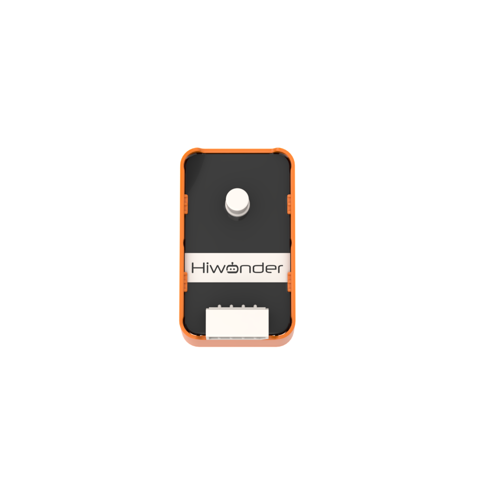

<table style="text-align: center;vertical-align: middle;">
	<tr><td colspan="2">光敏传感器</td></tr>
	<tr><td>功能</td><td>检测光线强度，触发遮阳伞的开合</td></tr>
    <tr><td>应用位置</td><td>安装在 “光控遮阳伞” 的底座旁</td></tr>
    <tr><td>实现效果</td><td>每检测到光线大于70，向主控发送打开遮阳伞的指令</td></tr>
</table>

<table style="text-align: center;vertical-align: middle;">
	<tr><td colspan="2">舵机模块</td></tr>
	<tr><td>功能</td><td>提供遮阳伞开合的动力</td></tr>
    <tr><td>应用位置</td><td>安装在 “光控遮阳伞” 的转轴处</td></tr>
    <tr><td>实现效果</td><td>接收到主控的指令后，控制遮阳伞收伞和开伞</td></tr>
</table>

### 5.7.4 Assembly Guide{#build_manual_19}

### 5.7.5 Coding Steps

1. **打开平台**：启动编程软件，新建项目；

2. **添加扩展**：

- 在软件左下角打开 “**扩展**” ；

- 在 “**扩展**” 中选择”**主控器**“添加 “**K12 ESP32**” ；

- 在 “**扩展**” 中选择”**传感器**“添加 “**光敏传感器**” ；

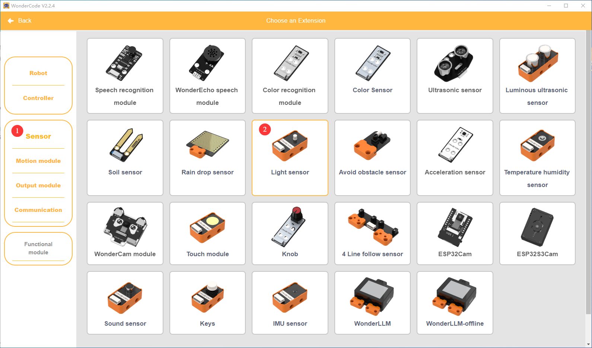

3. **参考程序**：

- 启动时，初始化 270° 舵机 S1 为 185° ，此时处于遮阳伞处于收合的状态；

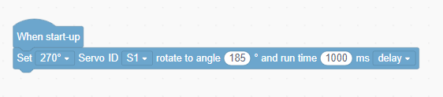

- 在主程序中进行光线检测和舵机控制：实时通过光线传感器（接口 5 ）检测环境的光线，当光线大于 70 时，舵机 S1 转到 0° 控制遮阳伞打开，反之就收合遮阳伞，每 0.5 秒刷新一次检测与控制状态，保证响应及时。

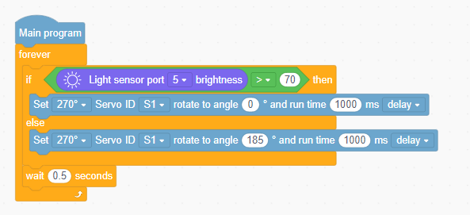

### 5.7.6 Program Download Steps

1. **连线**：用数据线将主控器与电脑 USB 端口连接；

2. **选端口**：在编程软件中选择主控器对应的 COM 端口（**COM口不唯一**）；

3. **下载**：点击 “**下载**” 按钮，将编写好的程序上传至主控器；

4. **开机**：给主控器接通电源，启动设备，测试功能。

### 5.7.7 Demo

## 5.8 Password Safe

### 5.8.1 Project Overview

这是一个会 “密码验证” 的密码保险箱，按键为 1，触摸为 0，按顺序输入正确密码后，舵机打开保险箱门，点阵屏显示输入的密码，就像一位安全的小卫士，只有正确密码才能解锁。

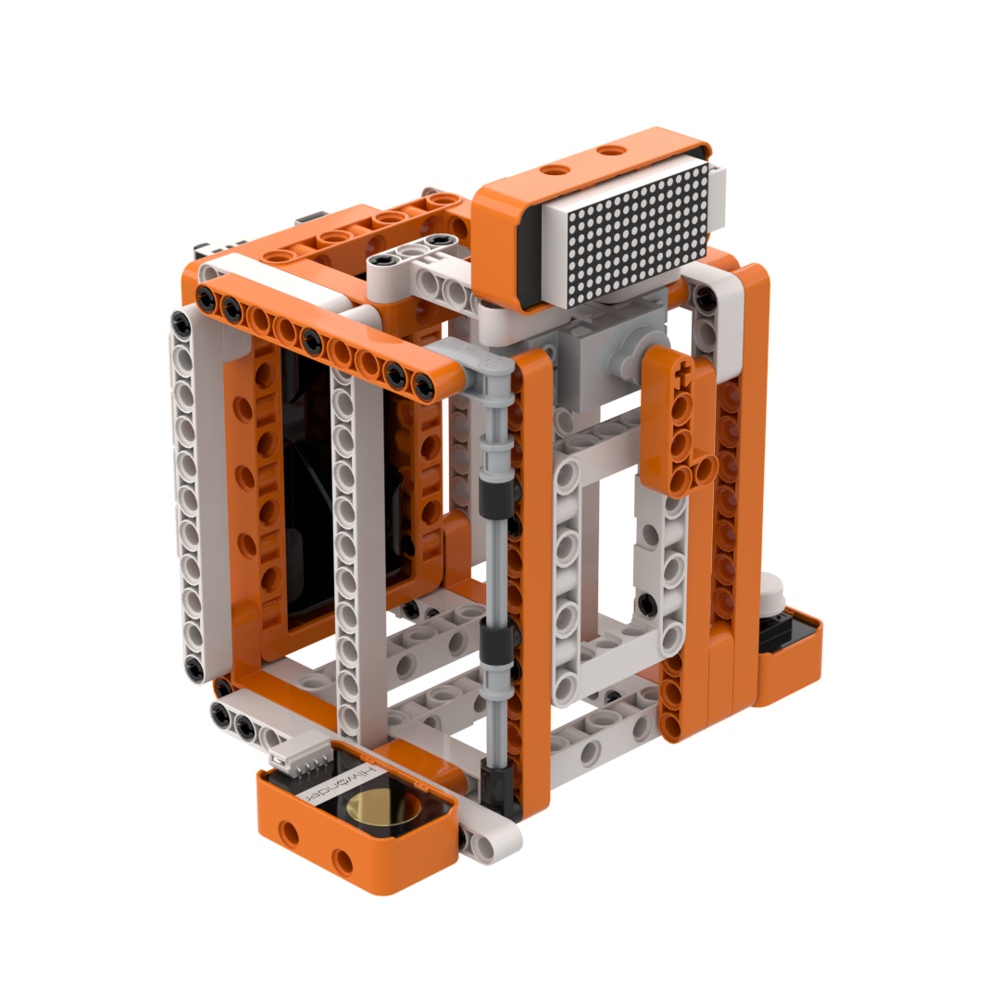

### 5.8.2 Learning Objectives

1. 在作品中实践舵机、按键、触摸与点阵屏的基础功能，理解密码输入、验证与解锁的联动逻辑。
2. 掌握密码保险箱的机械搭建。
3. 学会编写 “按键触摸密码输入 + 密码验证 + 舵机开门” 的程序，理解安全验证与状态控制原理。
4. 提升动手实践与安全设计能力，感受密码验证的编程乐趣。

### 5.8.3 Materials Needed

1. **材料准备**：主控器、舵机、按键传感器、触摸传感器、点阵屏模块、模块线、积木零件。

2. **模块介绍**：

<table style="text-align: center;vertical-align: middle;">
	<tr><td colspan="2">按键传感器</td></tr>
	<tr><td>功能</td><td>检测按压信号</td></tr>
    <tr><td>应用位置</td><td>安装在 “密码保险箱” 的底座旁</td></tr>
    <tr><td>实现效果</td><td>每检测到一次按压信号，向主控发送输入数字1的指令</td></tr>
</table>

<table style="text-align: center;vertical-align: middle;">
	<tr><td colspan="2">触摸传感器</td></tr>
	<tr><td>功能</td><td>检测触摸信号</td></tr>
    <tr><td>应用位置</td><td>安装在 “密码保险箱” 的底座旁</td></tr>
    <tr><td>实现效果</td><td>每检测到一次触摸信号，向主控发送输入数字0的指令</td></tr>
</table>

<table style="text-align: center;vertical-align: middle;">
	<tr><td colspan="2">点阵屏模块</td></tr>
	<tr><td>功能</td><td>显示输入密码和密码验证结果</td></tr>
    <tr><td>应用位置</td><td>安装在 “密码保险箱” 的正面</td></tr>
    <tr><td>实现效果</td><td>接收到主控的指控后，实时显示输入的密码，当密码验证正确时显示“OK”，失败显示“NO”</td></tr>
</table>

<table style="text-align: center;vertical-align: middle;">
	<tr><td colspan="2">舵机模块</td></tr>
	<tr><td>功能</td><td>提供保险箱箱门开合的动力</td></tr>
    <tr><td>应用位置</td><td>安装在 “密码保险箱” 的转轴处</td></tr>
    <tr><td>实现效果</td><td>接收到主控密码验证正确的指令后，控制箱门开启5秒后自动关闭</td></tr>
</table>

### 5.8.4 Assembly Guide{#build_manual_20}

### 5.8.5 Coding Steps

1. **打开平台**：启动编程软件，新建项目；

2. **添加扩展**：

- 在软件左下角打开 “**扩展**” ；

- 在 “**扩展**” 中选择”**主控器**“添加 “**K12 ESP32**” ；

- 在 “**扩展**” 中选择”**传感器**“添加 “**按键传感器**” 、“**按键传感器**” ；

- 在 “**扩展**” 中选择”**输出模块**“添加 “**点阵屏**” ；

3. **参考程序**：

- 启动时，初始化触摸传感器的接口 6 和点阵屏的接口 7，初始化 270° 舵机 S1 为 135° ，此时处于保险箱处于关门的状态，设置变量 “密码” 为101，并初始化变量 “密码位数1/2/3” 和 “输入位数” 为 2、2、2、1；

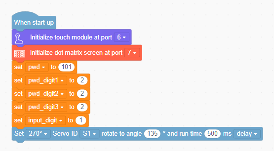

- 在主程序中进行按键输入：当按键（接口 5）被按下时，输入数字 1 ，按输入位数依次存入 “密码位数1/2/3” ，点阵屏实时显示已输入的数字组合，每输入一位，“输入位数” 自动 + 1，最多输入 3 位；

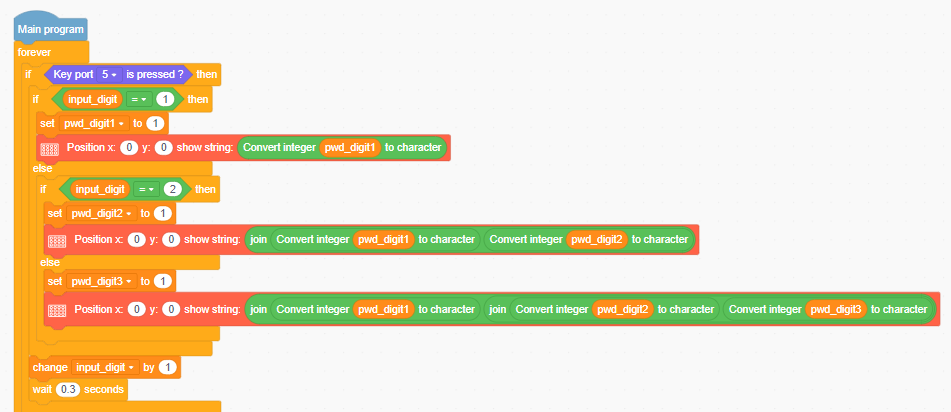

- 在主程序中进行触摸输入：当触摸被按下时，输入数字 0 ，按输入位数依次存入 “密码位数1/2/3” ，点阵屏实时显示已输入的数字组合，每输入一位，“输入位数” 自动 + 1，最多输入 3 位；

- 在主程序中进行密码验证和舵机控制：当输入位数达到 4 位时，触发密码进行验证，将字符串“密码位数1/2/3” 和预设密码101对比，若一致，点阵屏显示 “OK”，播放 C5 音调，舵机 S1 转到 225° 控制保险箱开门，5 秒后复位到 135°关门，否则点阵屏显示 “NO”，重复播放 2 次 A2 音调提示错误，验证结束后，将 “输入位数” 重置为 1，等待下一次输入。

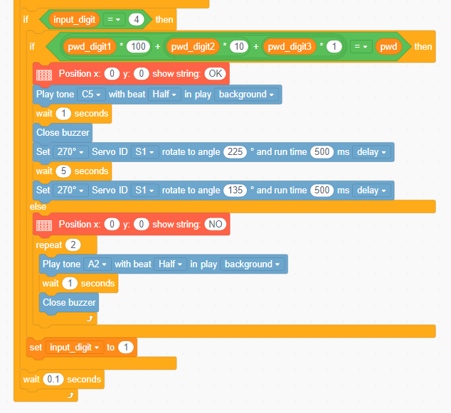

### 5.8.6 Program Download Steps

1. **连线**：用数据线将主控器与电脑 USB 端口连接；

2. **选端口**：在编程软件中选择主控器对应的 COM 端口（**COM口不唯一**）；

3. **下载**：点击 “**下载**” 按钮，将编写好的程序上传至主控器；

4. **开机**：给主控器接通电源，启动设备，测试功能。

### 5.8.7 Demo

## 5.9 Moving Basketball Hoop Challenge

### 5.9.1 Project Overview

这是一台会 “难度升级” 的移动投篮机，移动篮筐有三个难度等级，触摸传感器选择难度，按键启动；红外传感器检测到小球投进一次，点阵显示数值加 1，就像投篮游乐场的智能计分机，好玩又有挑战性。

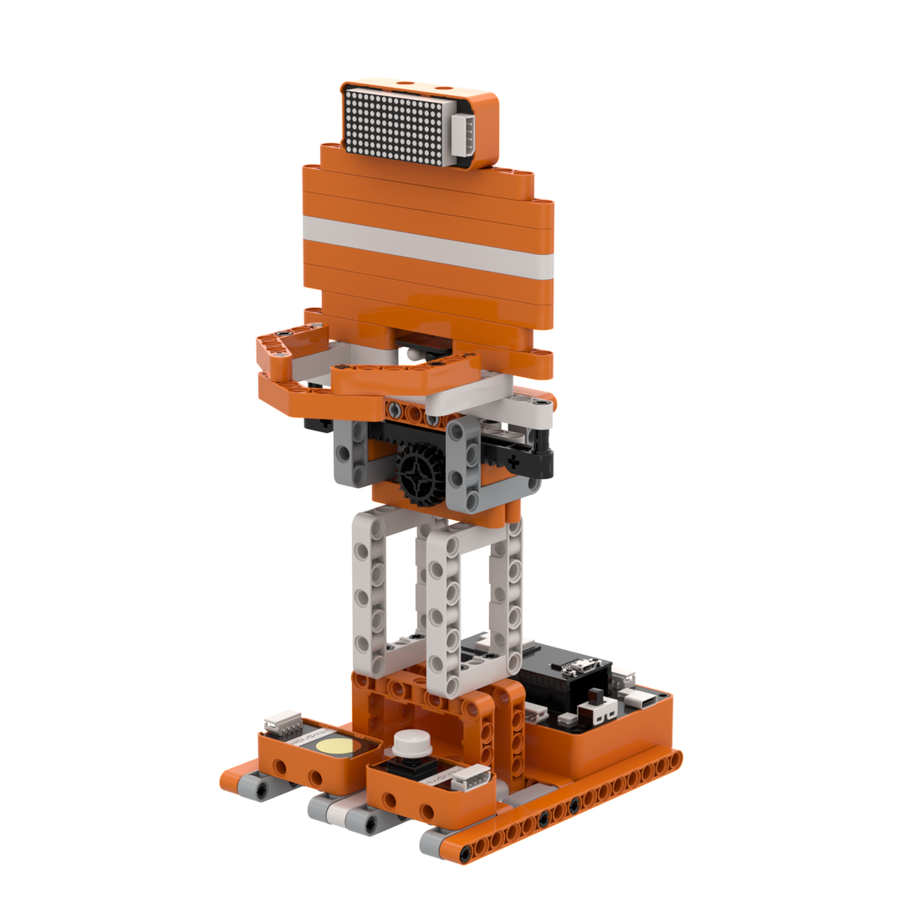

### 5.9.2 Learning Objectives

1. 在作品中实践舵机、红外、点阵、触摸与按键的基础功能，理解移动、投中检测、计分与显示的联动逻辑。
2. 掌握移动投篮机的机械搭建。
3. 学会编写 “触摸选择难度 + 按键启动 + 舵机移动 + 红外检测 + 点阵计分” 的程序，理解多设备协同工作原理。
4. 提升互动竞技类作品设计与多传感器综合编程能力。

### 5.9.3 Materials Needed

1. **材料准备**：主控器、舵机、按键传感器、触摸传感器、红外传感器、点阵屏、模块线、积木零件。

2. **模块介绍**：

<table style="text-align: center;vertical-align: middle;">
	<tr><td colspan="2">按键传感器</td></tr>
	<tr><td>功能</td><td>检测按压信号，触发投篮机开始移动、清零复位</td></tr>
    <tr><td>应用位置</td><td>安装在 “移动投篮机” 底部支架上</td></tr>
    <tr><td>实现效果</td><td>每检测到一次按压信号，向主控发送开始移动、清零复位的指令</td></tr>
</table>

<table style="text-align: center;vertical-align: middle;">
	<tr><td colspan="2">触摸传感器</td></tr>
	<tr><td>功能</td><td>检测触摸信号，触发难度等级切换</td></tr>
    <tr><td>应用位置</td><td>安装在 “移动投篮机” 底部支架上</td></tr>
    <tr><td>实现效果</td><td>每检测到一次触摸信号，向主控发送难度等级切换的指令</td></tr>
</table>

<table style="text-align: center;vertical-align: middle;">
	<tr><td colspan="2">红外传感器</td></tr>
	<tr><td>功能</td><td>检测篮球投中信号</td></tr>
    <tr><td>应用位置</td><td>安装在 “移动投篮机” 挡板底部</td></tr>
    <tr><td>实现效果</td><td>检测到篮球投中时，向主控发送计分信号</td></tr>
</table>

<table style="text-align: center;vertical-align: middle;">
	<tr><td colspan="2">点阵屏模块</td></tr>
	<tr><td>功能</td><td>实时显示难度等级、进球数</td></tr>
    <tr><td>应用位置</td><td>安装在 “移动投篮机” 的顶部</td></tr>
    <tr><td>实现效果</td><td>接收到主控的指令后，实时显示难度等级和进球数</td></tr>
</table>

<table style="text-align: center;vertical-align: middle;">
	<tr><td colspan="2">舵机模块</td></tr>
	<tr><td>功能</td><td>提供篮筐左右往复移动的动力</td></tr>
    <tr><td>应用位置</td><td>安装在 “移动投篮机” 的挡板附近</td></tr>
    <tr><td>实现效果</td><td>接收到主控的指令后，控制投篮机以对应的速度（30/60/90）左右移动</td></tr>
</table>

### 5.9.4 Assembly Guide{#build_manual_21}

### 5.9.5 Coding Steps

1. **打开平台**：启动编程软件，新建项目；

2. **添加扩展**：

- 在软件左下角打开 “**扩展**” ；

- 在 “**扩展**” 中选择”**主控器**“添加 “**K12 ESP32**” ；

- 在 “**扩展**” 中选择”**传感器**“添加 “**按键传感器**” 、“**触摸传感器**” 、“**红外传感器**” ；

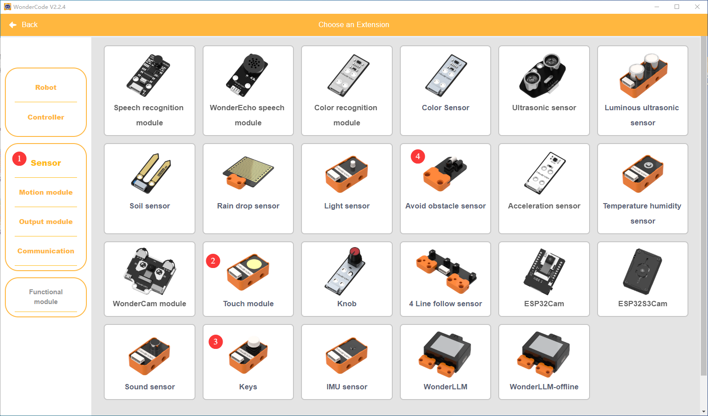

3. **参考程序**：

- 启动时，初始化点阵屏的接口 5 和触摸传感器的接口 8，将 “进球数”、“难度等级”、“篮筐状态”、“角度”、“角度变量” 等变量初始化，初始化 270° 舵机 S1 为 135° ，此时篮筐处于正中间位置，点阵屏显示 “NO:1”，为游戏做好准备；

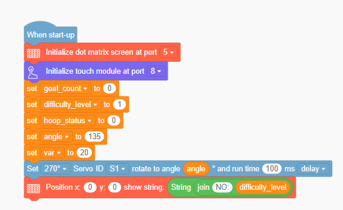

- 在主程序中根据 “篮筐状态” 分阶段执行完整的投篮游戏逻辑：当处于待机状态（篮筐状态 = 0）时，此时按下按键（接口 7），将篮筐状态设为 1，进入游戏模式；此时触摸被按下时，难度等级增加 1，若难度等级达到 4 则自动重置为 1，点阵屏同步更新难度显示；

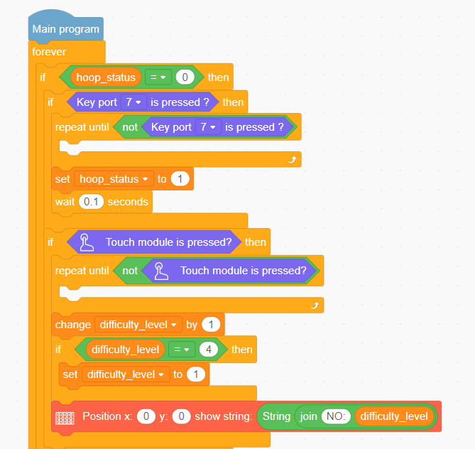

- 在主程序中根据 “篮筐状态” 分阶段执行完整的投篮游戏逻辑：当处于游戏状态（篮筐状态 = 1）时，红外传感器（接口 6 ）检测到障碍物（球投进）时，“进球数” 增加 1，点阵屏实时显示进球数；若此时再次按下按键，将篮筐状态设为 2，游戏结束；

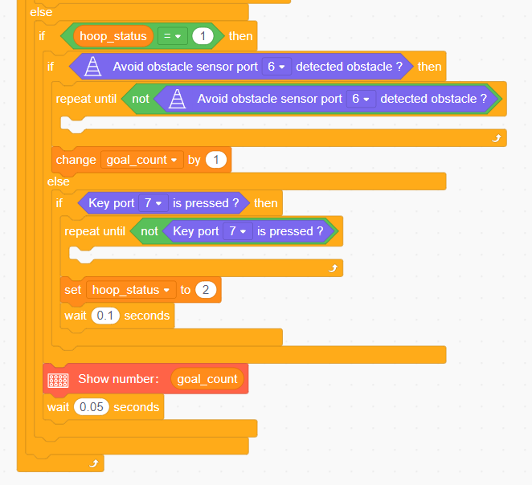

- 在主程序中根据 “篮筐状态” 分阶段执行完整的投篮游戏逻辑：当处于游戏状态（篮筐状态 = 1）时，根据 “角度变量”（±20）和 “角度”（135° 为基准），舵机 S1 控制篮筐在 15°~270° 间往复移动，难度等级越高，舵机运行时间越短（篮筐移动越快）；

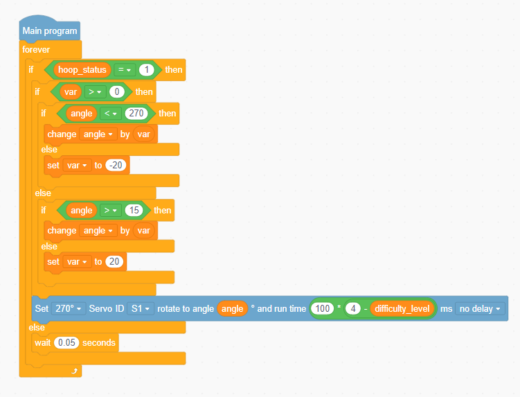

- 在主程序中根据 “篮筐状态” 分阶段执行完整的投篮游戏逻辑：当处于游戏结束状态（篮筐状态 = 2），等待 2 秒后，重置 “进球数” 为 0、“难度等级” 为 1、“角度” 为 135°、“角度变量” 为 20，舵机 S1 复位，点阵屏重新显示难度等级，将篮筐状态设为 0，回到待机状态。

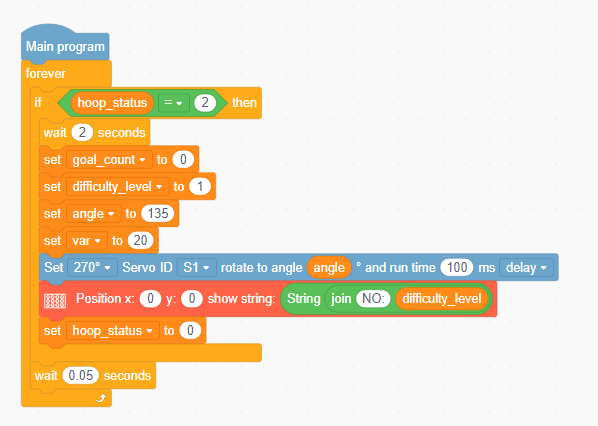

### 5.9.6 Program Download Steps

1. **连线**：用数据线将主控器与电脑 USB 端口连接；

2. **选端口**：在编程软件中选择主控器对应的 COM 端口（**COM口不唯一**）；

3. **下载**：点击 “**下载**” 按钮，将编写好的程序上传至主控器；

4. **开机**：给主控器接通电源，启动设备，测试功能。

### 5.9.7 Demo

## 5.10 Automatic Clothes Rack

### 5.10.1 Project Overview

这是一个会 “光控伸缩” 的自动晾衣架，上电后晾衣架收回，直到光敏传感器检测到光线大于 80 时，晾衣架自动伸出，就像一位贴心的晾晒助手，根据光线强弱自动调节晾晒状态。

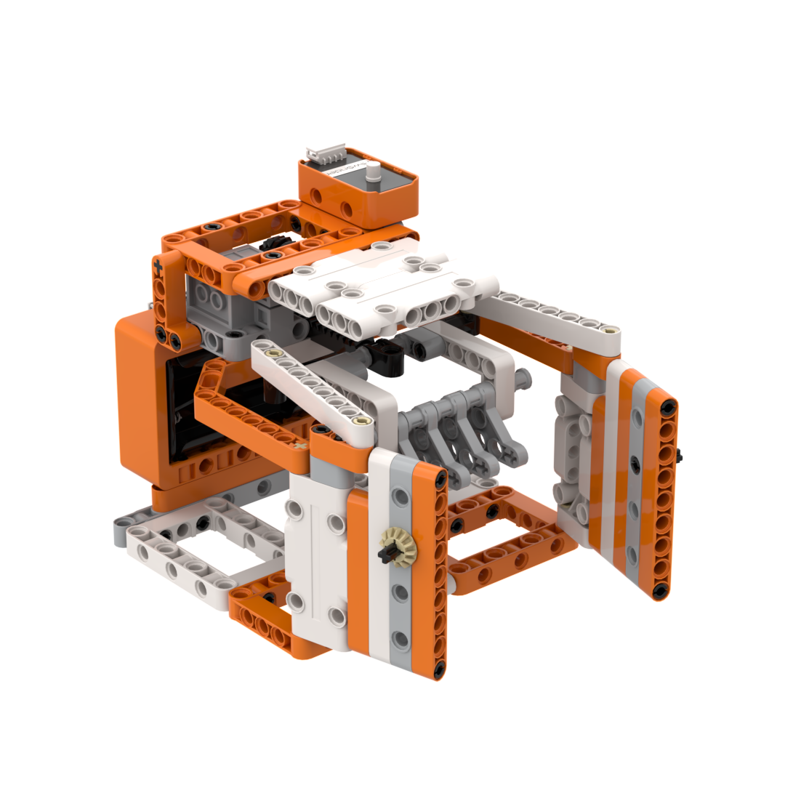

### 5.10.2 Learning Objectives

1. 在作品中实践舵机与光敏传感器的基础功能，理解光线检测与晾衣架伸缩的联动逻辑。
2. 掌握自动晾衣架的机械搭建。
3. 学会编写 “光敏检测 + 舵机伸缩” 的程序，理解环境感知与动作控制原理。
4. 提升动手实践与智能晾晒设计能力，感受光控交互的科技魅力。

### 5.10.3 Materials Needed

1. **材料准备**：主控器、舵机、光敏传感器、模块线、积木零件。

2. **模块介绍**：

<table style="text-align: center;vertical-align: middle;">
	<tr><td colspan="2">光敏传感器</td></tr>
	<tr><td>功能</td><td>检测光线强度，触发晾衣架的伸缩</td></tr>
    <tr><td>应用位置</td><td>安装在 “自动晾衣架” 的顶部</td></tr>
    <tr><td>实现效果</td><td>每检测到光线大于80，向主控发送伸出晾衣架的指令</td></tr>
</table>

<table style="text-align: center;vertical-align: middle;">
	<tr><td colspan="2">舵机模块</td></tr>
	<tr><td>功能</td><td>提供晾衣架伸缩的动力</td></tr>
    <tr><td>应用位置</td><td>安装在 “光控遮阳伞” 的转轴处</td></tr>
    <tr><td>实现效果</td><td>接收到主控的指令后，控制晾衣架的伸出和收回</td></tr>
</table>

### 5.10.4 Assembly Guide{#build_manual_22}

### 5.10.5 Coding Steps

1. **打开平台**：启动编程软件，新建项目；

2. **添加扩展**：

- 在软件左下角打开 “**扩展**” ；

- 在 “**扩展**” 中选择”**主控器**“添加 “**K12 ESP32**” ；

- 在 “**扩展**” 中选择”**传感器**“添加 “**光敏传感器**” ；

3. **参考程序**：

- 启动时，初始化 270° 舵机 S1 为 270° ，此时处于晾衣架处于收回的状态；

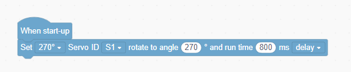

- 在主程序中进行光线检测和舵机控制：实时通过光线传感器（接口 5 ）检测环境的光线，当光线大于 80 时，舵机 S1 转到 140° 控制晾衣架伸出，反之就收回晾衣架，每 0.1 秒刷新一次检测与控制状态，保证响应及时。

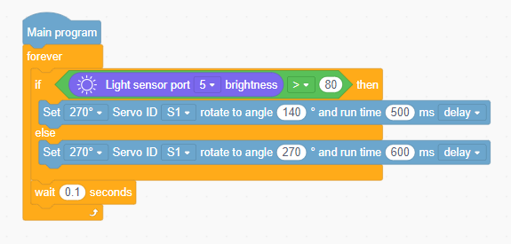

### 5.10.6 Program Download Steps

1. **连线**：用数据线将主控器与电脑 USB 端口连接；

2. **选端口**：在编程软件中选择主控器对应的 COM 端口（**COM口不唯一**）；

3. **下载**：点击 “**下载**” 按钮，将编写好的程序上传至主控器；

4. **开机**：给主控器接通电源，启动设备，测试功能。

### 5.10.7 Demo

## 5.11 Whirlwind Spin Ride

### 5.11.1 Project Overview

这是一台会 “齿轮传动” 的旋风转转椅，按键控制启动与停止，转大圈的同时 4 个座位也在旋转，就像游乐园里的刺激项目，充满旋转的快乐。

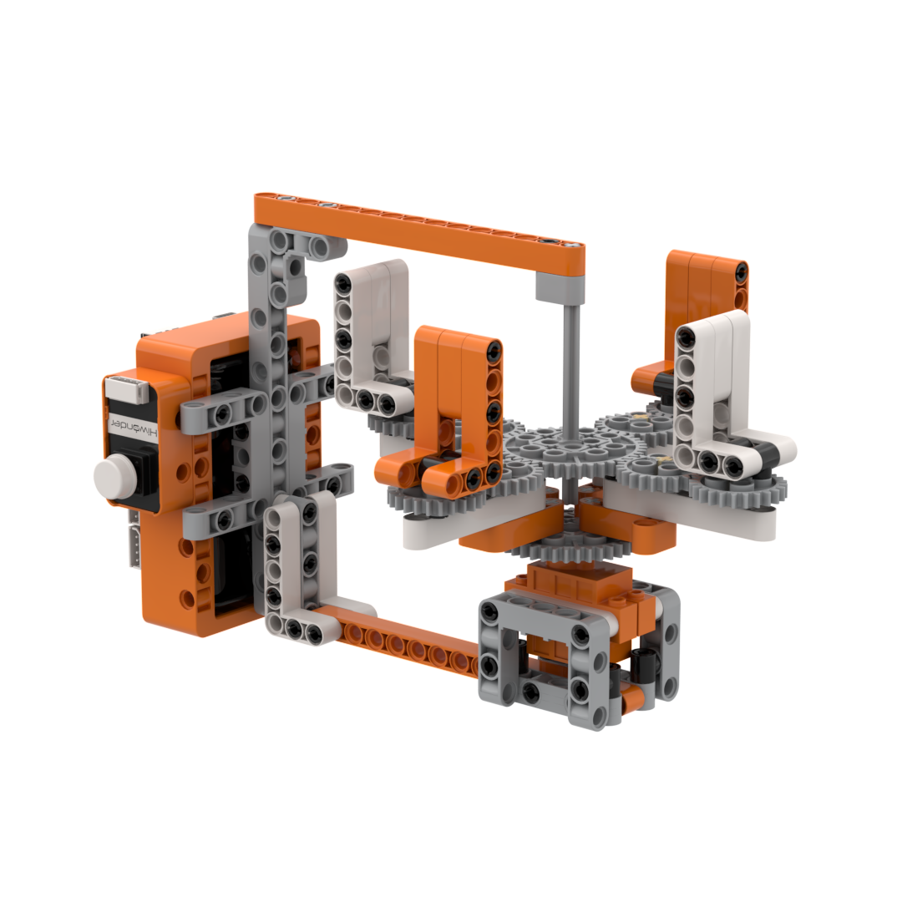

### 5.11.2 Learning Objectives

1. 在作品中实践电机与按键的基础功能，理解齿轮传动与双重旋转的逻辑。
2. 掌握旋风转转椅的机械搭建。
3. 学会编写 “按键触发 + 电机启停” 的程序，理解状态切换与动力传动原理。
4. 提升动手实践与复杂机械结构理解能力，感受游乐设施的科技魅力。

### 5.11.3 Materials Needed

1. **材料准备**：主控器、电机、按键传感器、模块线、积木零件。

2. **模块介绍**：

<table style="text-align: center;vertical-align: middle;">
	<tr><td colspan="2">按键传感器</td></tr>
	<tr><td>功能</td><td>检测按压信号，触发旋飞转转椅的启停</td></tr>
    <tr><td>应用位置</td><td>安装在 “旋飞转转椅” 的底座旁</td></tr>
    <tr><td>实现效果</td><td>每检测到一次按压信号，向主控发送状态切换的指令</td></tr>
</table>

<table style="text-align: center;vertical-align: middle;">
	<tr><td colspan="2">电机模块</td></tr>
	<tr><td>功能</td><td>提供旋转的动力</td></tr>
    <tr><td>应用位置</td><td>安装在 “旋飞转转椅” 的转轴处</td></tr>
    <tr><td>实现效果</td><td>接收到主控的指令后，控制旋飞转转椅的启动和停止，启动时转台大圈旋转，同时通过齿轮驱动座位自转</td></tr>
</table>

### 5.11.4 Assembly Guide{#build_manual_23}

### 5.11.5 Coding Steps

1. **打开平台**：启动编程软件，新建项目；

2. **添加扩展**：

- 在软件左下角打开 “**扩展**” ；

- 在 “**扩展**” 中选择”**主控器**“添加 “**K12 ESP32**” ；

- 在 “**扩展**” 中选择”**传感器**“添加 “**按键传感器**” ；

3. **参考程序**：

- 启动时，定义变量“运行状态”，并将变量初始化为 -1（-1是没有转动，1是在转动）；

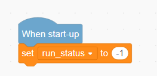

- 在主程序中进行按键检测和电机控制：当按键（接口5）被按下，将 “运行状态” 设置为“0-运行状态”（即取反），实现状态翻转，并等待 0.5 秒防抖；若 “运行状态” 为 1 ，电机 S1 以 30 的速度控制转台大圈旋转，同时通过齿轮驱动座位自转，否则停止转动。

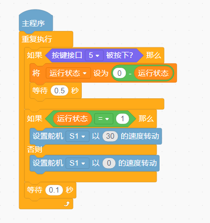

### 5.11.6 Program Download Steps

1. **连线**：用数据线将主控器与电脑 USB 端口连接；

2. **选端口**：在编程软件中选择主控器对应的 COM 端口（**COM口不唯一**）；

3. **下载**：点击 “**下载**” 按钮，将编写好的程序上传至主控器；

4. **开机**：给主控器接通电源，启动设备，测试功能。

### 5.11.7 Demo

## 5.12 Giant Pendulum Ride

### 5.12.1 Project Overview

这是一台会 “摇摆摆动” 的旋转大摆锤，按键启动后大摆锤来回摆动，就像游乐园里的明星项目，充满刺激的摇摆体验。

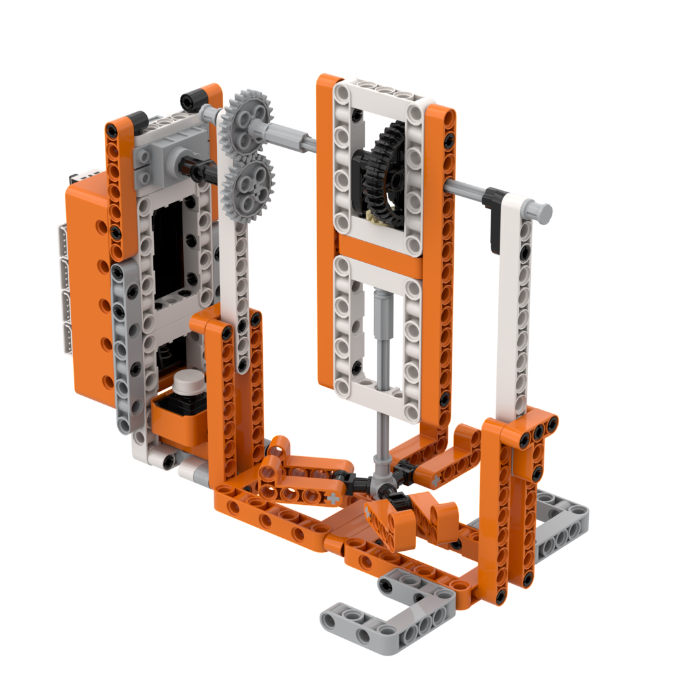

### 5.12.2 Learning Objectives

1. 在作品中实践舵机与按键的基础功能，理解按键触发与摆锤摆动的逻辑。
2. 掌握旋转大摆锤的机械搭建。
3. 学会编写 “按键触发 + 舵机摆动” 的程序，理解往复运动控制原理。
4. 提升动手实践与复杂机械结构理解能力，感受游乐设施的科技魅力。

### 5.12.3 Materials Needed

1. **材料准备**：主控器、舵机、按键传感器、模块线、积木零件。

2. **模块介绍**：

<table style="text-align: center;vertical-align: middle;">
	<tr><td colspan="2">按键传感器</td></tr>
	<tr><td>功能</td><td>检测按压信号，触发大摆锤启动</td></tr>
    <tr><td>应用位置</td><td>安装在 “旋转大摆锤” 的底座上</td></tr>
    <tr><td>实现效果</td><td>每检测到一次按压信号，向主控发送启动大摆锤的指令</td></tr>
</table>

<table style="text-align: center;vertical-align: middle;">
	<tr><td colspan="2">舵机模块</td></tr>
	<tr><td>功能</td><td>提供大摆锤摆动的动力</td></tr>
    <tr><td>应用位置</td><td>安装在 “旋转大摆锤” 的转轴处</td></tr>
    <tr><td>实现效果</td><td>接收到主控的指令后，控制大摆锤开始来回摆动，同时通过齿轮传动带动座位360度旋转</td></tr>
</table>

### 5.12.4 Assembly Guide{#build_manual_24}

### 5.12.5 Coding Steps

1. **打开平台**：启动编程软件，新建项目；

2. **添加扩展**：

- 在软件左下角打开 “**扩展**” ；

- 在 “**扩展**” 中选择”**主控器**“添加 “**K12 ESP32**” ；

- 在 “**扩展**” 中选择”**传感器**“添加 “**按键传感器**” ；

3. **参考程序**：

- 启动时，初始化 270° 舵机 S1 为 135° ，此时大摆锤处在正中间位置，定义变量“大摆锤状态”，并将变量初始化为0（0是没有摆动，1是在摆动）；

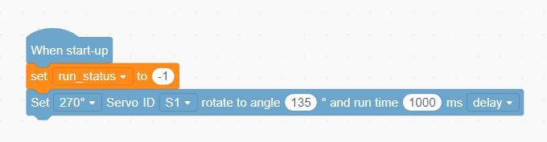

- 在主程序中进行按键检测和舵机控制：当按键（接口5）被按下，将大摆锤状态设为1，舵机 S1 先转到 140° 控制大摆锤向前摆动1.5秒至水平，舵机 S1 再转到 140° 控制大摆锤向后摆动1.5秒至水平。

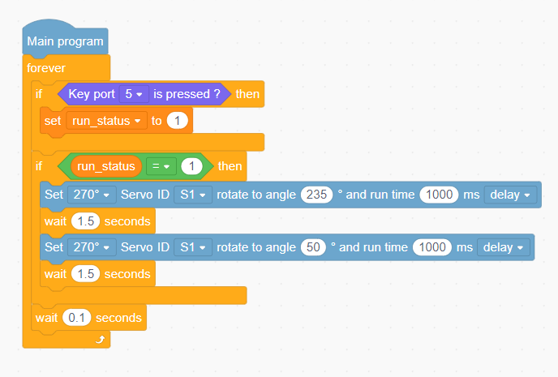

### 5.12.6 Program Download Steps

1. **连线**：用数据线将主控器与电脑 USB 端口连接；

2. **选端口**：在编程软件中选择主控器对应的 COM 端口（**COM口不唯一**）；

3. **下载**：点击 “**下载**” 按钮，将编写好的程序上传至主控器；

4. **开机**：给主控器接通电源，启动设备，测试功能。

### 5.12.7 Demo

