# 6. Ultimate Kit Creative Builds

## 6.1 Self-Balancing Scale

### 6.1.1 Project Overview

这是一台会 “自动找平” 的自动平衡秤，秤盘放入物品后，秤砣会自动调整位置，让秤杆始终保持水平平衡，就像一位精准的平衡大师，稳稳托住每一份重量。

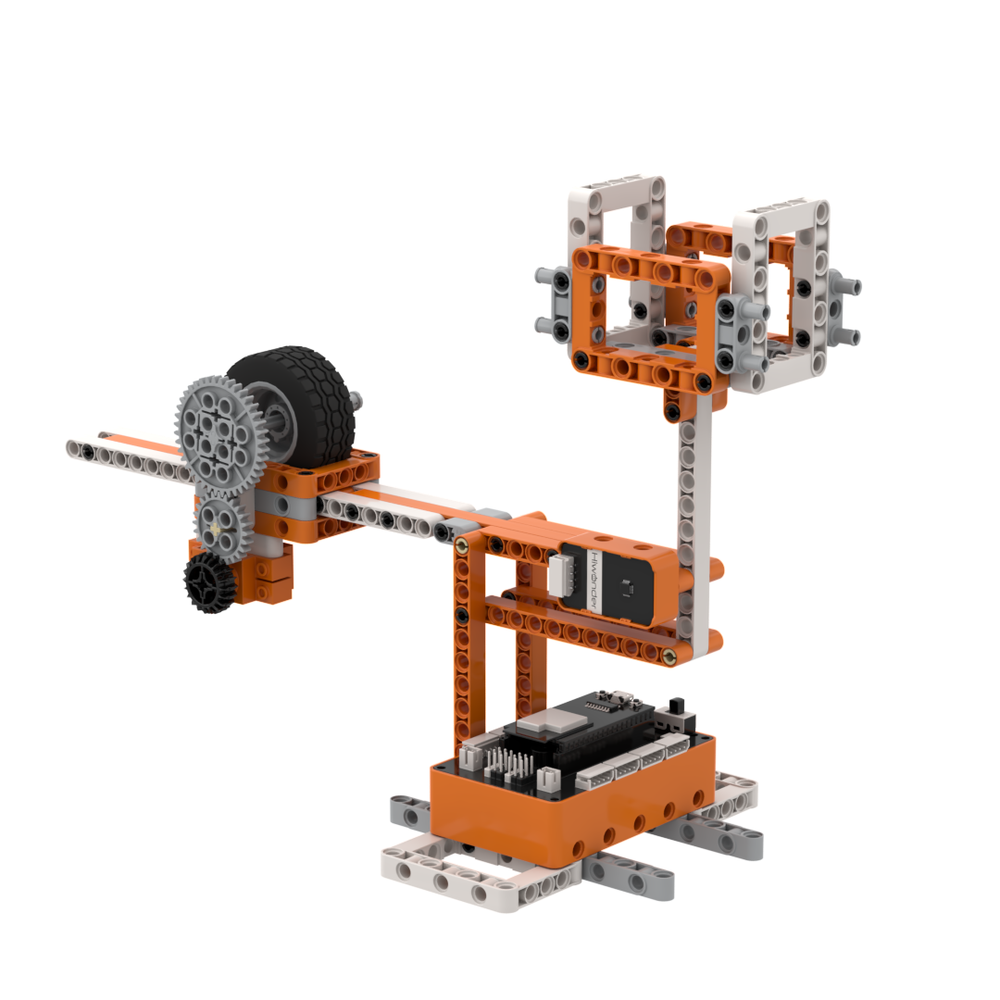

### 6.1.2 Learning Objectives

1. 在作品中实践电机与 IMU 传感器的基础功能，理解角度检测与平衡调整的联动逻辑。
2. 掌握自动平衡秤的机械搭建。
3. 学会编写 “IMU 角度检测 + 电机调整平衡” 的程序，理解闭环控制原理。
4. 提升动手实践与物理结合编程能力，感受智能平衡的科技魅力。

### 6.1.3 Materials Needed

1. **材料准备**：主控器、电机、IMU传感器、模块线、积木零件。

2. **模块介绍**：

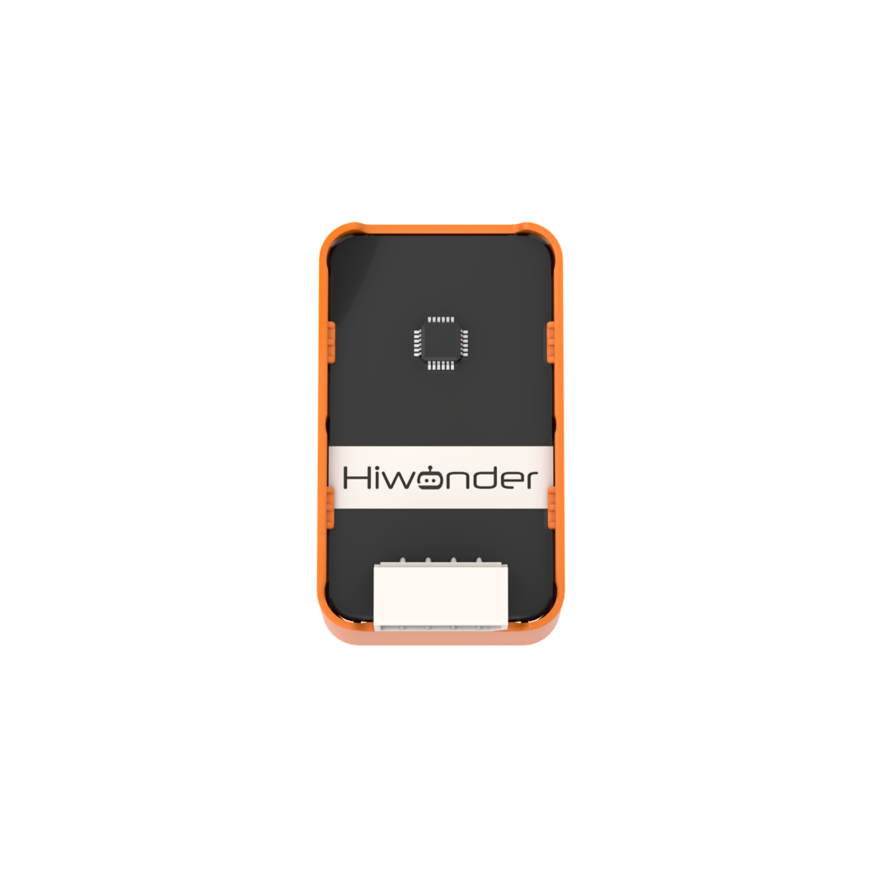

<table style="text-align: center;vertical-align: middle;">
	<tr><td colspan="2">IMU传感器</td></tr>
	<tr><td>功能</td><td>检测秤杆倾斜角度</td></tr>
    <tr><td>应用位置</td><td>安装在 “自动平衡秤” 秤杆处</td></tr>
    <tr><td>实现效果</td><td>检测秤杆倾斜角度，判断平衡状态，将状态信息发送给主控</td></tr>
</table>

<table style="text-align: center;vertical-align: middle;">
	<tr><td colspan="2">电机模块</td></tr>
	<tr><td>功能</td><td>提供秤砣移动的动力</td></tr>
    <tr><td>应用位置</td><td>安装在 “自动平衡秤” 秤砣处</td></tr>
    <tr><td>实现效果</td><td>接收到主控的信息后，带动秤砣左右移动，调节秤杆平衡</td></tr>
</table>

### 6.1.4 Assembly Guide{#build_manual_25}

### 6.1.5 Coding Steps

1. **打开平台**：启动编程软件，新建项目；

2. **添加扩展**：

- 在软件左下角打开 “**扩展**” ；

- 在 “**扩展**” 中选择”**主控器**“添加 “**K12 ESP32**” ；

- 在 “**扩展**” 中选择”**传感器**“添加 “**IMU传感器**” ；

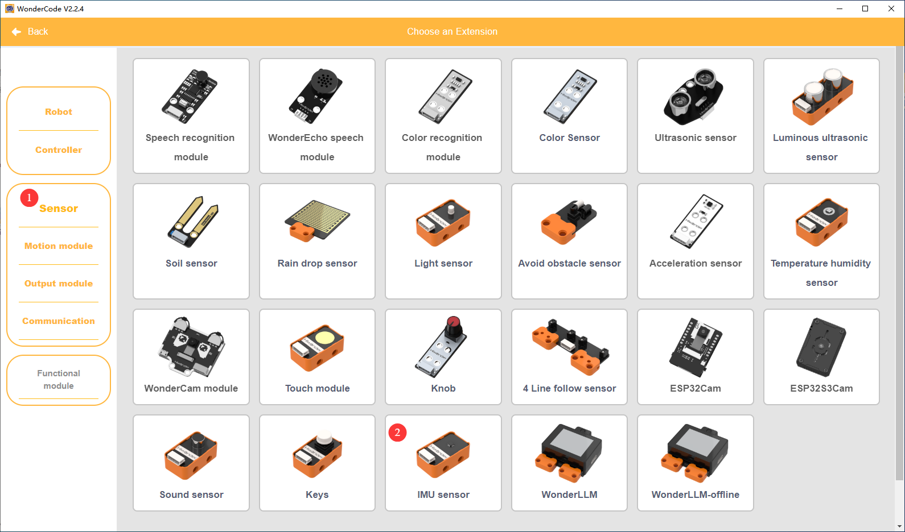

3. **参考程序**：

- 启动时，初始化 IMU 传感器 IIC 接口 2，等待 2 秒完成传感器校准；

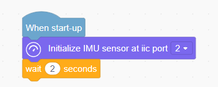

- 在主程序中进行角度获取与电机控制：实时通过 IMU 传感器读取秤杆的 X 轴角度值即秤杆的倾斜状态，并把角度值存入 “当前角度” 中，当秤杆左倾（角度 > 30°）：舵机 S1 以 40 的速度转动 0.1 秒（拖动秤砣向右移动），然后停止 0.2 秒，让秤杆有时间响应调整；

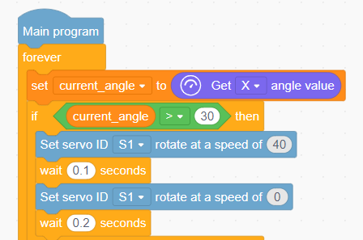

当秤杆右倾（角度 <-120°）：舵机 S1 以 40 的速度转动 0.1 秒（拖动秤砣向左移动），然后停止 0.2 秒，等待秤杆回正；当秤杆已平衡（角度在 - 120°~30°）：舵机保持停止，等待 0.1 秒后继续检测。

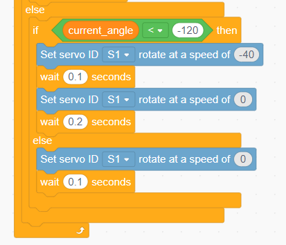

### 6.1.6 Program Download Steps

1. **连线**：用数据线将主控器与电脑 USB 端口连接；

2. **选端口**：在编程软件中选择主控器对应的 COM 端口（**COM口不唯一**）；

3. **下载**：点击 “**下载**” 按钮，将编写好的程序上传至主控器；

4. **开机**：给主控器接通电源，启动设备，测试功能。

### 6.1.7 Demo

## 6.2 Crazy Bicycle

### 6.2.1 Project Overview

这是一辆会 “灵活避障” 的疯狂自行车，上电后持续前进，当超声波检测到障碍物距离小于 15cm 时，自动向右转动 35 度继续前行，就像一位经验丰富的骑手，总能巧妙绕开障碍。

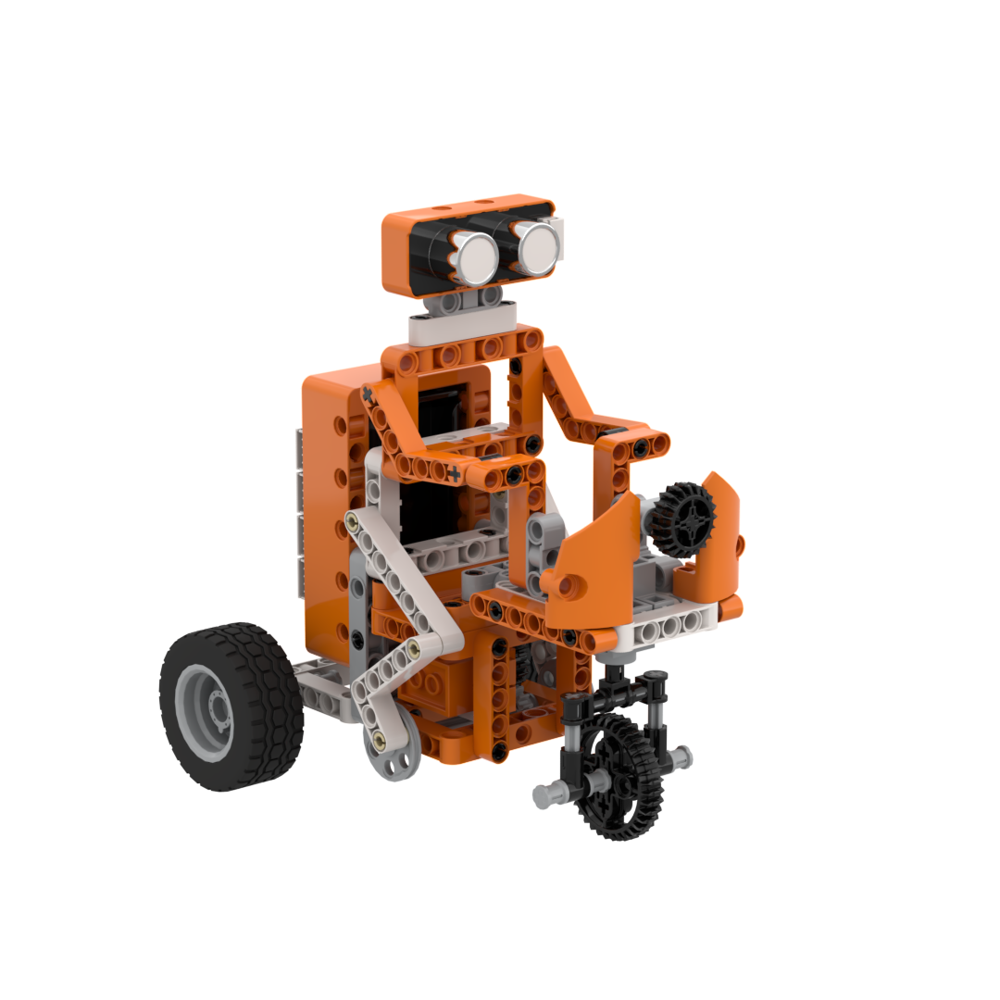

### 6.2.2 Learning Objectives

1. 在作品中实践电机、舵机与超声波传感器的基础功能，理解避障检测与转向控制的联动逻辑。
2. 掌握疯狂自行车的机械搭建。
3. 学会编写 “超声波避障 + 舵机转向 + 继续前进” 的程序，理解多设备协同工作原理。
4. 提升动手实践与智能交通设计能力，感受避障骑行的科技魅力。

### 6.2.3 Materials Needed

1. **材料准备**：主控器、电机、舵机、超声波传感器、模块线、积木零件。

2. **模块介绍**：

<table style="text-align: center;vertical-align: middle;">
	<tr><td colspan="2">超声波传感器</td></tr>
	<tr><td>功能</td><td>检测前方障碍物距离</td></tr>
    <tr><td>应用位置</td><td>安装在 “疯狂自行车” 的头上，充当眼睛</td></tr>
    <tr><td>实现效果</td><td>检测前方障碍物距离小于15cm时，向主控发送避障的指令</td></tr>
</table>

<table style="text-align: center;vertical-align: middle;">
	<tr><td colspan="2">电机模块</td></tr>
	<tr><td>功能</td><td>提供自行车前进的动力</td></tr>
    <tr><td>应用位置</td><td>安装在 “疯狂自行车” 的后轮处</td></tr>
    <tr><td>实现效果</td><td>接收到主控的指令后，控制自行车前进</td></tr>
</table>

<table style="text-align: center;vertical-align: middle;">
	<tr><td colspan="2">舵机模块</td></tr>
	<tr><td>功能</td><td>提供自行车转向避让障碍物的动力</td></tr>
    <tr><td>应用位置</td><td>安装在 “疯狂自行车” 的前轮处</td></tr>
    <tr><td>实现效果</td><td>接收到主控的指令后，控制前轮转弯，避让障碍</td></tr>
</table>

### 6.2.4 Assembly Guide{#build_manual_26}

### 6.2.5 Coding Steps

1. **打开平台**：启动编程软件，新建项目；

2. **添加扩展**：

- 在软件左下角打开 “**扩展**” ；

- 在 “**扩展**” 中选择”**主控器**“添加 “**K12 ESP32**” ；

- 在 “**扩展**” 中选择”**传感器**“添加 “**超声波传感器**” ；

3. **参考程序**：

- 启动时，先初始化超声波传感器的接口1，初始化 270° 舵机 S1 为 140° ，此时前轮车轮摆正；

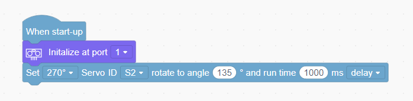

- 在主程序中进行距离检测和电机、舵机控制：实时通过发光超声波传感器检测障碍物距离，当其小于 15cm 时，舵机 S1 转到 100° 控制前轮拐弯，若障碍物移开，则舵机 S1 复位到 135° 摆正车轮继续前进，每 0.5 秒刷新一次检测与控制状态，保证响应及时。

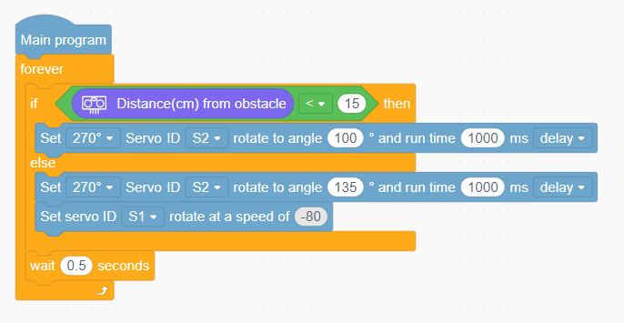

### 6.2.6 Program Download Steps

1. **连线**：用数据线将主控器与电脑 USB 端口连接；

2. **选端口**：在编程软件中选择主控器对应的 COM 端口（**COM口不唯一**）；

3. **下载**：点击 “**下载**” 按钮，将编写好的程序上传至主控器；

4. **开机**：给主控器接通电源，启动设备，测试功能。

### 6.2.7 Demo

## 6.3 Vintage Carriage

### 6.3.1 Project Overview

这是一辆会 “按键启停” 的复古马车，按键启动后马车向前奔跑，再次按下按键则停止，就像童话里的信使马车，慢悠悠地穿梭在时光里。

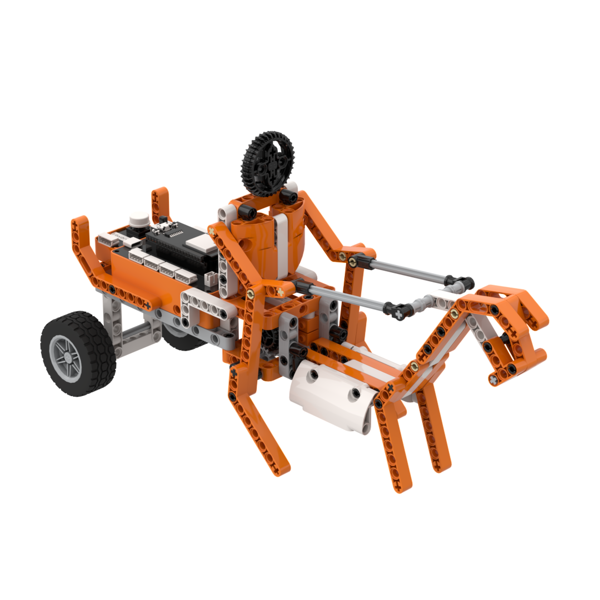

### 6.3.2 Learning Objectives

1. 在作品中实践电机与按键的基础功能，理解按键触发与启停控制的逻辑。
2. 掌握复古马车的机械搭建。
3. 学会编写 “按键触发 + 马车启停” 的程序，理解状态切换原理。
4. 提升动手实践与创意表达能力，感受复古交通工具的科技化改造。

### 6.3.3 Materials Needed

1. **材料准备**：主控器、电机、按键传感器、模块线、积木零件。

2. **模块介绍**：

<table style="text-align: center;vertical-align: middle;">
	<tr><td colspan="2">按键传感器</td></tr>
	<tr><td>功能</td><td>检测按压信号，触发马车启停</td></tr>
    <tr><td>应用位置</td><td>安装在 “复古马车” 的车厢上</td></tr>
    <tr><td>实现效果</td><td>每检测到一次按压信号，向主控发送状态切换的指令</td></tr>
</table>

<table style="text-align: center;vertical-align: middle;">
	<tr><td colspan="3">电机模块</td></tr>
	<tr><td>功能</td><td>提供马车前进的动力</td></tr>
    <tr><td>应用位置</td><td>安装在 “复古马车” 马的后腿处</td></tr>
    <tr><td>实现效果</td><td>接收到主控的指令后，控制马车的前进与停止，前进时连轴带动马头前后摆动，模拟马夫驾车动作</td></tr>
</table>

### 6.3.4 Assembly Guide{#build_manual_27}

### 6.3.5 Coding Steps

1. **打开平台**：启动编程软件，新建项目；

2. **添加扩展**：

- 在软件左下角打开 “**扩展**” ；

- 在 “**扩展**” 中选择”**主控器**“添加 “**K12 ESP32**” ；

- 在 “**扩展**” 中选择”**传感器**“添加 “**按键传感器**” ；

3. **参考程序**：

- 启动时，定义变量“运行状态”，并将变量初始化为 -1（-1是没有前进，1是在前进）；

- 在主程序中进行按键检测和电机控制：当按键（接口5）被按下，将 “运行状态” 设置为“0-运行状态”（即取反），实现状态翻转，并等待 0.5 秒防抖；若 “运行状态” 为 1 ，电机 S1 以 80 的速度控制马车前进，否则停止前进。

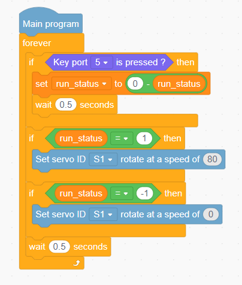

### 6.3.6 Program Download Steps

1. **连线**：用数据线将主控器与电脑 USB 端口连接；

2. **选端口**：在编程软件中选择主控器对应的 COM 端口（**COM口不唯一**）；

3. **下载**：点击 “**下载**” 按钮，将编写好的程序上传至主控器；

4. **开机**：给主控器接通电源，启动设备，测试功能。

### 6.3.7 Demo

## 6.4 Smart Locomotive

### 6.4.1 Project Overview

这是一列会 “智能避障” 的智能火车头，检测到触摸后启动前进，当红外传感器检测到前方有障碍物时立即停车，障碍物移开后继续前进，就像一条听话的钢铁长龙，安全又智能地行驶在轨道上。

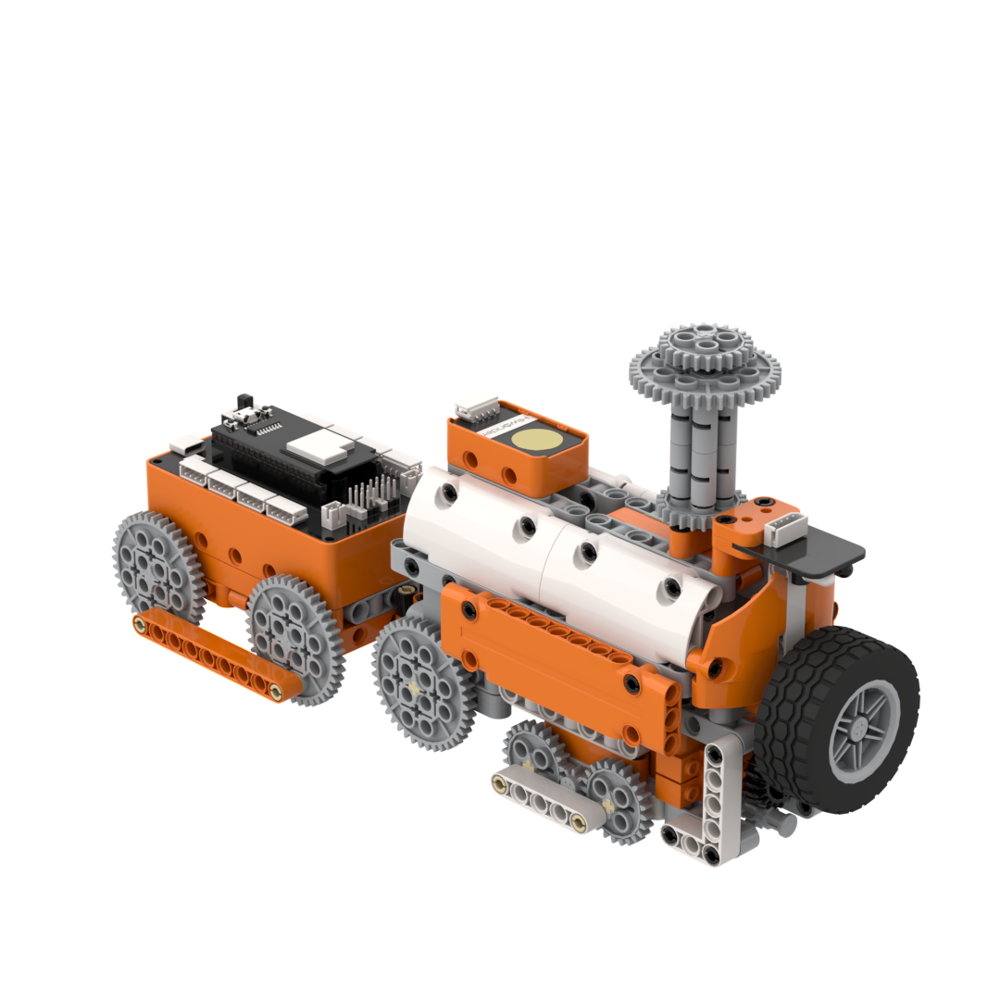

### 6.4.2 Learning Objectives

1. 在作品中实践触摸传感器、红外传感器、电机模块的基础功能与联动逻辑。
2. 掌握智能火车头的机械搭建。
3. 学会编写 “触摸启动 + 红外避障” 的程序，理解多传感器协同工作原理。
4. 提升动手实践与智能交通设计能力，感受轨道交通的科技化改造。

### 6.4.3 Materials Needed

1. **材料准备**：主控器、电机、触摸传感器、红外传感器、模块线、积木零件。

2. **模块介绍**：

<table style="text-align: center;vertical-align: middle;">
	<tr><td colspan="2">触摸传感器</td></tr>
	<tr><td>功能</td><td>检测触摸信号，触发火车启动</td></tr>
    <tr><td>应用位置</td><td>安装在 “智能火车头” 车头上</td></tr>
    <tr><td>实现效果</td><td>检测到一次触摸信号，向主控发送火车前进的指令</td></tr>
</table>

<table style="text-align: center;vertical-align: middle;">
	<tr><td colspan="2">红外传感器</td></tr>
	<tr><td>功能</td><td>检测前方障碍物</td></tr>
    <tr><td>应用位置</td><td>安装在 “智能火车头” 车头正前方</td></tr>
    <tr><td>实现效果</td><td>检测到前方有障碍物时，向主控发送火车停车的指令</td></tr>
</table>

<table style="text-align: center;vertical-align: middle;">
	<tr><td colspan="2">电机模块</td></tr>
	<tr><td>功能</td><td>提供火车前进的动力</td></tr>
    <tr><td>应用位置</td><td>安装在 “智能火车头” 底部车轮中间</td></tr>
    <tr><td>实现效果</td><td>接收到主控的指令后，控制火车的前进与停止</td></tr>
</table>

### 6.4.4 Assembly Guide{#build_manual_28}

### 6.4.5 Coding Steps

1. **打开平台**：启动编程软件，新建项目；

2. **添加扩展**：

- 在软件左下角打开 “**扩展**” ；

- 在 “**扩展**” 中选择”**主控器**“添加 “**K12 ESP32**” ；

- 在 “**扩展**” 中选择”**传感器**“添加 “**触摸传感器**” 、“**红外传感器**” ；

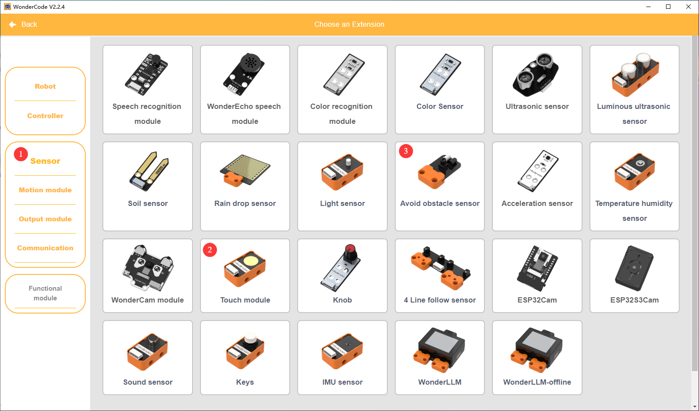

3. **参考程序**：

- 启动时，初始化触摸传感器的接口6，定义变量 “运行状态”，并将变量初始化为-1（-1是没有前进，1是在前进）；

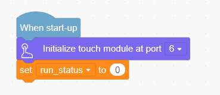

- 在主程序中进行触摸检测、红外检测和电机控制：当触摸被按下时，将 “运行状态” 设为 1，当 “运行状态” 为1时，电机 S1 以 60 的速度控制火车前进，直到红外（接口5 ）检测到有障碍物就停下，移开障碍物，火车继续前进。

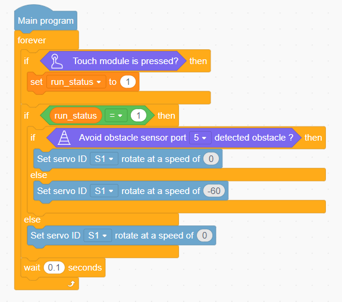

### 6.4.6 Program Download Steps

1. **连线**：用数据线将主控器与电脑 USB 端口连接；

2. **选端口**：在编程软件中选择主控器对应的 COM 端口（**COM口不唯一**）；

3. **下载**：点击 “**下载**” 按钮，将编写好的程序上传至主控器；

4. **开机**：给主控器接通电源，启动设备，测试功能。

### 6.4.7 Demo

## 6.5 Little Weightlifting Hero

### 6.5.1 Project Overview

这是一位会 “表情举铁” 的举铁小超人，按键启动后小人持续举哑铃，同时点阵屏同步显示表情，向上举时显示吃力表情，向下放时显示开心表情，就像一位努力健身的小勇士，活力满满。

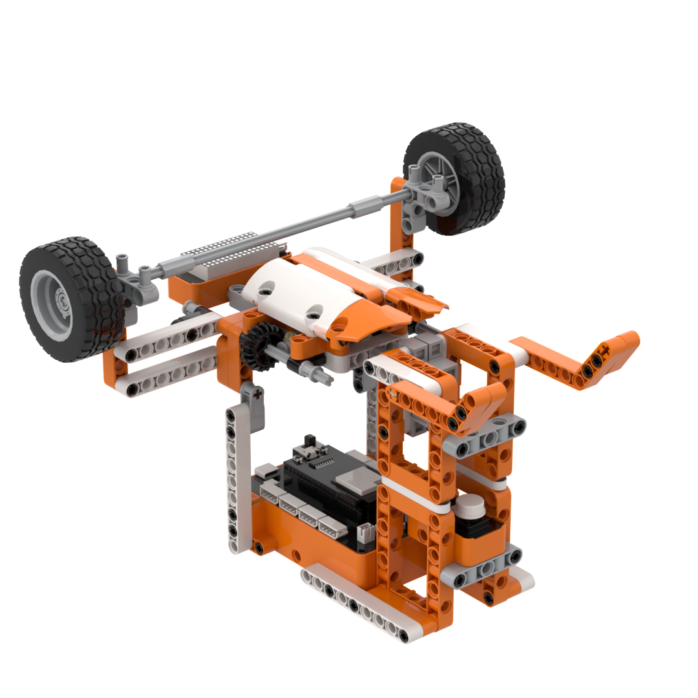

### 6.5.2 Learning Objectives

1. 在作品中实践舵机与点阵屏的基础功能，理解举铁动作与表情显示的联动逻辑。
2. 掌握举铁小超人的机械搭建。
3. 学会编写 “按键启动 + 舵机举铁 + 点阵表情” 的程序，理解多设备协同工作原理。
4. 提升动手实践与创意表达能力，感受趣味互动的编程乐趣。

### 6.5.3 Materials Needed

1. **材料准备**：主控器、舵机、按键传感器、点阵屏模块、模块线、积木零件。

2. **模块介绍**：

<table style="text-align: center;vertical-align: middle;">
	<tr><td colspan="2">按键传感器</td></tr>
	<tr><td>功能</td><td>检测按压信号，触发举铁动作</td></tr>
    <tr><td>应用位置</td><td>安装在 “举铁小超人” 的支架上</td></tr>
    <tr><td>实现效果</td><td>检测到一次按压信号，向主控发送启动举铁动作的指令</td></tr>
</table>

<table style="text-align: center;vertical-align: middle;">
	<tr><td colspan="2">点阵屏模块</td></tr>
	<tr><td>功能</td><td>显示表情图案</td></tr>
    <tr><td>应用位置</td><td>安装在 “举铁小超人” 的头部</td></tr>
    <tr><td>实现效果</td><td>接收到主控的指令后，向上举动时显示吃力表情，向下放时显示开心表情</td></tr>
</table>

<table style="text-align: center;vertical-align: middle;">
	<tr><td colspan="2">舵机模块</td></tr>
	<tr><td>功能</td><td>提供举铁的动力</td></tr>
    <tr><td>应用位置</td><td>安装在 “举铁小超人” 的转轴处</td></tr>
    <tr><td>实现效果</td><td>接收到主控的指令后，控制手臂上下往复运动，模拟举铁动作</td></tr>
</table>

### 6.5.4 Assembly Guide{#build_manual_29}

### 6.5.5 Coding Steps

1. **打开平台**：启动编程软件，新建项目；

2. **添加扩展**：

- 在软件左下角打开 “**扩展**” ；

- 在 “**扩展**” 中选择”**主控器**“添加 “**K12 ESP32**” ；

- 在 “**扩展**” 中选择”**传感器**“添加 “**按键传感器**” ；

- 在 “**扩展**” 中选择”**输出模块**“添加 “**点阵屏**” ；

3. **参考程序**：

- 启动时，初始化点阵屏模块的接口 6 ，初始化 270° 舵机 S1 为 270° ，此时手臂处于水平放置的状态，定义变量 “健身状态” ，并将变量初始化为-1（-1是没有举铁，1是在举铁）；；

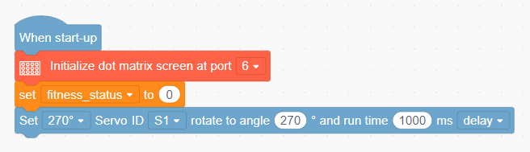

- 在主程序中进行按键检测、舵机控制和点阵显示：当按键（接口 5 ）被按下时，舵机 S1 先转到 0° 控制向上举哑铃，1 秒后舵机 S1 转到 270° 回到放下哑铃，向上举动时点阵屏显示 “>_<” 表情，放下时显示 ”^v^“ 表情，每 0.1 秒刷新一次检测状态。

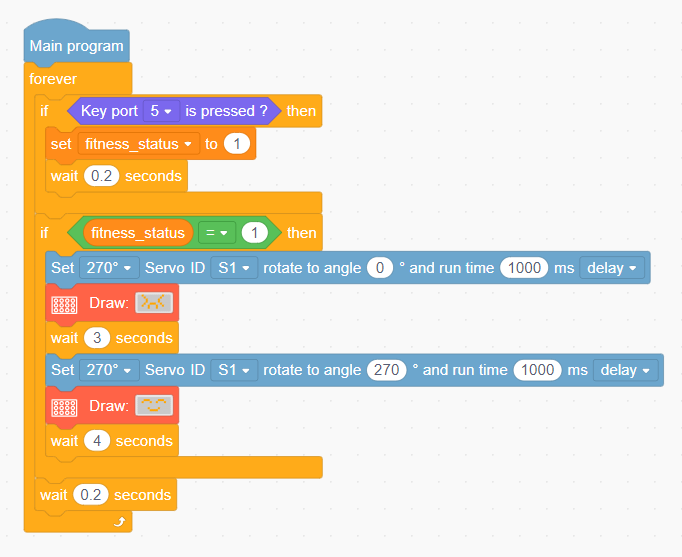

### 6.5.6 Program Download Steps

1. **连线**：用数据线将主控器与电脑 USB 端口连接；

2. **选端口**：在编程软件中选择主控器对应的 COM 端口（**COM口不唯一**）；

3. **下载**：点击 “**下载**” 按钮，将编写好的程序上传至主控器；

4. **开机**：给主控器接通电源，启动设备，测试功能。

### 6.5.7 Demo

## 6.6 Spiral Helicopter

### 6.6.1 Project Overview

这是一架会 “自动调速” 的螺旋直升机，超声波传感器朝下检测地面高度，高度越高，螺旋桨转速越快，就像一位专业的飞行员，总能根据高度精准调整动力，实现稳定飞行。

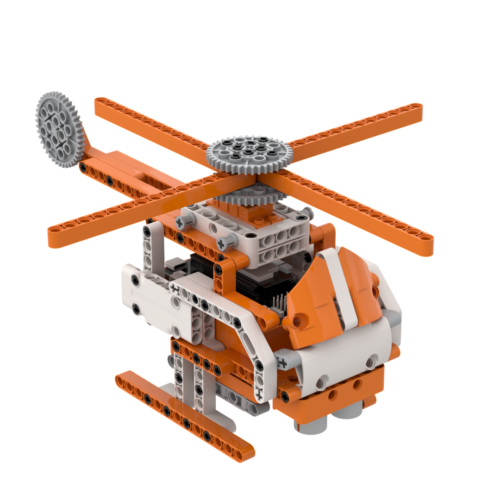

### 6.6.2 Learning Objectives

1. 在作品中实践超声波传感器、电机模块的基础功能，理解高度与转速的联动逻辑。
2. 掌握螺旋直升机的机械搭建。
3. 学会编写 “高度检测 + 转速调节” 的程序，理解反馈控制原理。
4. 提升动手实践与飞行控制能力，感受航空科技的编程魅力。

### 6.6.3 Materials Needed

1. **材料准备**：主控器、电机、超声波传感器、模块线、积木零件。

2. **模块介绍**：

<table style="text-align: center;vertical-align: middle;">
	<tr><td colspan="2">超声波传感器</td></tr>
	<tr><td>功能</td><td>检测直升机与地面的距离</td></tr>
    <tr><td>应用位置</td><td>安装在 “螺旋直升机” 的底部</td></tr>
    <tr><td>实现效果</td><td>实时检测直升机到地面的距离，向主控发送转速切换的指令</td></tr>
</table>

<table style="text-align: center;vertical-align: middle;">
	<tr><td colspan="2">电机模块</td></tr>
	<tr><td>功能</td><td>提供直升机螺旋桨转动的动力</td></tr>
    <tr><td>应用位置</td><td>安装在 “螺旋直升机” 螺旋桨底下</td></tr>
    <tr><td>实现效果</td><td>接收到主控的指令后，根据高度调节螺旋桨转速，高度越高转速越快</td></tr>
</table>

### 6.6.4 Assembly Guide{#build_manual_30}

### 6.6.5 Coding Steps

1. **打开平台**：启动编程软件，新建项目；

2. **添加扩展**：

- 在软件左下角打开 “**扩展**” ；

- 在 “**扩展**” 中选择”**主控器**“添加 “**K12 ESP32**” ；

- 在 “**扩展**” 中选择”**传感器**“添加 “**超声波传感器**” ；

3. **参考程序**：

- 启动时，初始化发光超声波的接口 1 ，定义变量 “最小高度” 模拟直升机最低安全高度5cm，定义变量 “最大高度” 模拟直升机最高安全高度50cm；

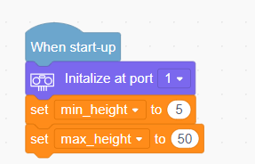

- 在主程序中进行距离检测和舵机控制：实时通过超声波传感器检测障碍物距离，将结果存入 “当前高度” 变量，跟最小高度和最大高度作比较，如果当前高度小于最小高度，则更新最小高度，如果当前高度大于最大高度，则更新最大高度，最后将 5-50cm 的高度映射为 0-100 的电机转速，电机 S1 驱动螺旋桨转动。

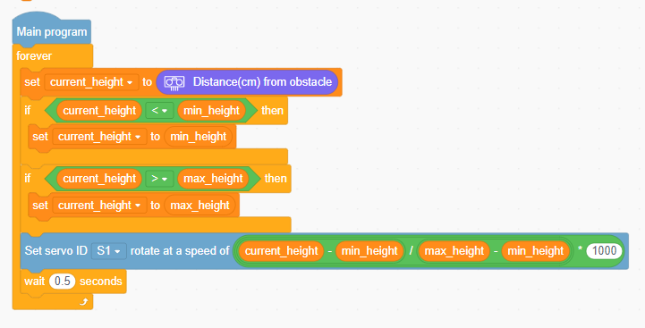

### 6.6.6 Program Download Steps

1. **连线**：用数据线将主控器与电脑 USB 端口连接；

2. **选端口**：在编程软件中选择主控器对应的 COM 端口（**COM口不唯一**）；

3. **下载**：点击 “**下载**” 按钮，将编写好的程序上传至主控器；

4. **开机**：给主控器接通电源，启动设备，测试功能。

### 6.6.7 Demo

## 6.7 Line-Tracking Car

### 6.7.1 Project Overview

这是一辆会 “自动循迹” 的自动巡线车，上电后小车自动沿着黑色轨迹巡圈行驶，就像一位专注的快递员，精准沿着路线完成配送任务。

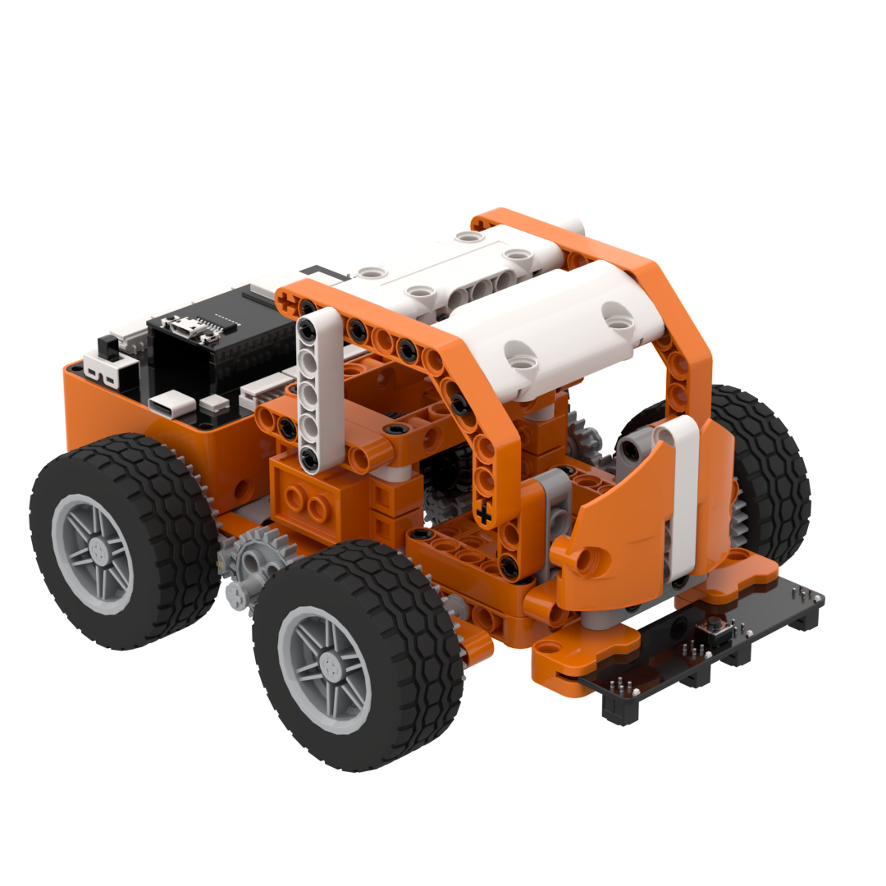

### 6.7.2 Learning Objectives

1. 在作品中实践双电机与四路巡线传感器的基础功能，理解巡线检测与车辆控制的逻辑。
2. 掌握自动巡线车的机械搭建。
3. 学会编写 “巡线行驶” 的程序，理解传感器检测与电机调速原理。
4. 提升动手实践与智能交通设计能力，感受自动循迹的科技魅力。

### 6.7.3 Materials Needed

1. **材料准备**：主控器、电机、四路巡线传感器、模块线、积木零件。

2. **模块介绍**：

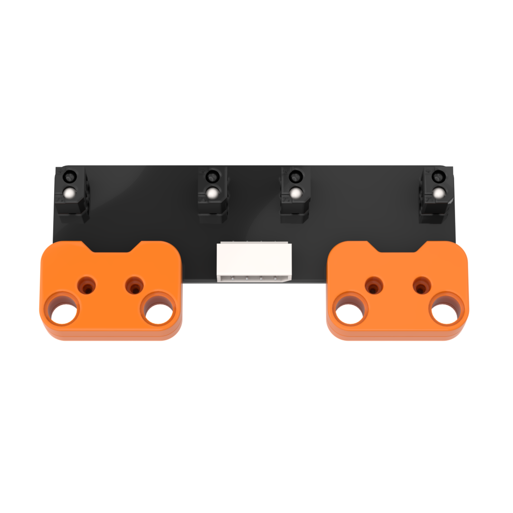

<table style="text-align: center;vertical-align: middle;">
	<tr><td colspan="2">四路巡线传感器</td></tr>
	<tr><td>功能</td><td>检测地面巡线信号</td></tr>
    <tr><td>应用位置</td><td>安装在 “自动巡线车” 的底部</td></tr>
    <tr><td>实现效果</td><td>识别黑色巡线轨迹，向主控输出巡线状态信号</td></tr>
</table>

<table style="text-align: center;vertical-align: middle;">
	<tr><td colspan="2">舵机模块</td></tr>
	<tr><td>功能</td><td>提供巡线车移动的动力</td></tr>
    <tr><td>应用位置</td><td>安装在 “自动巡线车” 的轮子上</td></tr>
    <tr><td>实现效果</td><td>接收到主控的信号后，根据巡线状态调整左右轮转速，实现循迹行驶</td></tr>
</table>

### 6.7.4 Assembly Guide{#build_manual_31}

### 6.7.5 Coding Steps

1. **打开平台**：启动编程软件，新建项目；

2. **添加扩展**：

- 在软件左下角打开 “**扩展**” ；

- 在 “**扩展**” 中选择”**主控器**“添加 “**K12 ESP32**” ；

- 在 “**扩展**” 中选择”**传感器**“添加 “**四路巡线传感器**” ；

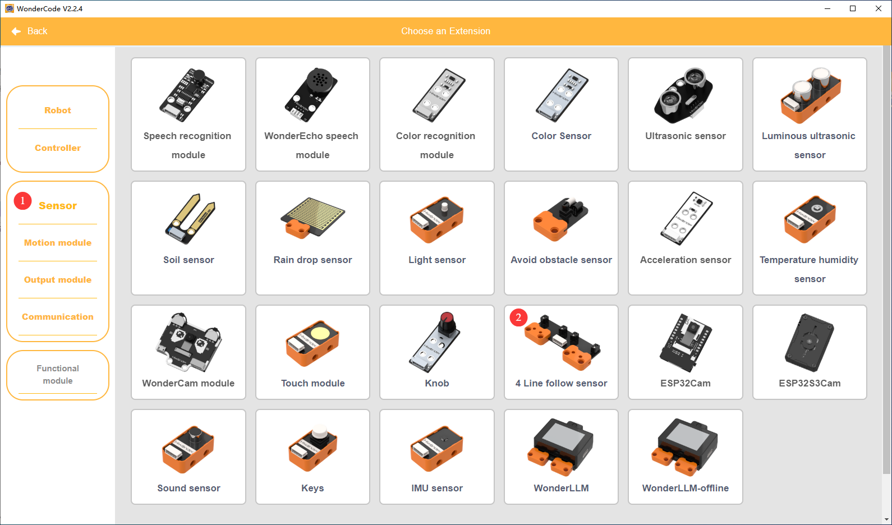

3. **参考程序**：

- 启动时，初始化四路巡线传感器的接口 1 ；

- 在主程序中根据四路巡线传感器检测到的不同通道（黑线位置），分别控制舵机 S1 和 S2 以不同速度组合转动，实现向左、向右或直行等方向调整，保持巡线车沿线路行驶，每 0.1 秒更新一次控制指令。

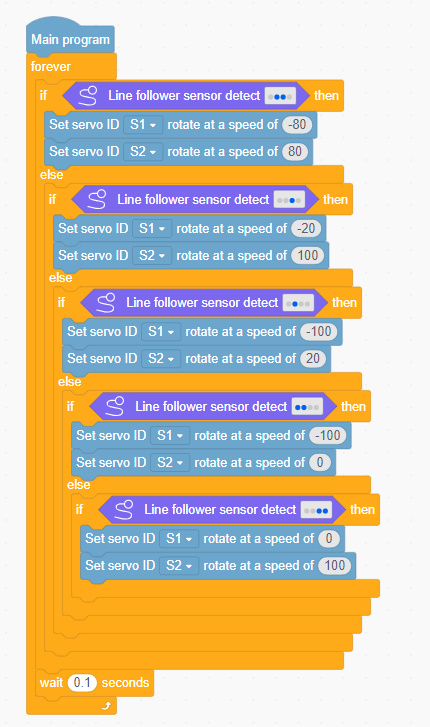

### 6.7.6 Program Download Steps

1. **连线**：用数据线将主控器与电脑 USB 端口连接；

2. **选端口**：在编程软件中选择主控器对应的 COM 端口（**COM口不唯一**）；

3. **下载**：点击 “**下载**” 按钮，将编写好的程序上传至主控器；

4. **开机**：给主控器接通电源，启动设备，测试功能。

### 6.7.7 Demo

## 6.8 Patrol Sailboat

### 6.8.1 Project Overview

这是一艘会 “根据风向航行” 的巡海小帆船，上电后持续前进，当红外检测到有船帆收回时缓慢停止前进，就像一位谨慎的船长，及时避开危险，安全航行。

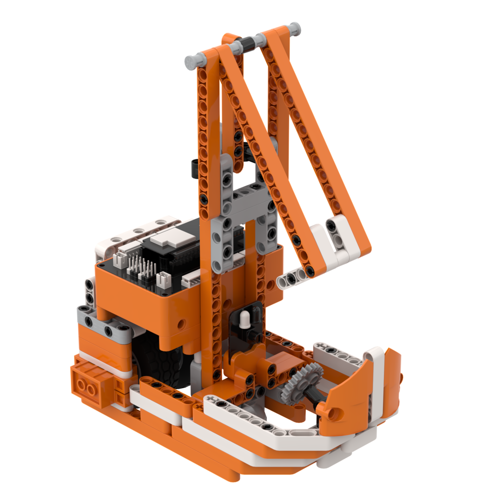

### 6.8.2 Learning Objectives

1. 在作品中实践双电机与红外传感器的基础功能，理解障碍物检测与减速停车的联动逻辑。
2. 掌握巡海小帆船的机械搭建与电路连接方法。
3. 学会编写 “红外检测→减速停车” 的程序，理解安全控制原理。
4. 提升动手实践与航海模拟能力，感受智能航行的科技魅力。

### 6.8.3 Materials Needed

1. **材料准备**：主控器、电机、红外传感器、模块线、积木零件。

2. **模块介绍**：

<table style="text-align: center;vertical-align: middle;">
	<tr><td colspan="2">红外传感器</td></tr>
	<tr><td>功能</td><td>检测船帆的状态</td></tr>
    <tr><td>应用位置</td><td>安装在 “巡海小帆船” 的船帆下方</td></tr>
    <tr><td>实现效果</td><td>检测到船帆收回信号，向主控发送缓慢停船的指令</td></tr>
</table>

<table style="text-align: center;vertical-align: middle;">
	<tr><td colspan="2">电机模块</td></tr>
	<tr><td>功能</td><td>提供帆船前进的动力</td></tr>
    <tr><td>应用位置</td><td>安装在 “巡海小帆船” 的轮子处</td></tr>
    <tr><td>实现效果</td><td>接收到主控的指令后，控制帆船前进和缓慢停止</td></tr>
</table>

### 6.8.4 Assembly Guide{#build_manual_32}

### 6.8.5 Coding Steps

1. **打开平台**：启动编程软件，新建项目；

2. **添加扩展**：

- 在软件左下角打开 “**扩展**” ；

- 在 “**扩展**” 中选择”**主控器**“添加 “**K12 ESP32**” ；

- 在 “**扩展**” 中选择”**传感器**“添加 “**红外传感器**” ；

3. **参考程序**：

- 在主程序中进行红外检测和电机控制：通过红外（接口 6 ）实时检测船帆是否收回，如果没有收回，电机 S1、S2 以 50 的速度前进 0.8 秒后停止，模仿惯性停止前进。

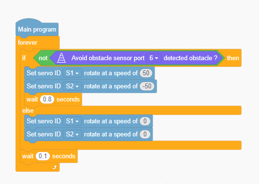

### 6.8.6 Program Download Steps

1. **连线**：用数据线将主控器与电脑 USB 端口连接；

2. **选端口**：在编程软件中选择主控器对应的 COM 端口（**COM口不唯一**）；

3. **下载**：点击 “**下载**” 按钮，将编写好的程序上传至主控器；

4. **开机**：给主控器接通电源，启动设备，测试功能。

### 6.8.7 Demo

## 6.9 Hexapod Robot

### 6.9.1 Project Overview

这是一只会 “避障前进” 的多足机器人，上电后持续前进，当超声波检测到前方障碍物距离小于 12cm 时，立即停止前进，就像一只警惕的小昆虫，时刻感知环境变化。

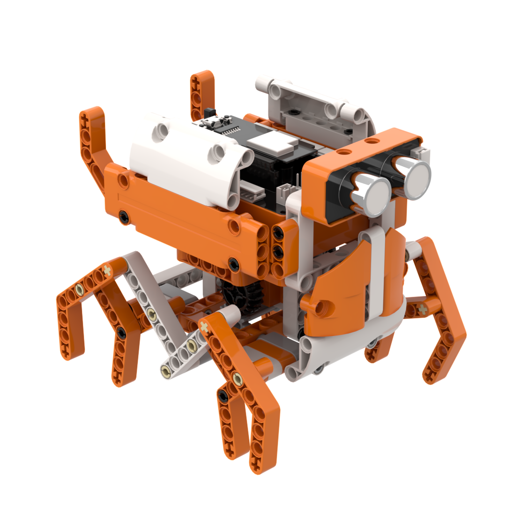

### 6.9.2 Learning Objectives

1. 在作品中实践双电机与超声波传感器的基础功能，理解避障检测与停止控制的逻辑。
2. 掌握多足机器人的机械搭建。
3. 学会编写 “超声波检测 + 前进启停” 的程序，理解安全控制原理。
4. 提升动手实践与仿生结构理解能力，感受多足行走的科技魅力。

### 6.9.3 Materials Needed

1. **材料准备**：主控器、电机、超声波传感器、模块线、积木零件。

2. **模块介绍**：

<table style="text-align: center;vertical-align: middle;">
	<tr><td colspan="2">超声波传感器</td></tr>
	<tr><td>功能</td><td>检测前方障碍物距离，触发多足停止前进</td></tr>
    <tr><td>应用位置</td><td>安装在 “多足机器人” 的头部</td></tr>
    <tr><td>实现效果</td><td>检测到前方障碍物距离小于12cm时，向主控发送停止前进的指令</td></tr>
</table>

<table style="text-align: center;vertical-align: middle;">
	<tr><td colspan="2">电机模块</td></tr>
	<tr><td>功能</td><td>提供多足前进的动力</td></tr>
    <tr><td>应用位置</td><td>安装在 “多足机器人” 的腿部</td></tr>
    <tr><td>实现效果</td><td>接收到主控的指令后，控制多足机器人前进与停止</td></tr>
</table>

### 6.9.4 Assembly Guide{#build_manual_33}

### 6.9.5 Coding Steps

1. **打开平台**：启动编程软件，新建项目；

2. **添加扩展**：

- 在软件左下角打开 “**扩展**” ；

- 在 “**扩展**” 中选择”**主控器**“添加 “**K12 ESP32**” ；

- 在 “**扩展**” 中选择”**传感器**“添加 “**超声波传感器**” ；

3. **参考程序**：

- 启动时，初始化超声波传感器的接口 1，定义变量“距离”，并将变量初始化为 0；

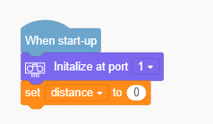

- 在主程序中进行距离检测和电机控制：实时通过超声波检测障碍物距离，将结果存入变量 “距离” ，当 “距离” 小于 12 时，停止前进，反之则前进。

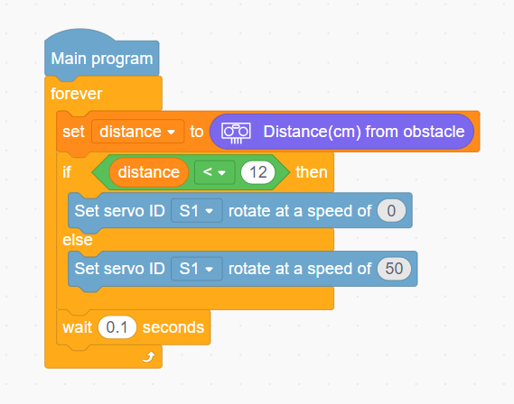

### 6.9.6 Program Download Steps

1. **连线**：用数据线将主控器与电脑 USB 端口连接；

2. **选端口**：在编程软件中选择主控器对应的 COM 端口（**COM口不唯一**）；

3. **下载**：点击 “**下载**” 按钮，将编写好的程序上传至主控器；

4. **开机**：给主控器接通电源，启动设备，测试功能。

### 6.9.7 Demo

## 6.10 Side-Stepping Crab

### 6.10.1 Project Overview

这是一只会 “听声横行” 的小螃蟹，只要你拍手发出声音，它就会跟着你发出声音的次数变换方向横行，就像沙滩上听指令行动的小勇士，精准又有趣。

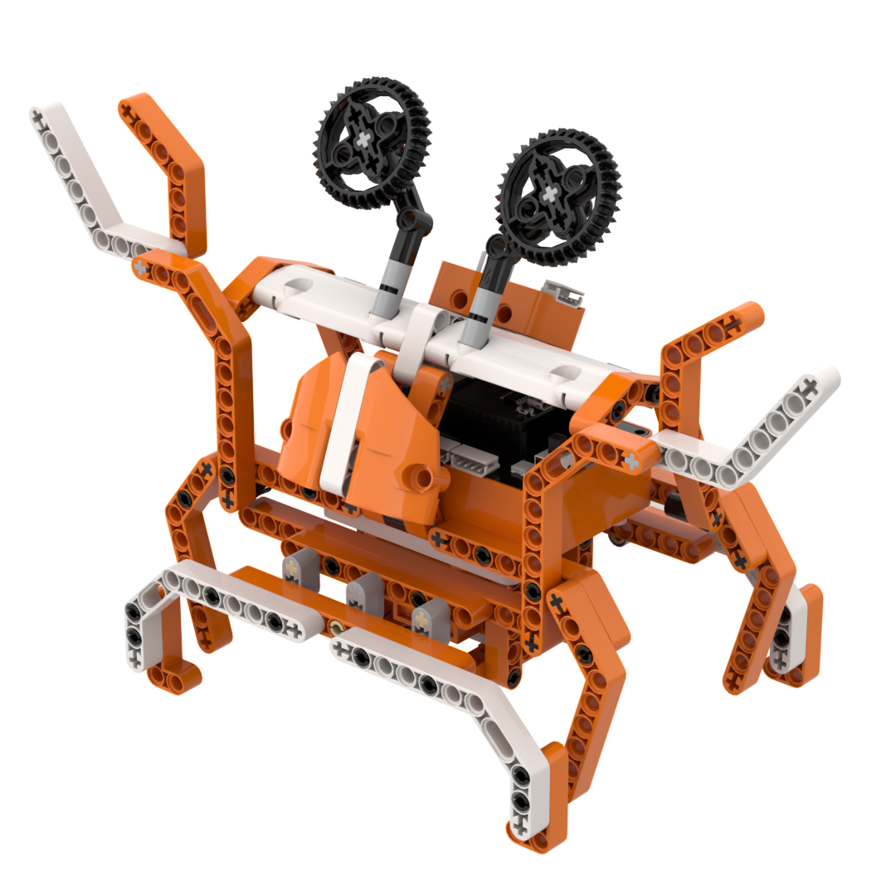

### 6.10.2 Learning Objectives

1. 在作品中实践声音传感器、电机模块的基础功能，理解声音触发与多方向移动控制的逻辑。
2. 掌握横行小螃蟹的机械搭建。
3. 学会编写 “声音计数 + 方向切换” 的程序，理解状态切换与电机控制原理。
4. 提升动手实践与逻辑思维能力，感受声控仿生的编程乐趣。

### 6.10.3 Materials Needed

1. **材料准备**：主控器、电机、声音传感器、模块线、积木零件。

2. **模块介绍**：

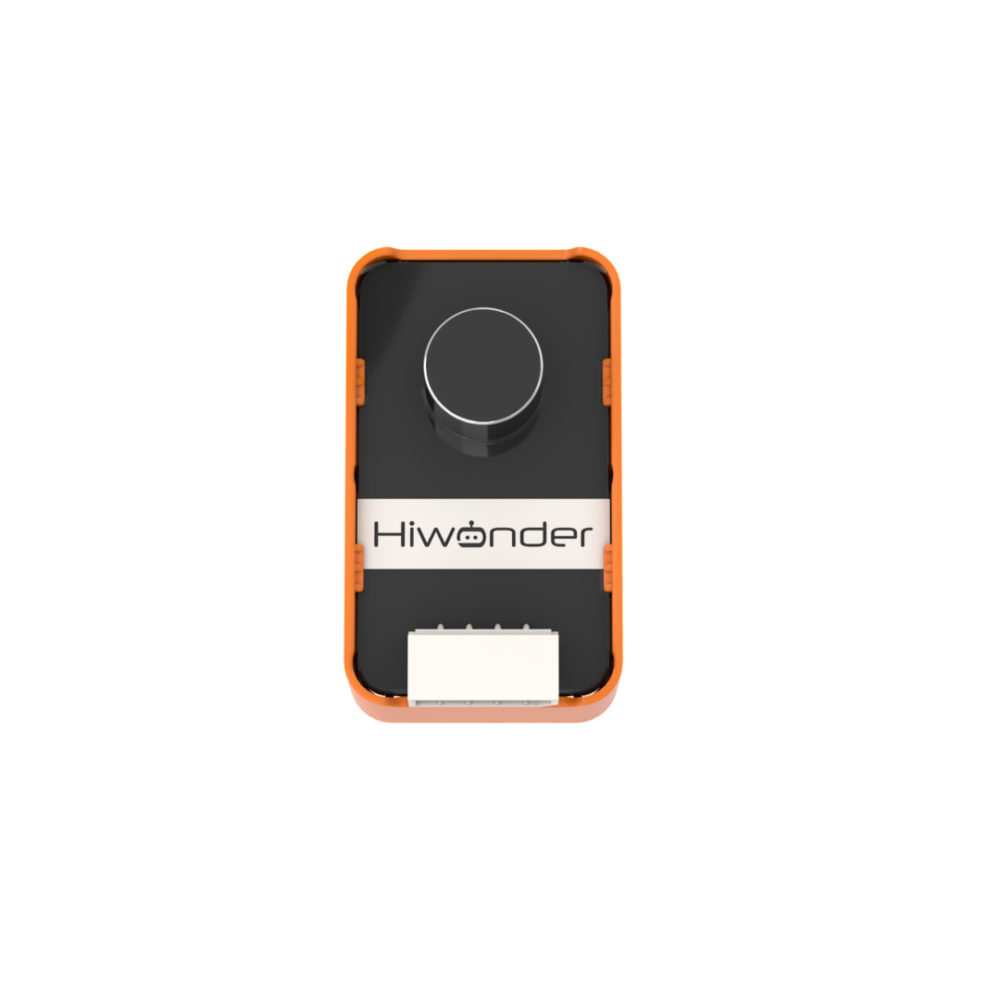

<table style="text-align: center;vertical-align: middle;">
	<tr><td colspan="2">声音传感器</td></tr>
	<tr><td>功能</td><td>检测环境中的声音信号，触发移动方向切换</td></tr>
    <tr><td>应用位置</td><td>安装在 “横行小螃蟹” 的后背壳上</td></tr>
    <tr><td>实现效果</td><td>每检测到一次声音，计数+1，向主控发送切换方向的指令</td></tr>
</table>

<table style="text-align: center;vertical-align: middle;">
	<tr><td colspan="2">舵机模块</td></tr>
	<tr><td>功能</td><td>供螃蟹左右横行的动力</td></tr>
    <tr><td>应用位置</td><td>安装在 “横行小螃蟹” 的腿部</td></tr>
    <tr><td>实现效果</td><td>接收到主控的指令后，控制螃蟹左右横行</td></tr>
</table>

### 6.10.4 Assembly Guide{#build_manual_34}

### 6.10.5 Coding Steps

1. **打开平台**：启动编程软件，新建项目；

2. **添加扩展**：

- 在软件左下角打开 “**扩展**” ；

- 在 “**扩展**” 中选择”**主控器**“添加 “**K12 ESP32**” ；

- 在 “**扩展**” 中选择”**传感器**“添加 “**声音传感器**” ；

3. **参考程序**：

- 启动时，定义变量 “启动” 和 “声音次数” ，并将两个变量初始化为 0，为程序运行做准备；

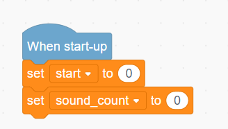

- 在主程序中进行声音检测与状态切换：当 “声音次数” 为 0 时，若声音传感器接口 5 检测到音量值大于 40，将 “声音次数” 加 1，等待 0.3 秒后进入 150 次快速检测循环，在循环中，若再次检测到音量大于 40，再次将 “声音次数” 加 1 并结束循环，随后将 “启动” 设为 1，触发螃蟹左右横行动作执行；

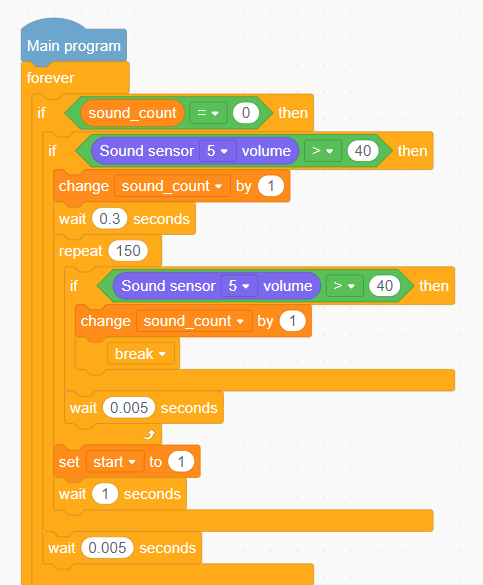

- 当 “声音次数” 为 1 或 2 时程序处于运行阶段，即螃蟹正在移动，若再次检测到音量大于 40，将 “声音次数” 重置为 0，“启动” 设为 0，电机停止转动，移动停止；

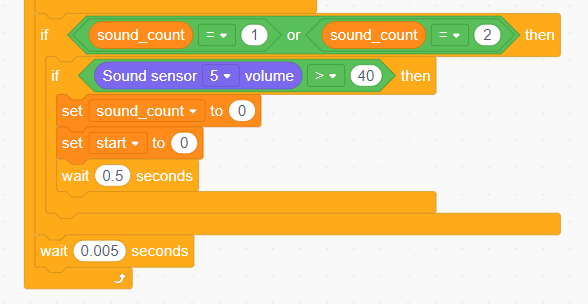

- 在主程序中进行左右横行控制：当 “启动” 为 1 时，根据 “声音次数” 的值控制电机 S1，若 “声音次数” 为 1，电机 S1 以 50 的速度控制螃蟹向左横行，若 “声音次数” 为 2，电机 S1 以 50 的速度控制螃蟹向右横行；当 “启动” 为 0 时，电机 S1 停止转动，每 0.1 秒刷新一次控制状态。

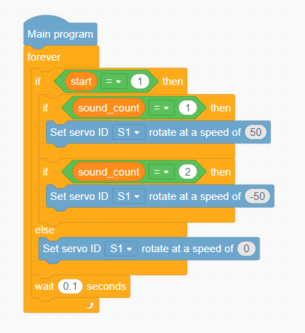

### 6.10.6 Program Download Steps

1. **连线**：用数据线将主控器与电脑 USB 端口连接；

2. **选端口**：在编程软件中选择主控器对应的 COM 端口（**COM口不唯一**）；

3. **下载**：点击 “**下载**” 按钮，将编写好的程序上传至主控器；

4. **开机**：给主控器接通电源，启动设备，测试功能。

### 6.10.7 Demo

## 6.11 Lifting Robotic Arm

### 6.11.1 Project Overview

这是一台会 “自动抓取” 的升降机械臂，上电后机械臂小车持续前进，当超声波检测到前方物体距离小于 5cm 时，控制机械臂降下抓取物品，向右转弯放置物品，就像一位灵活的物流助手，精准完成搬运任务。

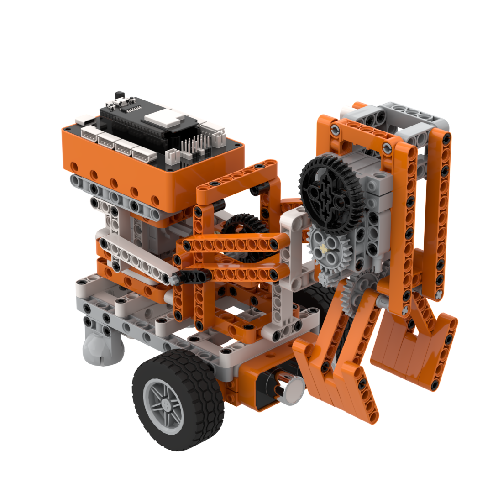

### 6.11.2 Learning Objectives

1. 在作品中实践双舵机、双电机与超声波传感器的基础功能，理解避障检测、抓取与放置的联动逻辑。
2. 掌握升降机械臂的机械搭建。
3. 学会编写 “超声波避障 + 舵机抓取 + 电机转向放置” 的程序，理解多设备协同工作原理。
4. 提升动手实践与工业应用能力，感受智能机械臂的科技魅力

### 6.11.3 Materials Needed

1. **材料准备**：主控器、电机、舵机、超声波传感器、模块线、积木零件。

2. **模块介绍**：

<table style="text-align: center;vertical-align: middle;">
	<tr><td colspan="2">超声波传感器</td></tr>
	<tr><td>功能</td><td>检测前方物体距离</td></tr>
    <tr><td>应用位置</td><td>安装在 “升降机械臂” 的正前方</td></tr>
    <tr><td>实现效果</td><td>检测到前方物体距离小于5cm时，向主控发送抓取的指令</td></tr>
</table>

<table style="text-align: center;vertical-align: middle;">
	<tr><td colspan="2">电机模块</td></tr>
	<tr><td>功能</td><td>提供小车移动的动力</td></tr>
    <tr><td>应用位置</td><td>安装在 “升降机械臂” 的后轮处</td></tr>
    <tr><td>实现效果</td><td>接收到主控的指令后，控制小车前进、后退、转向</td></tr>
</table>

<table style="text-align: center;vertical-align: middle;">
	<tr><td colspan="3">舵机模块</td></tr>
	<tr><td>功能</td><td>提供机械臂上下移动的动力</td><td>提供机械爪开合的动力</td></tr>
    <tr><td>应用位置</td><td>安装在 “升降机械臂” 的机械臂转轴处</td><td>安装在 “升降机械臂” 的机械爪转轴处</td></tr>
    <tr><td>实现效果</td><td>接收到主控的指令后，控制机械臂升降</td><td>接收到主控的指令后，控制机械爪开合抓取放置物体</td></tr>
</table>

### 6.11.4 Assembly Guide{#build_manual_35}

### 6.11.5 Coding Steps

1. **打开平台**：启动编程软件，新建项目；

2. **添加扩展**：

- 在软件左下角打开 “**扩展**” ；

- 在 “**扩展**” 中选择”**主控器**“添加 “**K12 ESP32**” ；

- 在 “**扩展**” 中选择”**传感器**“添加 “**超声波传感器**” ；

3. **参考程序**：

- 启动时，初始化超声波传感器的接口 1，初始化 270° 舵机 S1 为 0° ，此时机械爪处于闭合的状态，初始化 270° 舵机 S2 为 0° ，此时机械臂处于升高的状态；

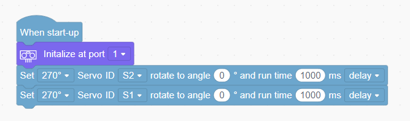

- 自定义一个 “夹取与放置” 函数：当返回参数 “夹取1放置2” 为 1 时，先控制舵机 S1 转到 270° 打开机械爪，然后控制舵机 S2 转到 165° 降下机械臂，再控制舵机 S1 转到 0° 闭合机械爪，最后控制舵机 S2 转到 0° 升回机械臂，完成一次抓取动作，当返回参数 “夹取1放置2” 为 2 时，先控制舵机 S2 转到 165° 降下机械臂，然后控制舵机 S1 转到 270° 打开机械爪，再控制舵机 S2 转到 0° 升回机械臂，最后控制舵机 S1 转到 0° 闭合机械爪，完成一次放置动作；

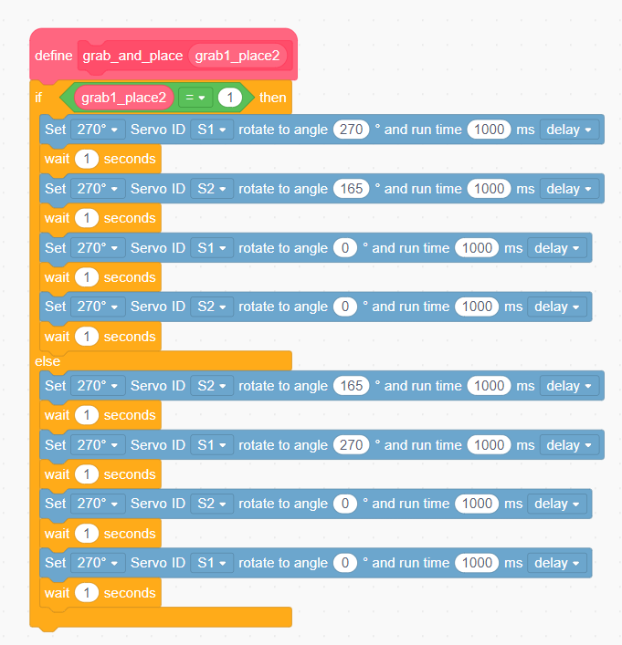

- 在主程序中进行距离检测和电机、舵机控制：实时通过超声波传感检测物体距离，将结果存到 “物体距离” 变量，当其大于 5cm 时，小车持续前进，反之，停止前进抓取物体后，右转 1 秒后将物体放下，再左转复位。

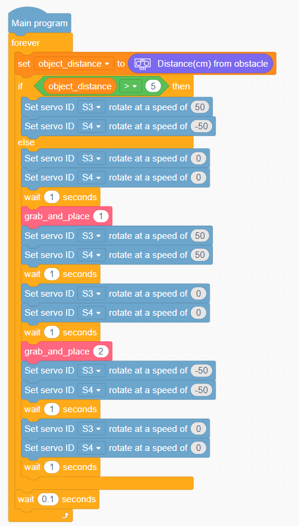

### 6.11.6 Program Download Steps

1. **连线**：用数据线将主控器与电脑 USB 端口连接；

2. **选端口**：在编程软件中选择主控器对应的 COM 端口（**COM口不唯一**）；

3. **下载**：点击 “**下载**” 按钮，将编写好的程序上传至主控器；

4. **开机**：给主控器接通电源，启动设备，测试功能。

### 6.11.7 Demo

## 6.12 Rapid-Fire Blaster

### 6.12.1 Project Overview

这是一把会 “按键射击” 的突击步枪，长按按键传感器时开始连续射击，松开按键就停止射击，就像战场上的武器装备，模拟真实的射击体验。

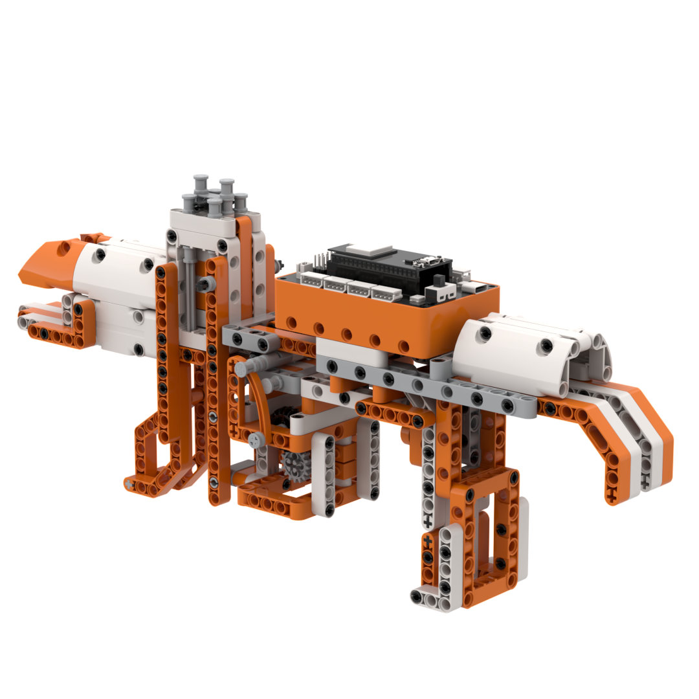

### 6.12.2 Learning Objectives

1. 在作品中实践电机与按键传感器的基础功能，理解长按触发与射击模拟的逻辑。
2. 掌握突击步枪的机械搭建。
3. 学会编写 “长按触发 + 连续射击 + 松开停止” 的程序，理解按键状态检测原理。
4. 提升动手实践与安全设计能力，感受模拟射击的编程乐趣。

### 6.12.3 Materials Needed

1. **材料准备**：主控器、电机、按键传感器、模块线、积木零件。

2. **模块介绍**：

<table style="text-align: center;vertical-align: middle;">
	<tr><td colspan="2">按键传感器</td></tr>
	<tr><td>功能</td><td>检测按压信号，触发射击动作</td></tr>
    <tr><td>应用位置</td><td>安装在 “突击步枪” 的扳机附近</td></tr>
    <tr><td>实现效果</td><td>检测到按压信号，向主控发送启动射击的指令</td></tr>
</table>

<table style="text-align: center;vertical-align: middle;">
	<tr><td colspan="2">电机模块</td></tr>
	<tr><td>功能</td><td>提供射击的动力</td></tr>
    <tr><td>应用位置</td><td>安装在 “突击步枪” 的枪身上</td></tr>
    <tr><td>实现效果</td><td>接收到主控的指令后，控制电机转动，模拟枪机往复运动，实现发射子弹的效果</td></tr>
</table>

### 6.12.4 Assembly Guide{#build_manual_36}

### 6.12.5 Coding Steps

1. **打开平台**：启动编程软件，新建项目；

2. **添加扩展**：

- 在软件左下角打开 “**扩展**” ；

- 在 “**扩展**” 中选择”**主控器**“添加 “**K12 ESP32**” ；

- 在 “**扩展**” 中选择”**传感器**“添加 “**按键传感器**” ；

3. **参考程序**：

- 在主程序中进行按键检测和电机控制：当按键（接口5）被按下，电机 S1 以 100 的速度转动，发射子弹，当按键未被按下时，电机 S1 停止转动，每 0.01 秒刷新一次检测与控制状态，实现按键控制电机启停的功能。

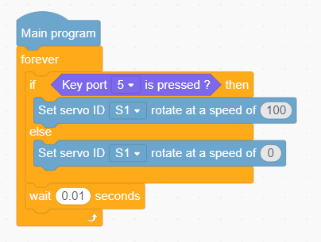

### 6.12.6 Program Download Steps

1. **连线**：用数据线将主控器与电脑 USB 端口连接；

2. **选端口**：在编程软件中选择主控器对应的 COM 端口（**COM口不唯一**）；

3. **下载**：点击 “**下载**” 按钮，将编写好的程序上传至主控器；

4. **开机**：给主控器接通电源，启动设备，测试功能。

### 6.12.7 Demo

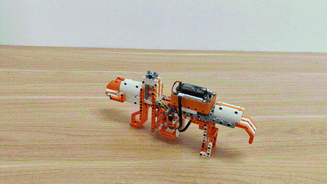

